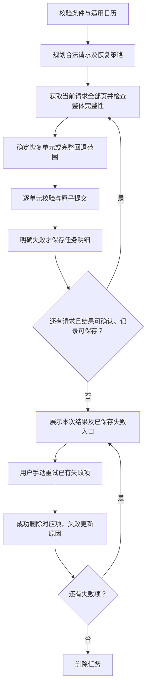

# Tensor 区间下载 PRD

> 增量产品范围：38 个接口区间下载、19 个交易日期接口跳过休市日、11 个接口保留原条件；成功部分正常入库，明确失败的恢复单元汇总为可查看、可手动执行的任务。

| 文档信息 | 内容 |
|---|---|
| 文档版本 | v1.4（沿用原文件路径，保持引用有效） |
| 文档状态 | 请求批次与恢复单元分离已确认；日期输入最多 31 个自然日，来源及独立恢复能力逐项核实 |
| 编制日期 | 2026-09-08 |
| 需求来源 | [Tensor 区间下载 BRD](Tensor_区间下载_BRD_v1.0.md)，正文 v1.4 |
| 继承基线 | [Tensor 多源证券数据平台 PRD](Tensor_多源证券数据平台_PRD_v1.0.md) |
| 目标用户与终端 | 受信内部用户，桌面端 Web |
| 本轮交付 | 需求文档修订；不包含功能实现、技术设计或真实服务验收 |

**修订边界：** 与 BRD v1.4、[TRD v1.10](Tensor_区间下载_TRD_v1.0.md) 同步：批量获取后按可独立恢复的对象和时间单元校验、提交；主表现有任务参数 JSON 保存公共条件及原始下载起止日期，子表保存失败对象、时间及原因，表结构不变。仅明确失败时创建记录，复用原任务，成功即删除；不再保留旧父子任务、预登记、逐轮历史或完整中断恢复要求。本次仅修订文档。

## 版本记录

| 版本 | 日期 | 说明 |
|---|---|---|
| v1.0 | 2026-09-07 | 定义区间、休市及原整段失败回滚方案 |
| v1.1 | 2026-09-07 | 按用户建议引入失败任务、手动重试与后续任务；本稿采用成功单元入库、失败单元独立恢复，替换整段失败回滚及全区间重提要求 |
| v1.1 修订 | 2026-09-08 | 按用户要求，执行限制仅保留日期输入最多 31 个自然日；删除整轮处理时长、累计业务行数、累计响应体限制及关联规则 |
| v1.2 | 2026-09-08 | 用户确认每批下载并校验完成后批量入库；以批次作为提交和恢复边界，保留已提交批次，移除整轮候选提交前冲突检查 |
| v1.2 执行约束修订 | 2026-09-08 | 区间下载及其手动重试开始后不可主动终止；补充页面提示、客户端断连行为与验收要求 |
| v1.3 | 2026-09-08 | 批量请求与恢复单元分离，支持同一响应内成功保留、失败单元独立重试；同步两表仅失败记录生命周期 |
| v1.3 失败继续修订 | 2026-09-08 | 用户要求本轮全部计划范围均尝试，下载失败记录后继续后续下载；来源级错误不再提前停止本轮 |
| v1.4 | 2026-09-08 | 失败任务列表和详情显示原始下载日期范围，复用现有任务参数 JSON；原始区间展示与当前失败重试范围分别处理，不改表结构 |

## 1. 产品目标与范围

用户一次提交区间，系统按合法方式批量获取；可独立确认完整性、校验和重试的股票时间单元分别提交，其他单元失败不撤销已提交成果。失败对象、时间及原因汇总在同一任务，用户只重试这些项；无可靠细分依据时保留完整请求范围。

### 1.1 本期范围

维持 38 个区间目标接口和 11 个原条件接口、19 个交易日期接口的休市过滤。保持“数据下载／数据查看”页面，在下载内使用“发起下载／失败任务”页签。后续单股入口和股票集合选择方式另行设计，当前模型同时适用于已有单股接口和批量获取结果。

### 1.2 已确认规则

| 事项 | 产品要求 |
|---|---|
| 成功保留 | 请求可批量，恢复单元分别校验和提交；每个单元内部仍全部成功或全部回滚 |
| 失败定位 | 按实际受影响对象和时间保存，不能仅凭请求是否批量选择单股或完整范围 |
| 失败后继续 | 首次及手动重试均遍历全部计划范围，下载失败记录后继续后续下载；来源认证、权限、限流、超时等错误不提前结束本轮 |
| 独立恢复条件 | 可靠对象／时间归属、完整性依据及合法单独重试方式均满足；不满足时使用完整范围 |
| 任务生命周期 | 明确失败才入表，复用原任务，成功删除，全部解决删除主表；未开始和未知项不补成失败 |
| 日期与操作 | 最多 31 个自然日；同步执行、无自动重试，区间下载开始后不可主动终止 |
| 实际支持 | 表单设计、接口策略、来源证据和真实账号验收分别记录，不能相互替代 |

## 2. 操作流程与交互

### 2.1 主流程

整体请求失败不提交部分页。已知受影响且可独立恢复的对象时间单元分别保存共同请求失败；无可靠成员集合时保存完整范围。日历或参数在业务执行前失败不创建失败任务。

下载错误的实际失败范围保存后继续下一请求，直至本轮全部计划范围都已尝试；不因前一请求失败而跳过后续日期。沿用现有日历过滤、月份及多日批次规则，不强制把多日批次拆为单日；失败项只留待后续手动重试。存储或提交故障按 §5.2、§5.8 处理。

### 2.2 下载页状态

| 状态或动作 | 页面要求 |
|---|---|
| 未选择接口 | 参数表单隐藏，开始下载不可用 |
| 选择接口 | 展示时间含义、条件及适用限制，日期为空；其他字段沿用元数据 |
| 修改条件或切换接口 | 清除旧结果与不再适用的参数，避免结果错配；持久化任务不受此操作影响 |
| 校验失败 | 字段附近提示，聚焦首错，不发送下载请求 |
| 请求未结束 | 禁用来源、接口、参数与重复提交，显示等待最终结果；区间下载提示“区间下载已开始，不可终止，请等待结果。”，不提供取消、暂停、停止或终止操作；不显示执行阶段或百分比 |
| 本轮结束 | 展示本轮已完成、失败、未执行及记录计数；有任务则提供“查看重试任务” |
| 离开、刷新或关闭页面 | 不取消已开始的区间下载，服务端继续执行；已保存的失败任务仍可查看，未收到响应时不推断执行已停止或已成功，按 TRD §9 的记录边界处理 |
| 修改条件后重新下载 | 属于新的首次下载操作；不改变旧任务的冻结条件 |

### 2.3 用户例子

一个完整批量响应包含 A、B、C 三只股票在 9 月 3 日的数据，接口已核实可按股票日期独立恢复。B 的业务字段校验失败：

| 执行 | 数据结果 | 任务结果 |
|---|---|---|
| 首次下载 | A／C 分别提交；B 不写入，显示完成 2 项、失败 1 项 | 创建 T1，仅保存 B＋9 月 3 日及原因 |
| 手动重试 T1，B 仍失败 | 不重新下载 A／C | 更新 T1 的 B 项原因 |
| 再次重试 B 成功 | B 的业务写入与明细删除同事务 | 最后一项删除后移除 T1 |

若 A、B、C 必须作为一个恢复单元，B 出错导致整项未提交，则保存完整范围，原因可指出 B；若整体超时或后续页失败，没有可靠逐股结果，也不能从收到的部分数据推断仅 B 失败。已保存的完整范围项重试仍按原范围执行，不自动拆小。

例如公告日期接口按一天一批下载 1～10 日，3 日限流后保存 3 日失败，继续尝试 4～10 日；若 7 日也失败，则最终只保存 3 日和 7 日，其他成功日正常入库。若后续每一天都失败，则每一天均实际调用并记录失败，不预判剩余日期的结果。手动重试也遍历本轮全部失败项。

### 2.4 区间下载开始后不可终止

适用于 38 个区间目标接口的首次下载，以及这些接口失败批次的手动重试；即使重试范围只剩一天或一个月，也遵守相同规则。

- “开始”指服务端校验通过、取得执行槽位并接受本轮执行；前端校验未通过不算开始。
- 提交前显示“区间下载开始后不可终止。”；执行中只允许查看，不提供取消、暂停、停止或终止按钮、菜单及快捷操作，服务端也不提供对应接口。
- 切换页签、离开、刷新、关闭页面及客户端超时／断连均不取消服务端执行。重新打开页面不自动重发请求；原执行仍在运行时，重复执行由服务端拒绝。
- 下载错误记录后继续后续独立单元及请求批次，直到本轮全部计划范围均尝试；来源级错误不提前结束。数据库不可用、记录保存失败或提交未知按 §5.8 处理；进程故障按 TRD §9 处理，不显示为“用户已取消”。
- 失去响应时显示结果未确认，不宣称已终止、已回滚或已成功；只展示实际已保存的失败记录，不承诺恢复完整执行历史。

## 3. 参数表单与时间含义

### 3.1 五类下载方式

| 类型 | 日期控件标签 | 提交前常驻说明 |
|---|---|---|
| 交易日期区间 | 开始交易日期、结束交易日期 | 按交易日期下载，包含起止日期；自动跳过适用交易日历确认的休市日。个股停牌不作为市场休市处理。 |
| 公告日期区间 | 开始公告日期、结束公告日期 | 按公告日期下载，包含起止日期及周末、节假日；公告日期不等于财务报告期或事件生效日期。 |
| 覆盖月份 | 开始日期、结束日期 | 按所选日期覆盖的完整月份下载，月度数据不按日切分。 |
| 原生日期范围 | 按第 3.4 节说明展示起止日期 | 保留接口原有日期条件；不套用交易日期接口的休市过滤。 |
| 保留原条件 | 不展示日期范围 | 当前接入方式不支持按历史区间下载；请按现有条件获取数据。 |

`weekly`、`monthly` 在交易日期说明下增加：“结果保持周线／月线粒度；所选日期用于匹配来源记录的交易日期，不生成每日记录，也不自动扩展为整个周／月。”

### 3.2 输入与校验

所有区间日期按 `YYYY-MM-DD` 展示，为不带时刻的自然日期；下载请求沿用 `YYYYMMDD` 编码，不因浏览器时区换算而前后移动一天。

| 条件 | 规则 | 提示示例 |
|---|---|---|
| 日期缺失 | 两端均必填，不自动补全另一端 | 请选择开始交易日期／结束交易日期 |
| 日期非法 | 按真实公历校验；拒绝 2026-02-29、2026-04-31 等 | 请输入有效日期 |
| 日期逆序 | 开始不得晚于结束 | 开始日期不得晚于结束日期 |
| 日期相同 | 合法，按一个自然日；月度接口按所在完整月份 | 无错误 |
| 超长范围 | `结束日期－开始日期＋1` 不得超过当前公布上限 | 单次最多支持 31 个自然日（含起止日期），请缩小区间 |
| 股票代码 | 保留必填性，去首尾空格，沿用“代码.市场”格式 | 请输入有效股票代码，例如 000001.SZ |
| 枚举条件 | 保留必填性与声明的选项，不接受自由填写其他值 | 请选择有效的交易所 |
| 未声明或混合参数 | 服务端拒绝未知条件，以及旧日期与新范围混用 | 当前接口不支持该参数，请使用开始、结束日期 |

前端校验通过后才提交；服务端重复执行同一规则，绕过页面的非法输入不得触发交易日历或业务数据请求。页面展示的限制必须与服务端实际限制一致；配置不一致时以明确错误要求修正，不能缩短范围继续执行。

不额外禁止未来日期或设置未经证实的最早历史日期。未来日期同样受上限约束；交易日期接口无法取得足够日历时返回未执行说明，首次不创建失败任务，已有失败项保留，其他接口按上游合法空数据或真实错误处理。说明中不承诺未公布的数据已经可下载。

### 3.3 区间摘要与月份边界

日期有效后，在提交按钮前显示“所选范围：2026-08-15 至 2026-09-03，共 20 个自然日”。这是用户输入范围，不是预估请求次数或记录数。

月度接口同时显示“实际覆盖月份：2026-08、2026-09，共 2 个月，按完整月份下载”。同一月份仅覆盖一次；跨年按年月区分；开始和结束同一天仍下载所在月份。以日期天数校验输入范围，不把扩展后的完整月份首尾天数用于拒绝合法输入。

31 个自然日不一定只覆盖两个自然月，例如非闰年的 1 月 31 日至 3 月 2 日共 31 天，实际覆盖 1、2、3 月；摘要和验收必须按实际月份计算。

### 3.4 三个原生区间接口

| 接口 | 日期说明方案 | 必须验证的代表性场景 |
|---|---|---|
| `trade_cal` | “开始日历日期／结束日历日期”；下载所选交易所日历日期范围，包含开盘及休市记录 | 在同一范围包含 `is_open=1` 和 `is_open=0`；结果不得只保留开盘日；更换交易所后结果来源对应所选条件 |
| `new_share` | 拟明确为“开始申购日期／结束申购日期”，对应上网发行日期 `ipo_date`，不等同于上市日期 `issue_date` | 使用 `ipo_date` 与 `issue_date` 不同的样例，并设置只包含其中一个日期的区间，核实上游筛选字段及两端包含性 |
| `namechange` | 拟明确为“开始公告日期／结束公告日期”，对应名称变更公告日期，不把请求起止日期理解为名称有效期 | 使用 `ann_date`、记录的 `start_date`／`end_date` 不同的样例，核实上游范围依据；不得因字段同名推断筛选规则 |

`trade_cal` 的日历字段可由本地定义及样例识别；后两项为待上游资料及代表性样例确认的文案方案，不能仅凭本地参数名冻结。核实期间保留现有请求含义；发布前须形成明确的最终说明，不能以“按原接口含义”作为最终用户文案。核实结果不同则修订本节说明与用例，不擅自改变上游筛选含义。

### 3.5 保留其他条件

`margin` 的交易所，`trade_cal` 的交易所，以及六个财务接口的股票代码继续必填；完整清单见附录 A。不得因区间化丢弃证券或市场条件，也不为原本没有股票代码输入的接口新增必填股票代码。

11 个保留接口继续按附录 B 使用原条件；失败时以该原条件请求形成重试项。页面不显示“仅有最新快照”“上游不支持历史”等未经证实的结论；无参数接口显示“无需填写参数”，仍可正常提交。

## 4. 交易日历与休市过滤

### 4.1 处理规则

仅附录 A.1 的 19 个接口使用以下规则：

1. 根据接口业务范围及用户已选市场条件，确定所有适用市场／业务日历。
2. 在任何业务数据请求前，确认全部适用日历能够可靠覆盖本轮待处理范围内每个自然日，并确认开闭市标识有效、无冲突。不能边下载业务数据边发现后续日历缺失。
3. 仅在该日期的所有适用市场／业务均明确休市时，跳过整个日期；有适用市场开盘则仍属于应下载日期，原有市场条件继续有效。
4. 本轮待处理日期全部休市时不发起业务数据请求，返回三项记录计数均为 0，并提示“所选范围无开盘日期”；首次连续区间使用“所选区间无开盘日期”。不创建后续任务。
5. 部分休市时下载剩余开盘日期，本轮结果显示跳过的自然日数量；开盘日合法空结果继续后续范围。休市和合法空日期不进入后续任务。
6. 任一必要日历缺失、不完整、冲突或获取失败，本轮不发起业务数据下载或业务数据入库；首次不创建失败任务，已有任务保留原明细。响应说明“日历未确认，未执行”，不把未执行自然日保存为业务失败。

不能仅过滤周末、使用普通工作日历、以个股停牌判断市场休市、将未知日期默认休市，或在日历失败后改为逐个自然日下载。读取、补充适用交易日历是允许的，不计作休市日业务数据下载，也不计入业务返回记录数。

### 4.2 适用日历登记

下表定义产品要求和核实方向，不表示来源适用关系已验证。附录 A.1 将每个交易日期接口映射到这里的日历类别；实际覆盖市场不能仅从接口中文名称推断。

| 类别 | 适用范围要求 | 权威来源与确认要求 |
|---|---|---|
| C-A | 接口实际覆盖的境内证券交易市场；无市场筛选时取全部适用市场开盘日期的并集 | 以对应交易所公布的日历及特殊休市安排为依据；可使用经核实的 Tushare `trade_cal` 表达，逐接口确认是否涵盖 SSE、SZSE、BSE，不将单一市场日历代表所有市场 |
| C-M | `margin` 用户选择的 `exchange_id` 对应市场／融资融券业务 | 先确认所选交易所及业务适用性，再使用相应日历；保留 SSE、SZSE、BSE 现有选项不表示上游已验证支持全部选项 |
| C-S | 对应转融通业务的实际交易日期 | 核对该业务的权威业务日历或正式规则；只有证明与所覆盖交易所日历等价后才可复用 C-A |
| C-N | 沪深股通相关业务日历及接口实际覆盖方向 | 核实上交所、深交所、港交所公布的相关互联互通交易安排；如同时覆盖沪股通和深股通，按业务开盘日期并集判断，不能仅套用港股或 A 股休市日 |
| C-X | `moneyflow_hsgt` 实际覆盖的互联互通方向 | 分别核实沪股通、深股通及港股通等实际覆盖方向；某一方向停市不能使其他应下载方向被跳过 |

日历来源须能追溯到权威交易所／业务发布者。自动读取日历不增加用户预先下载日历的步骤，不增加数据源选择器或日历管理页面。

### 4.3 覆盖、更新与异常

- 每次下载都验证日历的市场身份、区间覆盖及可用性。复用本地日历必须有来源、覆盖区间及更新依据；“已有记录”本身不能证明足够完整或仍有效。
- 首次下载及每轮手动重试均须在该轮操作内获取或重新确认适用日历；技术设计若采用跨请求缓存，须定义明确有效期、特殊休市修订处理和失效规则，并证明不会用旧安排跳过应下载日期。无法确认新鲜度时按日历不可用处理。
- 日历相互矛盾时不能任取一份；不完整日历补充失败时不能只下载已知日期。必要日历即使返回空列表也属于无法判断，不属于“全区间休市”。
- 公告日期、月度推荐、原生区间和 11 个保留接口不应用本节过滤。`trade_cal` 下载本身保留休市记录，不要求先有另一份日历才可下载。

重试任务中的日期可以不连续，日历检查与业务调用只服务于本轮任务列出的范围；不能把失败日期的最小值到最大值重新视为待下载的连续区间。重试范围只由现存失败项确定，不依赖原始整段区间。

## 5. 请求批次、恢复单元与失败任务

### 5.1 批量获取与单元隔离

请求批次用于合法取数，可包含多股、多日和分页。恢复单元用于独立校验、原子提交和重试，可为股票＋日期、股票＋时间范围，或整个原请求范围。一个响应允许多个单元分别成功或失败，单个恢复单元内部不能部分入库。

| 条件 | 处理 |
|---|---|
| 对象、时间、完整性和单独重试方式均可确认 | 按策略形成独立单元；局部数据错误只影响对应股票时间单元 |
| 来源不提供逐股状态，但完整响应和归属已验证 | 可隔离本地单元适配错误，不编造来源逐股结果 |
| 请求超时、后续页失败或整体截断 | 不先提交部分响应；保存全部实际受影响的已知独立单元，或一个精确完整范围 |
| 股票／日期归属错误或不能证明单元完整 | 在任何单元提交前阻止拆分，使用完整范围恢复 |
| 不支持合法单股重试或原接口不属于股票维度 | 保留原条件的完整恢复单元，不发送猜测参数 |

时间含义继续遵守 §3：交易日期先过滤休市，公告日期不等于报告期，月份覆盖整月，原生及 11 个保留接口不增加无效时间条件。股票时间单元不等于“所有股票×所有自然日”，缺少记录须区分合法空与已证实缺失。

整体分页和归属检查完成后逐单元校验、事务批量写入。某单元 SQL 分组失败使该单元全回滚，其他已提交单元保留；数据库健康且回滚明确时继续独立单元。当前请求处理完毕后才请求下一批，不将多个独立单元合并为一个事务。

失败明细边界形成后冻结。STOCK 表示可独立恢复的股票对象，与最初是否批量获取无关；REQUEST 表示完整恢复范围。已保存 REQUEST 不在重试中转成 STOCK，单股 RANGE 不拆成逐日项，也不将已经成功的单元包入新整批失败项。

### 5.2 继续与中止规则

| 情况 | 本轮行为 | 失败记录 |
|---|---|---|
| 可定位的单元适配、来源结果或数据冲突错误 | 保留其他独立单元，继续可处理项 | 对应单元和原因 |
| 单元事务已确认回滚且数据库仍可用 | 当前单元失败，继续其他独立单元 | 当前单元完整范围 |
| 业务调用中的来源认证、权限、限流、超时或整体不可用 | 保存当前实际失败范围后继续后续请求，直至本轮计划范围全部尝试 | 仅保存实际失败项；后续也失败时分别记录，不预判剩余范围 |
| 数据库不可用、记录保存或提交未知 | 停止，不推测成功或回滚 | 如实说明未确认，不补造失败 |
| 参数、插件或辅助日历在执行前失败 | 无业务调用 | 首次不创建任务，已有记录保留 |

当前失败项不在本轮自动重试，后续计划请求仍依次执行；手动重试失败任务时同样继续处理其余项。业务执行前插件、凭证或日历校验失败仍按上表拒绝，不把尚未执行的范围记录成失败。

### 5.3 重复与冲突

业务唯一键及来源隔离不变。单元内相同记录去重，同键不同内容使该单元失败；本次执行与已提交单元比较，同键相同不重复写，不同内容仅使当前单元失败。不同执行之间沿用原有 Upsert，不新增跨次成功指纹或历史冲突证明。整体归属不明时先按请求范围失败，不凭错误行跳过完整性检查。

### 5.4 本次结果与计数

| 指标 | 定义 |
|---|---|
| S 已完成项 | 本轮完整提交或已确认合法空的恢复单元数量 |
| F 失败项 | 本轮明确失败的恢复单元数量；保存是否确认另行说明 |
| N 未开始项 | 仅在已知单元集合时显示，未开始范围不持久保存；未知数量不填零 |
| H 休市日期 | 适用日历确认跳过的自然日数，独立于单元数 |
| R 返回数 | 本轮已确认完成单元的完整来源行数，不计失败部分响应 |
| I／U | 数据库提交确认的实际新增／更新数，不以返回数或全表行数推算 |

同一 HTTP 的 A／C 成功、B 失败显示“完成 2 项，失败 1 项”，而不是成功／失败各一次请求。完整 REQUEST 或单股 RANGE 各计一项，不按股票行数或覆盖天数放大；只有单元全集明确且结果确定时才使用 S＋F＋N 核对总数。

全部完成显示成功或成功 0 条；有成功与失败／未开始项时显示部分完成，并列出实际对象、时间和原因。记录或提交结果不明时显示“结果未确认”，不承诺失败项已完整保存。只有已保存的任务才提供入口。

计数只属于本次同步响应；任务刷新不重放历史计数，查询全表数量可含旧数据。仍使用已有数据查看，不新增原本没有的日期查询筛选。

### 5.5 任务聚合与信息

首次明确失败时创建主表及失败子项，同次下载后续失败归同一任务；不同首次下载不合并。主表保存任务标识、插件、接口、任务参数 JSON 和时间；任务参数复用现有字段，包含公共条件和首次提交的原始下载起止日期，不新增表或列。子表保存对象、时间类型及值、原因和更新时间。对象、时间共同参与唯一标识，两只股票同日失败分别保存。

不保存成功、未开始、提交未知、执行计划、轮次历史或父子任务；也不保存 Token、来源响应、堆栈或数据库凭证。插件及名称从当前元数据读取，缺失时显示保存的标识。

### 5.6 任务列表与详情

“失败任务”只展示已保存的当前失败记录，按 updated_at DESC、task_id DESC 排序；分页默认 20，可选 50／100，支持插件、接口筛选。列表展示任务、插件、接口、原始下载区间、当前失败范围摘要、项数及创建／更新时间；空列表显示“暂无失败任务”。

详情展示公共条件、原始下载区间和各失败对象、日期／月份／范围及原因。STOCK 显示股票代码；REQUEST 结合主表条件说明原范围。不能把同一天不同股票合成一项，不能把不连续失败日扩大成首尾连续区间。不增加历史状态筛选或“核对结果”入口。

最初选择的完整下载区间在首次明确失败时随任务参数保存，列表和详情分别标注“原始下载区间”和“当前失败范围”。原始区间取自首次提交的起止日期，保持日历过滤及月份展开前的原值；当前失败范围取自现存失败明细。刷新、重启或部分重试成功均不改写原始区间。例如最初下载 1～10 日，仅 3、7 日失败，任务显示原始区间 1～10 日、当前失败 3 日和 7 日；3 日重试成功后仍显示原始区间 1～10 日，当前失败仅 7 日。

11 个原条件接口没有原始日期输入时显示“不适用”；若区间任务记录缺少原始起止日期，显示“未记录”，不根据失败明细推算。原始区间仅说明任务来源，不代表其中所有日期失败或待重试，也不用于还原历史成功计数；全部失败项解决后任务仍按既有规则删除。

### 5.7 手动重试及重复操作

点击“重试一次”直接发起执行，不再弹确认。服务端只处理仍存在的明细，原始下载区间仅供展示，不作为重试取数范围；成功写业务数据与删除明细同事务，最后一项成功时删除主表；仍失败更新原项原因，保留原始日期。请求形状或参数当前不可执行时保留原记录并说明。

执行提示来自进程内存，不保存 RUNNING／版本等状态。单实例槽位阻止并发，忙时返回 409；任务已不存在返回 404，不按旧页面信息新建任务。首次请求或重试丢失响应后不自动重发，也不恢复已删除项；不承诺永久幂等。

### 5.8 保存失败与中断边界

首次失败的主表和明细同事务保存，失败不留半条结构。记录保存失败或提交未知时停止，提示记录／结果未确认，不撤销其他已提交单元。进程退出前来不及保存的失败、未开始范围及未知结果不通过扫描、日志或业务表补造。

重试期间原失败明细保留到成功事务提交；事务回滚则记录仍在，响应丢失不能重插已删除项。重启后只能查看实际仍存在的失败记录，查不到任务不证明某次无响应下载成功。区间下载断连后服务端仍按 §2.4 继续处理。

## 6. 限制、完整性与错误建议

### 6.1 执行限制

执行限制仅保留以下日期输入上限，适用于 38 个区间接口；11 个保留原条件的接口不套用日期输入上限。

| 限制 | 口径 | 超限处理 |
|---|---|---|
| 日期输入最多 31 个自然日 | 含两端，在日历过滤和月份展开前校验；首次请求不合法时不下载、不创建可执行任务 | 修改输入；不能静默截短 |

手动重试原任务形成一次新的执行，原冻结条件不因重试而扩大。任务按明确列表执行，不用首末失败日期形成新连续范围。

表单展示“单次最多支持 31 个自然日（含起止日期）”。恰好 31 天允许提交，超过 31 天预先拒绝，不下载、不创建可执行任务，不静默截短。

### 6.2 上游完整性

有后续页、总数或游标时必须按经核实方式取完；分页失败或已达返回上限而无法证明完整时，不提交该请求的部分数据。整体完整性通过后，仍需确认对象、时间及单元完整性才可独立提交。不能因返回包含股票代码便默认所有接口都可逐股恢复。

未核实来源能力保留证据缺口，不以模拟通过代替真实验证；失败重试遵守相同完整性和原条件限制。实际策略与技术验证见 TRD §5.2。

### 6.3 错误建议与验证

| 原因 | 用户建议 |
|---|---|
| 参数或已变更的参数合同 | 修改条件发起新下载；已有任务保留原事实，不自动改写 |
| 认证、权限、插件不可用 | 检查原插件当前配置和权限；不建议改用其他插件或仅缩小区间解决权限问题 |
| 限流、来源临时不可用或网络问题 | 等待恢复后手动执行任务，不自动重试 |
| 日历未确认 | 检查来源、覆盖或配置；手动重试先确认适用日历 |
| 截断、数据冲突 | 根据具体原因缩小新的下载请求或联系维护人员；原任务条件不变 |
| 任务存储或提交结果不明 | 查看实际已保存记录及提示；不承诺找回未保存范围，不自动重发 |

错误摘要和请求标识沿用安全规则，错误编码映射由技术设计补充。验证 31／32 天、单日高数据量、宽表和跨月推荐，以及来源错误后记录实际失败、继续尝试全部后续范围并保留成功项。客户端超时不能当作业务回滚证据。

## 7. 请求兼容与文档修订

### 7.1 下载请求迁移

| 原输入 | 本期输入及迁移 |
|---|---|
| 19 个接口的 `trade_date` | 改为 `start_date/end_date`；单日两端相同，仍受休市规则约束 |
| 15 个接口的 `ann_date` | 改为 `start_date/end_date`，含义为公告区间；原股票代码继续保留 |
| 月度推荐的 `month` | 改为起止日期，例如 20260801～20260831；同月任意相同日期也覆盖该完整月 |
| 3 个原生接口的起止日期 | 参数和原义保留，`trade_cal` 继续携带交易所 |
| 11 个保留接口的原参数 | 保留，不接受无实际作用的起止日期 |

新旧日期参数混用或新增区间接口仍传旧日期参数时明确拒绝，不忽略后扩大下载。平台起止参数不表示直接透传给仅支持单日的上游。页面、调用方和示例同版迁移；这是本稿建议方案。

手动重试通过任务标识触发，由服务端读取冻结的插件、接口和批次清单，不让页面自行拼接多个日期下载请求。具体 HTTP 地址和字段属于技术设计；提供失败任务查询、手动重试和执行槽位防并发，不承诺永久幂等或中断核对协议。

### 7.2 与平台 PRD 的关系

| 原规则 | 本期修订 |
|---|---|
| 单日／月份表单与附录参数 | 38 个接口改为区间，11 个条件保留 |
| 一次提交与结果反馈 | 仍一次操作等待本轮结果，增加部分完成、精确未完成范围及任务入口 |
| 整次范围失败回滚 | 改为恢复单元内原子性，成功单元保留；仅明确失败项持久保存 |
| 不提供下载任务历史和状态 | 只新增当前失败主表与明细，执行提示来自内存，不保留历史状态或父子记录 |
| 只读查看 | 沿用现有数据集、筛选和分页；支持核对本轮已完成部分 |

评审冻结后，本增量规则优先；未涉及部分继续继承平台 PRD。实施时更新 [HTTP 契约](../contracts/openapi-v1.yaml)、[错误说明](../contracts/error-codes.md)、运行元数据和 [使用说明](../../README.md)。本文不代表代码或合同已经改变。

## 8. 功能需求与 BRD 追踪

沿用既有编号，本节替代旧父子任务及整请求事务要求。

| PRD 编号 | 需求 | 详细规则 | 对应 BRD |
|---|---|---|---|
| PRD-RANGE-01 | 49 项表单分类准确 | §1、§3、附录 | BRD-RANGE-01、05 |
| PRD-RANGE-02 | 原条件及范围不扩大 | §3、§5.1、§5.7 | BRD-RANGE-02、10 |
| PRD-RANGE-03 | 日期、月份及粒度明确 | §3、§5.1 | BRD-RANGE-03、04 |
| PRD-RANGE-04 | 适用日历及业务前失败边界 | §4、§5.2 | BRD-RANGE-13、14 |
| PRD-RANGE-05 | 手动执行、防并发、无自动重提 | §2、§5.7 | BRD-RANGE-09、16 |
| PRD-RANGE-06 | 合法空完成，无占位和任务 | §5.1、§5.4 | BRD-RANGE-06 |
| PRD-RANGE-07 | 请求与恢复分离，单元原子提交 | §5.1～5.3 | BRD-RANGE-07、11 |
| PRD-RANGE-08 | 部分完成及本次计数准确 | §5.4 | BRD-RANGE-08 |
| PRD-RANGE-09 | 当前单元冲突局部失败，跨次沿用更新规则 | §5.3 | BRD-RANGE-09 |
| PRD-RANGE-10 | 整体取全和实际失败范围 | §5.2、§6 | BRD-RANGE-11、14 |
| PRD-RANGE-11 | 可理解错误和手动重试 | §5.2、§6.3 | BRD-RANGE-12 |
| PRD-RANGE-12 | 请求迁移及原生／原条件语义 | §3、§7 | BRD-RANGE-01、05 |
| PRD-RANGE-13 | 首次明确失败才创建任务，后续同任务追加 | §5.5 | BRD-RANGE-14 |
| PRD-RANGE-14 | 任务展示原始下载区间、当前失败对象、时间及原因 | §5.5～5.6 | BRD-RANGE-15 |
| PRD-RANGE-15 | 同任务重复手动重试，成功删除 | §5.7 | BRD-RANGE-16 |
| PRD-RANGE-16 | 数据与明细删除同事务，中断边界诚实 | §5.8 | BRD-RANGE-17 |
| PRD-RANGE-17 | 开始后不可主动终止，断连不取消 | §2.4 | BRD-RANGE-18 |

## 9. 验收标准与证据

### 9.1 验收矩阵

表中 PRD-01～17 对应 PRD-RANGE-01～17，AC-RANGE 编号对应 BRD v1.4。记录受控来源请求、实际业务写入和失败表的独立证据。

| 编号 | 场景 | 通过标准 | 追踪 |
|---|---|---|---|
| AC-PRD-RANGE-01 | 49 项接口 | 19／15／1／3／11 分类与参数保持，能力状态独立记录 | PRD-01；AC-RANGE-01 |
| AC-PRD-RANGE-02 | 开盘与休市混合 | 首次和重试均只跳过已确认适用休市日期 | PRD-04；AC-RANGE-02 |
| AC-PRD-RANGE-03 | 股票及市场条件 | income 股票及 margin 交易所按原条件恢复，不扩大范围 | PRD-02；AC-RANGE-03 |
| AC-PRD-RANGE-04 | 月份跨年及边界 | 完整年月去重，31 天输入可覆盖多个月，失败按原月份范围 | PRD-03；AC-RANGE-04 |
| AC-PRD-RANGE-05 | 单日输入 | 开盘、休市及公告日语义正确，合法空不建任务 | PRD-02、06；AC-RANGE-05 |
| AC-PRD-RANGE-06 | 无效输入和 31／32 天 | 非法无业务请求，31 天允许，32 天预先拒绝 | PRD-02；AC-RANGE-05 |
| AC-PRD-RANGE-07 | 部分空／全空 | 合法空单元完成，无占位、不删旧数据；空与失败混合显示部分完成 | PRD-06、08；AC-RANGE-06 |
| AC-PRD-RANGE-08 | 同一批量响应 A／B／C，B 校验失败 | 已核实独立恢复时 A／C 分别入库，只保存 B＋时间；不为 A／C 建失败项 | PRD-07、13；AC-RANGE-07 |
| AC-PRD-RANGE-09 | 重复与冲突 | 单元内及与已提交单元冲突只影响当前单元，不撤销其他成功 | PRD-09；AC-RANGE-08 |
| AC-PRD-RANGE-10 | 限流／整体失败 | 保存当前实际失败范围后继续后续请求，全部计划范围均被尝试；仅实际失败项入表 | PRD-10、13；AC-RANGE-09 |
| AC-PRD-RANGE-11 | 分页失败／截断 | 当前请求部分页不入库，不能根据部分响应只登记某股失败 | PRD-07、10；AC-RANGE-09 |
| AC-PRD-RANGE-12 | 来源错误与局部错误 | 局部及来源级错误均记录后继续；后续连续失败逐项记录，本轮不重复失败请求；首次及手动重试均覆盖 | PRD-10、11；AC-RANGE-10 |
| AC-PRD-RANGE-13 | 计数 | 同一 HTTP 两个成功单元、一个失败显示 2／1；R／I／U 只计本轮提交确认项 | PRD-08；AC-RANGE-11 |
| AC-PRD-RANGE-14 | REQUEST 与原条件接口 | 无独立恢复依据时完整范围单事务，重试不拆小、不加日期或换接口 | PRD-02、12；AC-RANGE-12、22 |
| AC-PRD-RANGE-15 | 全休市 | 无业务请求、无新增失败，原项完整确认休市后可移除 | PRD-04、06；AC-RANGE-13 |
| AC-PRD-RANGE-16 | 多市场与个股停牌 | 不漏适用市场，停牌不当市场休市 | PRD-04；AC-RANGE-14 |
| AC-PRD-RANGE-17 | 日历未确认 | 首次不建任务；已有失败项保留，零业务请求 | PRD-04、13；AC-RANGE-15 |
| AC-PRD-RANGE-18 | 非交易日期接口 | 公告、月份、trade_cal 等不误用休市过滤 | PRD-03、04；AC-RANGE-16 |
| AC-PRD-RANGE-19 | 旧参数迁移 | 旧或混用日期形状拒绝，合法请求保留附加条件 | PRD-02、12；AC-RANGE-05 |
| AC-PRD-RANGE-20 | 表单切换及响应丢失 | 不错配结果或自动重提；只查看真实保存的失败，不推测已成功 | PRD-05、16；AC-RANGE-19 |
| AC-PRD-RANGE-21 | 同任务两股同日失败 | 分别保存，一股成功仅删对应项，另一股可继续手动重试；无剩余删除主表 | PRD-13、15；AC-RANGE-17 |
| AC-PRD-RANGE-22 | 列表、详情和重启 | 插件、接口、公共条件、原始下载区间及当前失败对象、时间、原因可查；首次 1～10 日、失败 3／7 日，3 日重试成功后原始区间仍为 1～10 日且只重试剩余 7 日；复用 JSON 字段，无新增表或列 | PRD-14；AC-RANGE-18 |
| AC-PRD-RANGE-23 | 双击和过期任务 | 执行槽位忙拒绝并发，任务不存在返回 404，不重建已删除项 | PRD-05、15；AC-RANGE-19 |
| AC-PRD-RANGE-24 | B 单元 SQL／明细删除失败 | B 全回滚，A 已提交保留；连接健康且回滚明确时可继续 C，业务与明细同事务 | PRD-07、16；AC-RANGE-20 |
| AC-PRD-RANGE-25 | 当前插件／参数不兼容 | 保留原记录及原因，不能更换来源或扩大范围 | PRD-02、11；AC-RANGE-10 |
| AC-PRD-RANGE-26 | 保存失败／提交未知 | 停止并提示未确认，不虚报完整失败任务；N 只描述已知未开始范围 | PRD-08、16；AC-RANGE-19、20 |
| AC-PRD-RANGE-27 | 尝试主动终止 | 无取消／暂停／停止操作，正常或故障结束后才解除锁定 | PRD-17；AC-RANGE-21 |
| AC-PRD-RANGE-28 | 切页、超时、断连 | 服务端继续，执行结束前不释放槽位，页面不自动重提 | PRD-05、17；AC-RANGE-21 |
| AC-PRD-RANGE-29 | 缺少股票记录或归属不明 | 不直接判单股失败，完整性与归属未通过时不拆分提交；整批回退不覆盖已成功项 | PRD-07、10；AC-RANGE-22 |

### 9.2 证据与真实服务范围

证据记录文档版本、输入、日历、HTTP 获取范围、恢复单元范围及结果、taskId、实际数据库变化和本次计数。用模拟来源覆盖整体失败、局部股票错误、单元 SQL 回滚和记录保存失败；不以模拟通过代替来源实际支持。

后续真实验证分别报告 49 项请求合同、38 项区间设计、49 项失败恢复策略及具体账号可执行性，新增独立恢复方式须单独验证。可选择有权限的 daily、income、margin、weekly／monthly、trade_cal、new_share 等代表接口，具体范围以安排为准，不复用历史单日验收冒充本轮通过。

[ISSUE-008](../issues/problems/ISSUE-008-tushare-live-coverage-gap.md) 的 9 项继续“不依赖，未解决，用户后续单独处理”，不恢复真实调用、不关闭问题或改写既有验收。

## 10. 决策与实施前核实

| 编号 | 事项 | 完成标准 |
|---|---|---|
| DEC-01 | 31 天上限已确认 | 过滤和月份展开前校验，31 天允许、32 天拒绝 |
| DEC-02 | 请求迁移 | 旧日期形状同版迁移，保留接口必要条件，见 §7 |
| DEC-03 | 恢复单元已确认 | 合法批量取数后按独立完整单元分别校验、提交及重试；无独立依据时使用完整范围 |
| DEC-04 | 不可主动终止已确认 | 断连不取消，执行槽位直到正常或故障结束才释放 |
| DEC-05 | 失败后继续已确认 | 所有计划范围均尝试，局部及来源级下载错误记录后继续后续下载；存储故障及提交未知仍按 §5.8 处理 |
| VER-01 | 原生日期语义 | 核实 §3.4 含义、两端包含性及代表样例 |
| VER-02 | 适用日历 | 核实 19 项来源、市场、覆盖与更新规则 |
| VER-03 | 整体及单元完整性 | 逐接口验证取全、对象时间归属、合法单独重试；未核实不启用独立恢复 |
| VER-04 | 两表及事务验证 | 明确失败才入表，业务与明细删除同事务；局部回滚隔离、未知结果诚实提示、无预登记或父子任务 |

本次仅修订文档。实施验证使用 `mvn -f data-plane/pom.xml verify`、`mvn -f data-plane/pom.xml -Pacceptance clean verify`；在 control-plane 执行 `npm test`、`npm run build`，配置验收环境后执行 `npm run test:e2e`。实际功能、数据库及来源验收结果后续单独登记。

## 附录 A：区间接口清单（38 个）

本表列出产品目标输入，当前定义核对来源为 [Tushare 数据集定义](../../data-plane/tensor-plugin-tushare/src/main/resources/datasets/tushare_pro/)。所有范围均要求开始、结束日期；“无”表示没有其他输入条件，不表示没有日期条件。日历类别见 §4.2，映射为待核实的适用范围要求。

### A.1 交易日期区间（19 个）

| 接口 | 数据说明 | 保留的其他条件 | 日历类别 |
|---|---|---|---|
| `adj_factor` | 复权因子 | 无 | C-A |
| `block_trade` | 大宗交易 | 无 | C-A |
| `daily` | 日线行情 | 无 | C-A |
| `daily_basic` | 每日估值与市场指标 | 无 | C-A |
| `hk_hold` | 沪深港股通持股明细 | 无 | C-N，需核实实际覆盖方向 |
| `hsgt_top10` | 沪深港通十大成交股 | 无 | C-N |
| `margin` | 融资融券汇总 | 交易所 `exchange_id`，必填，SSE／SZSE／BSE | C-M |
| `margin_detail` | 融资融券交易明细 | 无 | C-A |
| `moneyflow` | 个股资金流向 | 无 | C-A |
| `moneyflow_hsgt` | 沪深港通资金流向 | 无 | C-X |
| `monthly` | 月线行情 | 无 | C-A |
| `slb_len` | 转融通期限与规模 | 无 | C-S |
| `slb_sec` | 转融通证券汇总 | 无 | C-S |
| `slb_sec_detail` | 转融通证券明细 | 无 | C-S |
| `stk_limit` | 每日涨跌停价格 | 无 | C-A |
| `suspend_d` | 每日停复牌信息 | 无 | C-A |
| `top_inst` | 龙虎榜机构明细 | 无 | C-A |
| `top_list` | 龙虎榜每日明细 | 无 | C-A |
| `weekly` | 周线行情 | 无 | C-A |

### A.2 公告日期区间（15 个）

| 接口 | 数据说明 | 保留的其他条件 |
|---|---|---|
| `balancesheet` | 资产负债表 | 股票代码 `ts_code`，必填 |
| `cashflow` | 现金流量表 | 股票代码 `ts_code`，必填 |
| `disclosure_date` | 财报披露计划 | 无 |
| `dividend` | 分红送股 | 无 |
| `express` | 业绩快报 | 无 |
| `fina_audit` | 财务审计意见 | 股票代码 `ts_code`，必填 |
| `fina_indicator` | 财务指标 | 股票代码 `ts_code`，必填 |
| `fina_mainbz` | 主营业务构成 | 股票代码 `ts_code`，必填 |
| `forecast` | 业绩预告 | 无 |
| `income` | 利润表 | 股票代码 `ts_code`，必填 |
| `repurchase` | 股票回购 | 无 |
| `share_float` | 限售股解禁 | 无 |
| `stk_holdertrade` | 股东增减持 | 无 |
| `top10_floatholders` | 前十大流通股东 | 无 |
| `top10_holders` | 前十大股东 | 无 |

### A.3 覆盖月份的区间（1 个）

| 接口 | 数据说明 | 保留的其他条件 |
|---|---|---|
| `broker_recommend` | 券商月度推荐 | 无；原月份输入由起止日期替代 |

### A.4 原生日期范围（3 个）

| 接口 | 数据说明 | 保留的其他条件 |
|---|---|---|
| `namechange` | 证券名称变更记录 | 无；原生日期语义见 §3.4 |
| `new_share` | IPO 新股发行信息 | 无；原生日期语义见 §3.4 |
| `trade_cal` | 交易日历 | 交易所 `exchange`，必填，SSE／SZSE／BSE |

## 附录 B：保留现有条件的接口（11 个）

| 接口 | 数据说明 | 当前下载条件 |
|---|---|---|
| `hs_const` | 沪深港通标的范围 | `hs_type`，必填，SH／SZ |
| `index_classify` | 行业指数分类 | 无需参数 |
| `index_member` | 行业指数成分 | 无需参数 |
| `index_member_all` | 行业分级与完整成分 | 无需参数 |
| `pledge_detail` | 股权质押明细 | 无需参数 |
| `pledge_stat` | 股权质押统计 | 无需参数 |
| `stk_holdernumber` | 股东户数 | `ts_code`，必填 |
| `stk_managers` | 上市公司管理层信息 | 无需参数 |
| `stk_rewards` | 管理层薪酬与持股 | `ts_code`，必填 |
| `stock_basic` | 股票基础信息 | `list_status`，必填，L／P／D |
| `stock_company` | 上市公司基本信息 | `exchange`，必填，SSE／SZSE／BSE |

本附录不推断上游是否存在未接入的历史参数。现有条件返回的数据可以包含历史记录，“保留现有条件”不等同于“仅返回当前时点”。
