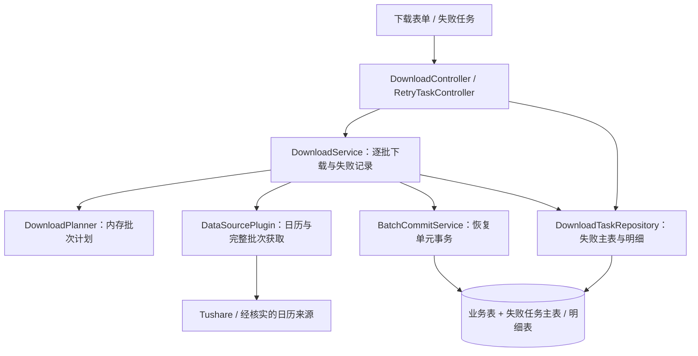

# Tensor 区间下载 TRD

> 增量设计目标：在已登记的 49 个接口中，38 个纳入区间下载设计（其中 19 个需要休市过滤），11 个保留原条件；失败任务与手动重试按这 49 个接口的各自请求方式设计。以上数量表示目标覆盖，不表示当前已实现或真实可用的接口数量。

| 文档信息 | 内容 |
|---|---|
| 文档版本 | v1.10（沿用原文件路径） |
| 文档状态 | 技术评审稿；只记录明确下载失败项，区间下载开始后不可主动终止；不表示功能已实现或外部能力已验证 |
| 编制日期 | 2026-09-08 |
| 上游需求 | [区间下载 BRD](Tensor_区间下载_BRD_v1.0.md)、[区间下载 PRD](Tensor_区间下载_PRD_v1.0.md) 正文 v1.4；请求批次、恢复单元及原始区间展示规则已同步，技术细节见本文 §2、§5、§7 |
| 继承基线 | [平台 TRD](Tensor_多源证券数据平台_TRD_v1.0.md)，未被本增量覆盖的约束继续适用 |
| 代码核对基线 | 当前工作区，HEAD `277fcff`；输入需求文档为当前工作区版本 |
| 技术栈 | Java 21、Spring Boot 3.5.16、Spring JDBC、MySQL 8.4、Flyway；Vue 3.5、Vite 8、Element Plus 2 |
| 部署形态 | 模块化单体、单 JAR、单实例；同步执行，无任务队列及自动重试 |
| 本轮交付 | 同步 BRD／PRD／TRD：复用任务参数 JSON 保留并展示原始下载日期范围，失败明细仍决定重试范围，表结构不变；仅更新文档 |

**本次已确认：** 按用户最新要求，只记录实际执行后明确失败的恢复单元。下载开始前不插入任务记录，首次明确失败时才创建主表及失败明细；重试成功删除对应明细，全部解决后删除主表。子表继续使用时间类型＋字符串，主表任务参数使用 JSON 对象；不保存流程状态、执行计划或每次执行历史。此前的未完成项预登记与中断恢复方案不再采用；未开始项、进程退出前未保存的失败及提交未知均不自动补成失败记录。本版将请求批次与恢复单元分离：可独立判定的股票时间单元分别提交，成功成果保留；无法可靠拆分时仍按完整范围恢复。事务原子性适用于恢复单元，不再要求整个 HTTP 请求共用一个事务。

**执行约束补充：** 区间下载及其失败批次的手动重试一旦开始，不允许用户主动终止；页面离开、刷新、关闭或客户端断连不取消服务端执行。具体执行边界见 §2.4，下载错误记录后继续，存储／提交故障按 §9 处理。

**失败后继续（2026-09-08，用户确认）：** 首次下载及手动重试均遍历本轮全部计划范围；下载失败保存实际恢复范围后继续后续请求，认证、权限、限流、超时等来源错误不提前结束本轮。替代此前来源级错误停止后续请求的规则；数据库不可用、失败记录保存失败或提交未知仍按 §9 处理。

**字段归属：** 主表保存任务标识、插件、接口、JSON 类型的任务参数 `task_params` 及创建／更新时间；其中保存公共条件及首次提交的 `start_date/end_date`，供查询原始下载区间。子表通过任务标识关联，保存失败对象、时间及原因。子表以 `target_type/target_value` 区分单只股票与原请求对象范围；原始日期仅供展示，重试取数范围由失败明细决定，两表结构不变。

## 版本记录

| 版本 | 日期 | 说明 |
|---|---|---|
| v1.0 | 2026-09-07 | 根据 BRD／PRD 正文 v1.1，设计区间规划、日历确认、单元事务、冲突检测、失败任务及中断核对 |
| v1.0.1 | 2026-09-07 | 区分接口登记数量、设计目标、当前实现和真实验收状态；明确 11 个原条件接口的重试边界及 9 项真实验证缺口，不扩大功能范围 |
| v1.0.1 修订 | 2026-09-08 | 按用户要求，仅保留日期输入最多 31 个自然日；删除整轮时长、累计行数、累计响应体限制及关联预算、错误码和验收规则 |
| v1.1 表结构修订 | 2026-09-08 | 按用户要求改为任务主表与关联明细表；明细时间采用类型和字符串，不保存 JSON；写入时机、PENDING 及中断恢复留待讨论，标记依赖旧四表模型的待调整内容 |
| v1.1 批次修订 | 2026-09-08 | 按用户确认改为每批完整下载、校验、批量入库；失败整批恢复，成功批次保留；保留两表结构及当时尚未决定的写入／恢复语义 |
| v1.2 | 2026-09-08 | 曾讨论当前失败和未完成项的预登记、成功原子移除及同任务重试；该存储范围现由 v1.3 替代 |
| v1.3 | 2026-09-08 | 用户改为只记录明确下载失败项；失败时才入表，重试成功删除；移除预登记、未开始项恢复、执行状态／版本及核对协议 |
| v1.4 | 2026-09-08 | 区间下载及其手动重试开始后不可主动终止；明确无终止接口、客户端断连不取消执行及执行槽位释放边界 |
| v1.5（已被纠正） | 2026-09-08 | 曾将非时间请求条件移至失败明细；用户指出缺少抽象，字段归属由 v1.6 替代 |
| v1.6 | 2026-09-08 | 主表以通用任务参数保存公共条件；子表只保存失败时间及原因，两表不包含接口专用条件列 |
| v1.7 | 2026-09-08 | 按用户要求，主表 `task_params` 改用 JSON 对象，空参数为 `{}`；替代此前键值字符串编码方案，子表时间结构不变 |
| v1.8 | 2026-09-08 | 考虑后续单股下载，失败明细增加对象类型和值；唯一键、重试及删除均按对象＋时间定位，保留原批次原子性 |
| v1.8 粒度澄清 | 2026-09-08 | 批量请求也可能定位单股错误；区分 HTTP 获取范围、失败定位与实际恢复范围，对象类型不由请求是否批量决定 |
| v1.9 | 2026-09-08 | 用户确认按实际结果恢复；批量取数可产生多个独立恢复单元，单元内原子提交、失败不撤销其他单元；无可靠细分依据时保留完整恢复范围 |
| v1.9 单日参数映射澄清 | 2026-09-08 | 用户确认单日恢复项保留 DATE，由插件策略生成单日参数或起止相同的范围参数；首次下载与重试复用转换逻辑，表结构不变 |
| v1.9 失败继续修订 | 2026-09-08 | 用户要求全部计划范围均尝试，下载失败保存后继续；替代来源级错误提前停止规则，同步首次及手动重试验收 |
| v1.10 | 2026-09-08 | 用户要求失败任务查询显示原始下载日期范围且不改表结构；在现有 task_params JSON 中保留首次起止日期，重试先提取公共条件再按明细还原精确范围 |

## 1. 目的、范围与现状

### 1.1 文档目的

本文定义请求批次规划、恢复单元提交及两表失败记录。只保存实际下载中明确失败的单元，供用户按原条件手动重试；成功、未开始和执行计划不进入任务存储。

用户已说明后续会支持单只股票下载，本轮将失败模型扩展为“对象＋时间范围＋原因”。已有要求股票代码的接口使用同一模型；新增单股下载入口、股票集合选择方式及各接口的新请求策略留待后续设计，本次不据此改变 49 项目标范围或宣称已支持新功能。

需求优先级为：用户最新确认的仅失败记录、恢复单元及原始区间展示规则 → 区间 BRD／PRD 正文 v1.4 → 本文技术方案 → 平台旧设计。前期 [区间讨论方案](../superpowers/specs/2026-09-07-download-date-ranges-design.md) 中“全部响应合并后整段回滚”的部分已失效，不作为实现依据。

### 1.2 目标范围

下表描述拟实现的技术行为；当前实现差距见 §1.3，数量与可用性口径见 §1.4。

| 目标范围 | 拟实现的技术处理 |
|---|---|
| 19 个交易日期接口 | 先确认全部适用日历；按实际支持的区间或单日请求规划开盘日期批次 |
| 15 个公告日期接口 | 按公告日期语义规划多日或单日批次，不过滤周末和节假日；参数语义缺口先核实 |
| 1 个月份接口 | 按覆盖的完整年月展开，每月一个批次 |
| 3 个原生区间接口 | 原区间及条件作为一个批次，不按天拆分 |
| 11 个保留接口 | 原参数作为一个批次，不新增时间参数 |
| 49 个已登记接口的失败恢复设计 | 按各自恢复策略保存明确失败单元、查看同一失败任务并手动重试；不承诺恢复未执行范围 |

只增加失败恢复所需的记录与界面。不增加定时调度、后台自动下载、自动重试、取消、实时进度、完整下载历史中心、数据编辑、查询筛选能力或新数据源。业务代码继续遵守平台的 Git 能力禁用约束。

### 1.3 已核对的实现及差距

| 位置 | 当前行为 | 本期必要改动 |
|---|---|---|
| `tensor-core/.../download/DownloadService.java` | 一次插件调用、一次适配、一次持久化；空响应直接返回 | 在内存规划请求批次和恢复策略，批量获取后按恢复单元校验、提交；仅明确失败时保存任务 |
| `tensor-core/.../persistence/PersistenceService.java` | `PROPAGATION_REQUIRED`、60 秒事务上限、数据集锁在事务完成后释放 | 复用 JDBC 批量 Upsert 和锁；有失败明细的重试将业务写入、明细删除及必要的主表删除放入同事务 |
| `tensor-core/.../adapter/GenericDatasetAdapter.java` | 单批次相同记录去重；同键不同内容报错 | 在对象／时间归属确认后按恢复单元调用；补充与已提交单元的内存比较，不增加历史指纹表 |
| `tensor-plugin-tushare/.../TushareProPlugin.java` | 从 49 份 Dataset YAML 生成描述符，参数直接交给客户端 | 分离页面区间参数与上游批次参数，提供日历能力和执行策略 |
| `tensor-plugin-tushare/.../client/TushareProClient.java` | 单次 HTTP、单响应体上限；未见逐接口完整性策略 | 增加完整性检查和经核实的分页；保留精确数值解析 |
| `tensor-app/.../web/download/` | 按元数据匹配封闭参数形状，拒绝未知字段 | 增加带 `ts_code`、`exchange_id` 的范围形状，同版迁移旧日期形状 |
| `control-plane/src/composables/useDownloadFlow.js` | 失败后可用原参数重新提交整次下载 | 业务重试使用已有失败任务；网络不明不自动重发或创建失败记录 |
| `control-plane/src/api/http.js` | 每请求生成 `X-Request-Id`，统一等待 130 秒 | 保留现有请求追踪；失败保存后提供 taskId，不增加版本领取或永久幂等协议 |
| Flyway | 生产迁移当前到 V7，验收环境另有 V6 fixture 迁移 | 新增两张失败记录表；保留原有迁移及 49 张业务表 |

上述路径中的 `...` 表示各模块已有的 `src/main/java/com/akkc/tensor/` 包路径。现状核对仅用于设计，不构成已有功能验收。

### 1.4 接口数量与可用性口径

| 数量／状态 | 准确含义 | 不可据此推断 |
|---|---|---|
| 49 个已登记接口 | 当前仓库存在 49 份 Tushare 数据集定义；本设计保留完整接口清单及失败恢复合同 | 49 个均已支持区间下载，或当前账号均可调用 |
| 38 个区间目标接口 | 19 个交易日期＋15 个公告日期＋1 个月份＋3 个原生范围，纳入本次区间设计 | 38 个已完成新区间实现、日历核实或真实验收 |
| 11 个保留原条件接口 | 本次不增加历史区间参数；原条件请求失败时，按整个原请求设计重试 | 因支持失败重试而获得区间能力，或上游本身不存在尚未接入的历史能力 |
| 9 项真实验证缺口 | ISSUE-008 列出的接口维持“不依赖，未解决，用户后续单独处理” | 9 项全部已证实不支持、全部当前不可用，或本次已获准恢复真实调用 |
| 40 项既有真实验收记录 | ISSUE-008 引用的 M14-T09 记录了当时选定 40 个接口按原功能完成验收 | 40 个已通过本次区间、日历过滤或失败任务验收；历史结果也不保证当前账号状态 |

**区间能力、失败重试能力、当前可执行性和真实验证状态分别记录。** 9 项验证缺口跨区间目标及原条件两组，不能用 `49－9` 得出当前支持区间下载的数量。本文没有执行新区间功能验收，不给出“当前已支持 N 个新区间接口”的结论。

11 个接口纳入失败恢复设计，是为了重试它们原有条件下明确失败且已保存的请求，不为它们生成日期区间或按天重试。接口已经明确缺失／禁用、凭证未配置或合同不兼容时，按 §3.2 在业务执行前拒绝；仅有“尚未真实验证”的记录不等于已证实不可用，也不能自动标为验证通过。业务调用中的权限或完整性失败按 §2 保存；业务执行前的辅助日历失败直接返回错误，不创建失败项。

## 2. 已确认的失败记录方案

### 2.1 记录范围与术语

**请求批次**是一次合法来源取数范围，可以含多只股票、多个日期及多页响应。**恢复单元**是可以独立确认完整性、校验、原子提交和按原条件重试的对象＋时间范围；同一请求批次可包含多个恢复单元。

有可靠对象／时间归属、完整性证据及合法单独重试方式时，使用 STOCK＋DATE 或已核实的 STOCK＋RANGE／MONTH／NONE。无法满足这些条件时，整个原请求范围作为一个 REQUEST 恢复单元。单股请求与批量请求均可产生 STOCK 失败项，对象类型不由 HTTP 请求方式决定。

**只记录已实际执行且明确失败的恢复单元。** 下载前不写任务记录；首次明确失败才创建主表及对应明细。同次首次下载的失败归到同一任务，后续重试继续使用该任务。

失败包括来源明确报错、完整性／适配／冲突校验失败及已确认回滚的单元事务。成功、合法空、已确认休市和未开始单元不保存为失败。参数、插件或辅助日历校验在业务执行前失败时直接报错。进程退出、记录未保存及提交未知不自动补成失败，也不承诺恢复全部未执行范围。

### 2.2 执行与重试原则

1. 按合法方式获取当前请求批次的全部页，先验证整体包络、完整性和对象／时间归属，再分别处理恢复单元；不把前几页提前当完整数据入库。
2. 每个独立单元的全部数据校验通过后，在自己的事务中批量写入。局部数据错误或该单元事务已确认回滚时，只保存该单元失败，其他独立单元可继续提交。
3. 已确认提交的单元保留，包括同一个 HTTP 请求中其他股票或日期的成果；不将多个独立单元包进同一个事务。
4. 整体请求失败且没有可靠逐单元结果时，按 §5.2 保存实际受影响的完整范围；不能只保存已发现的某一股而遗漏其他未完整获取或未提交的数据。
5. 局部及来源级下载错误均保存实际失败范围后继续后续单元及请求批次，直到本轮全部计划范围都已尝试；业务调用中的认证、权限、限流、超时等错误不提前结束本轮，不据此预判后续范围失败。不自动重试当前失败请求；数据库不可用、失败记录保存失败或提交未知时停止，不猜测回滚。
6. 手动重试保持已保存单元的对象和时间边界；成功时业务写入、对应明细删除及必要的主表删除同事务。再次失败更新原明细，不生成历史轮次或父子任务。

一个恢复单元只有完整成功或明确失败的确定结果，提交未知单独表达；一个请求批次可以包含已成功、失败或尚未处理的多个单元。“部分完成”按恢复单元汇总，不等同于某个事务部分提交。

“全部计划范围均尝试”沿用日历过滤及现有批次划分，不强制逐日下载或拆小失败范围。单日请求失败记录该日，多日请求失败按 §5.2 记录实际恢复范围，然后继续下一请求；来源错误本身不留下未开始范围。未开始项仅可能来自业务前拒绝、存储／提交故障或进程中断等既有边界。

### 2.3 最小持久化边界

主表保存任务标识、插件、数据接口、任务参数和时间戳；任务参数包含公共条件及用于展示的原始下载起止日期，复用现有 JSON 列。子表保存任务关联、失败对象、时间范围、错误原因及更新时间。公共条件和原始区间在主表保存一次，子表只保存定位失败单元的对象和时间选择器，不复制参数 JSON。不保存执行计划、任务领取版本、请求摘要、执行所有者、成功标记、完整历史或来源响应。正在重试的提示来自当前进程内存，不增加持久执行状态。

查询和浏览器刷新只读取已有失败记录；重启后这些记录仍可查看，但不扫描或补造未开始项、未确认项，也不自动执行任务。已完成后没有记录，不以查不到记录推断某次请求成功。

### 2.4 区间下载开始后不可终止

规则适用于 38 个区间目标接口的首次下载及其失败批次的手动重试，包括只剩单日／单月的重试。服务端完成请求校验、取得执行槽位并接受本轮执行后，即视为开始。

1. 不提供取消、暂停、停止或终止接口，不接受客户端取消标记；不增加 CANCELLED 等执行状态或任务字段。
2. 页面卸载、路由切换、浏览器关闭、客户端请求超时或连接断开不触发下载取消，也不释放执行槽位。服务端在当前进程中继续既有批次循环，不新增任务队列、后台调度或自动重试。
3. 执行槽位只在本轮实际完成或按失败规则结束后释放；响应连接状态不能决定业务执行是否结束。断连后重复请求仍按 §8.2 返回繁忙，不并行启动替代执行。
4. 来源级及局部下载错误记录后继续后续独立单元及批次；数据库不可用、失败记录保存失败或提交未知按 §9 结束。进程崩溃、强制退出等基础设施故障按 §9 的真实记录边界处理，不伪造为用户取消或承诺全部成功。

## 3. 模块与执行流程

### 3.1 模块边界



Core 负责规划、校验、逐批提交和失败记录，插件负责合法来源请求、日历及取全。Controller 只做参数绑定、调用用例及响应转换。复用现有注册、适配、PersistenceService 和 JDBC 批量写入，不引入任务队列或恢复账本。

### 3.2 首次下载

1. 校验插件、接口、参数及 31 天上限，在内存保留首次输入的原始起止日期；确认适用日历，规划合法请求批次及其恢复策略，不插入任务记录。
2. 获取当前请求批次所有页；验证整体协议、完整性及分组依据。未通过时不提交其部分数据，按 §5.2 保存失败范围。
3. 在内存中按可靠对象和时间归属形成单元；逐单元适配、校验和提交。某只股票的数据错误不使已证明独立完整的其他单元失败；无法归属的错误在任何单元提交前按整个请求范围处理。
4. 首次明确失败以短事务创建主表和失败明细，task_params 同时保存公共条件及原始起止日期；后续失败追加同一任务，不改写原始区间。成功单元不写任务记录；失败记录保存未确认则停止。
5. 当前请求批次的单元均已处理，或当前请求的实际失败范围已保存后，继续下一请求批次，直到全部计划范围均尝试；下载错误不跳出外层执行循环。存储／提交故障按 §9 停止；已经取到响应但尚未处理的单元不因进程退出自动登记失败。
6. 返回本次可确认的单元计数、已提交记录数、失败范围和已确认保存的 taskId；未开始范围仅在响应说明。

辅助日历失败时业务调用为零，不创建失败任务；若业务接口本身为 trade_cal，其业务请求失败仍正常记录。

### 3.3 手动重试

1. 取得单实例执行槽位，读取主表及当前失败明细；插件、参数、对象、时间或合法重试方式已不兼容时保留记录并说明原因。
2. 分别获取每个已保存单元的完整数据，校验后在该单元事务内写业务数据并删除对应明细。成功一项不影响其他失败项的存在。
3. 不合并不同失败范围，不从失败页续传，不扩大到此前已提交单元。为减少请求而批量合并重试不是本次必要能力。
4. REQUEST 回退项继续按保存的完整范围作为一个事务单元重试，不在重试中转换成 STOCK 明细或一边提交部分结果一边删除整项；单股 RANGE 同样保留原时间边界。
5. 再次明确失败更新原因并继续下一项，直到本轮读取的失败项全部尝试；来源错误不提前结束重试。最后一项成功时删除主表；存储／提交故障或进程中断前未轮到的项保留原失败信息，提交未知不重插已可能成功删除的项。

例如同任务 A、B 两只股票在 3 日失败，A 成功仅删除 A＋3 日，B 仍保留；不存在的成功项不重建，首次下载中未执行的范围不补造。

## 4. 元数据、参数与批次规划

### 4.1 下载策略与查询定义分离

保留 49 份 Dataset YAML 中的业务列、业务键、查询模式、筛选能力和原上游参数定义。新增插件内资源 `download/tushare-pro-policies.yaml`（拟定路径），以 `apiName` 显式登记下载策略，不从中文名称或任意日期字段猜测能力。

`ApiDescriptor` 扩展 `downloadPolicy`；其 `parameters` 是面向下载调用方的投影。`DatasetDefinition.parameters` 继续描述原批次请求，`queryMode` 继续服务现有查询，不因为页面改为区间就改成通用范围查询。

| 策略字段 | 技术语义 |
|---|---|
| `mode` | `TRADE_DATE_RANGE / ANN_DATE_RANGE / MONTH_RANGE / NATIVE_RANGE / ORIGINAL_PARAMS` |
| `dateSemantic`、`description` | 日期说明及粒度文案；原生语义待核实项不得冒充已确认文案 |
| `sourceRequestMode` | 独立于页面 `mode`：经核实的 `DATE / MONTH / RANGE / NONE` 请求方式；区间能力须同时满足日期语义、附加条件和取全要求 |
| `sourceDateParameter` | 单日方式映射 `trade_date` 或 `ann_date`；月份映射 `month`；区间使用经核实的 `start_date/end_date` |
| `batchPlanning` | 合法请求分组、分页及终止证据；不新增统一每批天数或数据量上限 |
| `recoveryPolicy` | 插件内部登记 STOCK_TIME／REQUEST、对象与时间映射、单元完整性及合法单独重试方式；缺少证据时使用 REQUEST，不从返回列名自动推断 |
| `calendarProfile` | 交易日期接口使用 C-A／C-M／C-S／C-N／C-X 及具体市场解析规则；其他为空 |
| `limits` | 仅包含日期输入上限 `maxRangeDays=31`，供页面展示；11 个原条件接口不适用 |
| `completenessPolicy` | 经核实的分页方式、上限／截断判据、证据引用和核实状态，仅插件内部使用 |

启动时校验策略和数据集一一对应且恰好为 19／15／1／3／11；转换前后的附加参数必须等价。新增策略资源放在数据集加载目录之外，避免被现有 49 份定义加载器误读。

上述校验只证明目标策略登记完整，不证明功能已实现、账号具备权限或日历／完整性证据已核实。`downloadPolicy.mode` 表达设计的请求方式，不作为当前可执行性或真实验收通过的标志。

### 4.2 插件 API 的增量合同

以下为拟实现的内存／插件合同，不是已有能力；批次和候选单元仅在当前执行内存中存在，不保存计划 JSON：

```text
FetchBatch       = sourceParams + recoveryPolicy
RecoverySelector = TargetSelector + TimeSelector
TargetSelector   = STOCK(code) | REQUEST
TimeSelector     = DATE(date) | MONTH(month) | RANGE(startDate, endDate) | NONE
FetchResult      = DownloadEnvelope + 明确的单元失败结果（无则为空）
DownloadContext  = 服务端故障检查，不接收客户端取消信号

DataSourcePlugin.confirmCalendar(apiName, scope, context) -> CalendarDecision
DataSourcePlugin.download(apiName, sourceParams, context) -> FetchResult
```

插件负责完整取数及有来源依据的逐单元结果解释；不能伪造现有 Tushare 接口有逐股状态。没有逐股状态但整体响应完整、数据归属及单元完整性已核实时，Core 可以按元数据分组，并在各单元适配时隔离局部字段错误。列名、行宽及对象／时间归属须先通过整体结构检查，普通业务字段的类型和值按单元校验。

包络保留整个请求批次的原始参数，不以最后一页 offset 替代；Core 先核对来源身份和请求范围，再形成独立单元，不能要求批量包络的参数等于每个单股单元的参数。当前 GenericDatasetAdapter 及持久化逻辑按单元调用，不能先整体适配、遇一行错误就放弃其他可独立单元。

非交易日期接口不确认日历；默认不支持的日历能力明确报未确认。实施时同版迁移 Tushare、fixture 和测试插件，不新增旧二进制 SPI 适配层。

### 4.3 HTTP 参数绑定与迁移

- HTTP 外层继续使用 `pluginId`、`apiName`、`params`。参数名保持蛇形，外层 DTO 保持驼峰。
- 38 个接口要求 `start_date/end_date`；19 个旧 `trade_date`、15 个旧 `ann_date` 和月度旧 `month` 在 HTTP 层明确拒绝，混用同样拒绝。
- `DownloadParameters`／`ParameterCodec` 补充 `TsCodeDateRangeParameters`、`ExchangeIdDateRangeParameters`；复用已有普通范围及 `exchange` 范围形状。
- 参数形状匹配使用投影后的 `ApiDescriptor`。不能只改 Vue 表单而保留旧的服务器绑定逻辑。
- `ParameterValidator` 继续严格公历校验、未知参数拒绝、必填及枚举校验；增加包含两端的天数上限。缺日期不使用默认值。
- 使用 `LocalDate`／`YearMonth`，不转换为 UTC 时间戳；前端继续以字符串显示／编码，避免时区偏移。
- 股票代码规范化后冻结，交易所等附加条件原样保留；重试不能添加用户可编辑的 `params`。

### 4.4 批次规划规则

| 页面模式 | 输入范围与批次规划 | 上游请求方式 |
|---|---|---|
| `TRADE_DATE_RANGE` | 先确认日历并排除休市；日期语义、条件及取全方式已核实时优先多日批次，否则使用经核实的单日方式 | 合法 `start_date/end_date` 或 `trade_date`，保留市场等附加条件 |
| `ANN_DATE_RANGE` | 按自然日期覆盖完整公告范围；支持公告区间且条件满足时优先多日，不过滤周末 | 合法公告 `start_date/end_date` 或 `ann_date`；报告期／解禁日期不能替代公告日期 |
| `MONTH_RANGE` | 覆盖的每个完整年月一批，年月去重 | `month=YYYYMM` |
| `NATIVE_RANGE` | 原完整区间及全部附加条件为一批 | 原 `start_date/end_date` |
| `ORIGINAL_PARAMS` | 原条件请求为一批，不扩充日期能力 | 全部原参数；无参数接口为 `{}` |

规划以 [官方能力调研](../research/2026-09-08-tushare-range-batch-research.md) 为依据，逐接口选择满足当前条件的来源方式，不能把页面分类直接当作上游能力：

1. 优先选择可证明完整获取的原范围；因已核实的上游限制、合法分段或日历空档需要时，在请求前划批。没有统一每批天数、行数、字节或时长上限。
2. 交易日期范围须精确覆盖应下载日，不把休市空档重新包进业务范围请求；可按连续开盘日期片段规划。不能用最早和最晚失败日期合并不同失败批次。
3. `top_list/top_inst/dividend/disclosure_date` 当前公开合同没有对应多日参数，按合法单日请求组批；`broker_recommend` 按单月。全市场 `daily` 等须同时核实选择条件和截断，支持起止参数不保证全市场多日一次取全。
4. `fina_indicator/fina_mainbz/top10_holders/top10_floatholders` 的区间是报告期，`share_float` 是解禁日期；不能机械透传公告区间。`fina_mainbz` 的公告参数及部分接口缺少股票条件的问题先解决；无已核实合法方式时明确不可执行，不猜参数、不换 VIP 接口。
5. 按对象和时间联合检查批次覆盖，确保不重叠、无遗漏、顺序稳定；不同股票可以覆盖相同日期。业务请求前冻结对象及时间范围，失败不自动拆成更小批次或从失败页续传。请求方式或合同不兼容时说明原因，不悄悄改写任务条件。

输入上限先于过滤和月份展开。`20260131～20260302` 共 31 天，月度批次为 `202601、202602、202603`；单日月份输入仍覆盖整月。合法分批不能用来接受超过 31 个自然日的首次日期输入。

请求批次的时间分段仍遵守上表；事务和失败隔离按 §2.1 的恢复单元执行。STOCK_TIME 仅在对象和时间可可靠归属、每个单元可证明完整且可合法单独重试时启用。例如批量获取 A、B、C 的同日数据，B 有局部错误，A／C 可分别完整提交，失败表仅保留 B＋该日。

恢复单元可为单股单日、单股时间范围，或完整 REQUEST；不能把周线／月线、公告与报告期强制拆成股票与自然日的笛卡尔积。返回中少一只股票或少一天不自动代表失败，须区分合法空与已证实缺失。

已保存明细的对象、时间边界在重试中冻结。重新确认日历时可以在原范围内请求有效片段，全部片段仍在原单元事务提交；整项已确认休市可移除。当前记录不包含对象范围动态拆分、REQUEST 转为 STOCK 的恢复协议。

## 5. 日历与上游完整性

### 5.1 日历确认

日历适用关系以 PRD §4.2 及附录 A.1 为需求登记；具体来源和业务等价关系仍需证据。实现不得将 C-A 固定为 SSE，或将 C-N／C-X 固定为港股普通交易日历。

| 类别 | 本期解析要求 |
|---|---|
| C-A | 策略登记接口实际覆盖市场，取这些市场的开盘并集；SSE／SZSE／BSE 覆盖逐项核实 |
| C-M | 根据冻结的 `exchange_id` 解析相应市场及融资融券业务规则 |
| C-S | 使用经确认的转融通业务日历；只有证据证明等价才能复用境内交易所日历 |
| C-N | 解析接口实际覆盖的互联互通方向，按相应业务开盘并集判断 |
| C-X | 分别确认资金流接口覆盖的互联互通方向，不能因一个方向休市跳过全部业务 |

确认流程：

1. 在接受本轮之后、业务请求之前，解析全部必要市场／业务身份。
2. 通过原插件内部日历提供器获取该轮日期的权威安排；可用经核实的 Tushare `trade_cal`，其他正式来源适配留在插件内部。
3. 校验每个必要来源对每个候选日期都有有效结论，市场身份正确，标识只为有效开／闭市值；相同来源重复且一致可去重，冲突失败。
4. 所有必要日历均已确认后，日期只要有一个适用市场开盘就保留；全部明确休市才跳过。
5. 日历来源、适用市场及逐日结论仅在本次内存中供规划校验使用，不写入失败表。首次日历确认失败直接返回错误；已有失败任务重试时重新确认其对应日历。

本期不跨次执行缓存，也不要求用户先下载 `trade_cal`。本次同一来源可复用；重试同一任务时重新确认。非连续失败日按连续片段或来源支持的精确查询读取日历；来源只能返回较宽范围时仅使用任务日期，绝不产生任务外业务请求或批次。

任一必要来源缺失、空、冲突、覆盖不足或不能确认新鲜度，返回 CALENDAR_UNCONFIRMED，业务请求为零，不新建整段日期的失败任务。已有失败任务的明细保留原样，不根据不完整日历删除其中部分日期；页面说明本次日历检查失败，不显示“31 天下载失败”。

来源适用性未核实时返回 `CALENDAR_UNCONFIRMED`，不能猜测交易所替代。接口仍可展示；相关业务可用性及 19 项正式验收须等待 §13 证据关闭。原生 `trade_cal` 下载不经过上述屏障，保留开盘和休市行。

### 5.2 请求完整性与单元隔离

每个接口分别登记整体协议、来源状态、合法分页／截断判据、对象和时间映射、单元完整性及单独重试证据。接口有 ts_code 和日期列本身不足以开启独立恢复；无需单股请求能力的原条件接口仍使用 REQUEST。

1. 取完当前请求所有已知页／合法子请求，验证身份、字段、行宽、整体范围和所有行的归属。游标重复、总数矛盾、后续页失败、不可证明取全的上限响应均不提交该请求的部分数据。只对经核实支持的接口发送分页参数。
2. 整体检查完成后，按 recoveryPolicy 划分候选单元。每个业务键必须唯一归属一个单元；无法解析股票／日期、记录越界或归属冲突影响整个请求，须在任何单元提交前拦截。
3. 在能可靠归属且覆盖完整的情况下，某单元的业务字段错误、同键不同内容或来源明确的单元失败仅影响该单元；其余单元分别校验和提交。缺少逐股状态不妨碍隔离本地数据错误，但不能据此编造来源逐股状态。
4. 若整体来源调用失败，且已明确该请求由哪些合法独立 STOCK 单元组成，则这些实际受影响单元分别记录“请求失败，未获取完整数据”；这表示共同请求失败，不声称各股票各自发生来源业务错误。没有可靠成员集合时，保存一条完整 REQUEST＋时间，不猜测证券清单。
5. REQUEST 回退范围必须能由主表公共参数及该条时间完整重建；策略不得创建既无法逐单元恢复、又无法用该结构恢复的对象子集请求。整批回退只能发生在该请求尚无单元提交时，不能将已提交单元再包进 REQUEST 失败项。
6. 缺少完整性或独立重试证据时使用完整 REQUEST 单元，按完整数据校验和单事务处理；明确的局部错误可写入原因，但不得只记录该股票而遗漏同单元其他未提交数据。已知截断使用 SOURCE_TRUNCATED，完整性无法判定使用 SOURCE_COMPLETENESS_UNCONFIRMED，不以 HTTP 200 作为完整成功证据。

当前请求的单元处理完毕或实际失败范围已保存后，继续下一请求批次；存储／提交故障按 §9 处理。合法空须通过相应整体及单元检查，不能凭缺少记录直接报空或失败。`new_share`、`namechange` 等时间语义仍按 PRD VER-01 核实，本节不升级外部能力结论。

## 6. 数据校验、重复与计数

### 6.1 规范化及比较

使用现有适配结果和 `BusinessKeyExtractor` 定义业务键，不改变现有复合键或指纹业务键。新增内容指纹针对**全部持久化业务列**，排除 `ingested_at`、来源审计列及派生 `business_key`。

按元数据列顺序进行带类型、空值标记及长度前缀的确定性编码。日期用公历日期；整数用十进制；小数按已声明数据库精度／尺度规范化，不能用浮点；字符串保持适配后的业务值。为新内容编码设置版本，避免 Java Map 顺序、JSON 数字格式或 `BigDecimal` 尺度差异造成假冲突。不得为新内容指纹顺带修改现有业务键编码。

当前恢复单元内相同键使用规范业务内容精确比较；本次执行已提交键的内存索引保留规范键表示、SHA-256 内容摘要及编码版本，用于与后续批比较。只在事务提交确认后加入索引，不保留此前完整业务行。SHA-256 碰撞属于该摘要方案的理论边界。内存索引随执行结束释放，不持久保存成功内容；跨次重试的规则见 §6.3。

### 6.2 同一次执行：恢复单元校验

1. 整体请求完成 §5.2 检查后，逐恢复单元适配；同单元完全相同记录去重，同键不同内容使该单元失败。
2. 与本次执行已提交键的内存索引比较；相同内容不重复写，冲突只使当前单元 DATA_CONFLICT，不撤销此前提交单元。
3. 单元全部 SQL 在单个事务中执行；只有提交确认后才加入已提交键索引并更新 R／I／U。确认回滚的单元不加入索引，也不作为其他单元的成功依据。
4. 局部适配或写库失败继续后续独立单元；连接不可用、失败记录未确认或提交未知时停止。整体分页或归属失败不得绕过 §5.2 将部分数据先提交。

同一次 HTTP 响应中的 A、B、C 三个独立单元，B 校验失败时可提交 A、C，只记录 B；若 A、B、C 同属一个 REQUEST 单元，则 B 的错误使整个单元失败。两种情况由已核实恢复策略决定。

### 6.3 已有数据与跨次重试

本简化方案复用现有 PersistenceService 的 Upsert 行为，不新增跨次成功内容指纹或基于历史执行的冲突检查。不同执行之间的同键数据按现有业务唯一键及更新规则处理；失败任务只保存重试所需条件，不能作为先前成功内容的证明。同一次执行内的单元间校验仍按 §6.2 使用内存索引。

### 6.4 本次响应与当前剩余项

本次响应按恢复单元统计已完成、明确失败及未开始项；HTTP 请求数可供诊断，不代替成功／失败项数。独立单股日期为一项，完整 REQUEST 或单股 RANGE 也各为一项，不按返回行数或覆盖天数拆算。

R 为本轮已确认完成单元的完整来源行数，I／U 为数据库确认提交的实际新增／更新数；失败单元收到的部分行不计成功返回数。只在该单元事务提交确认后更新，不能用 SQL 分组大小或查询全表数量推算。重试仅统计本轮，不累加上轮结果。

同一请求内 A、C 成功、B 失败可显示已完成 2 项、失败 1 项及 A／C 的 R／I／U。尚无法确定单元集合时显示实际范围，不虚报单元总数；提交未知时不填零或以失败明细倒推成功数。

任务查询返回主表保存的原始下载区间及当前失败项，不保存历史成功统计或未开始明细。原始区间只说明首次输入；刷新和重启后不能据此还原缺失执行范围及本轮计数，查不到记录也不证明未收到响应的请求成功。

## 7. 失败任务的数据模型与事务

### 7.1 两张表

主表描述“这是什么下载任务”，包含任务身份、插件、接口、公共条件及原始下载日期范围；子表描述“哪个下载对象、哪些时间失败了、为什么失败”。一条主表对应多条失败明细，可以区分同一天不同股票的失败。同一次下载的多个失败恢复单元聚合到一个任务；不同首次请求不因插件或条件相同而合并。

使用现有 MySQL、InnoDB、utf8mb4_0900_as_cs；UUID 为 CHAR(36)，时间戳为 UTC DATETIME(3)。主表任务参数使用 MySQL JSON 类型，子表时间继续使用类型和字符串；两表均不保存待处理计划。

#### 7.1.1 主表 `tensor_download_task`

| 字段 | 类型／可空性 | 含义 |
|---|---|---|
| `task_id` | `CHAR(36) NOT NULL` | 任务 UUID，主键；首次明确失败时创建 |
| `plugin_id` | `VARCHAR(64) NOT NULL` | 插件标识 |
| `api_name` | `VARCHAR(64) NOT NULL` | 数据接口标识，与插件共同确定数据种类 |
| `task_params` | `JSON NOT NULL` | 公共请求条件及首次提交的原始 `start_date/end_date`；不含子表承载的股票选择器及当前失败时间；无公共条件且无原始日期时写入 `{}` |
| `created_at` | `DATETIME(3) NOT NULL` | 首次保存失败任务的时间 |
| `updated_at` | `DATETIME(3) NOT NULL` | 最近失败记录或重试更新的时间 |

完整请求通过接口元数据校验并规范化后，按接口策略分离公共条件、对象和时间。公共条件及首次区间输入保存为 `task_params`，首次保存后保持不变；STOCK 恢复单元的股票代码仅保存为子表 `target_value`，不在主表重复保存 `ts_code`。子表时间字段表达当前失败单元的日期、月份或范围；主表起止日期表达首次下载范围，两者用途不同。REQUEST 恢复单元保留主表中确定原对象范围的公共条件，例如交易所；它不表示忽略条件后下载全市场。分页位置、凭证和执行状态不进入任务参数。插件／数据名称从元数据读取，元数据已不存在时仍显示保存的标识。

原始起止日期复用 `task_params` 中的 `start_date/end_date` 键，均为首次提交并通过校验的 `YYYYMMDD` 字符串，不新增数据库列、表、索引或迁移。原值在日历过滤及月份展开前冻结，并于首次明确失败时随主表保存；后续失败、重试及部分成功不得覆盖。38 个区间接口新建的失败任务必须保存两端，11 个原条件接口不增加这两个键。

查询分别返回和展示“原始下载区间”及从明细读取的“当前失败范围”。例如 `task_params={"exchange_id":"SSE","start_date":"20260901","end_date":"20260910"}`，仅 3、7 日失败时原始区间仍为 1～10 日。重试必须先从内存副本移除这两个展示键，再按明细重建实际时间参数；不能把整个 task_params 直接传给插件。完整 REQUEST 失败项仍通过子表保存其实际恢复时间，不能用主表展示区间代替。

`task_params` 必须为 JSON 对象，无公共条件的区间任务仍保存两个原始日期键；公共条件和原始日期均无时使用 `{}`，未提供的可选参数不写入。Java 使用 `Map<String, Object>` 和现有 JSON 序列化能力读写，通过 JDBC 绑定参数持久化；禁止将 JSON 再包成字符串保存。拒绝非法 JSON、重复键和非对象根值（包括 JSON null）；区间任务的展示日期单独按首次输入规则校验，公共参数按合法字段及类型校验，组合后的恢复请求再校验必填和枚举，不能因 `ts_code` 已移至对象选择器而判主表缺少必填参数。按键值含义还原参数，不依赖 JSON 键顺序或文本格式。

例如区间任务使用 `{"exchange_id":"SSE","start_date":"20260901","end_date":"20260910"}`，原条件任务使用 `{"list_status":"L"}`。任务存储层只读写通用 JSON 对象，公共条件、展示日期及重试时间参数映射由下载策略解释；新增合法接口参数无需修改两表结构，也不新增参数表。

不保存 status、version、request_hash 或 contract_version。主表存在就表示仍有失败项；“正在重试”由内存中的当前执行情况计算。主键为 task_id，列表索引为 `(updated_at, task_id)`，插件与接口不设唯一约束。

#### 7.1.2 子表 `tensor_download_task_item`

| 字段 | 类型／可空性 | 含义 |
|---|---|---|
| `task_id` | `CHAR(36) NOT NULL` | 外键，关联 `tensor_download_task.task_id` |
| `target_type` | `VARCHAR(16) NOT NULL` | STOCK：单只股票的独立恢复范围；REQUEST：主表条件确定的原恢复单元对象范围，选择规则见 §4.4 |
| `target_value` | `VARCHAR(64) NOT NULL` | STOCK 为规范股票代码，如 `000001.SZ`；REQUEST 使用空字符串 |
| `time_type` | `VARCHAR(16) NOT NULL` | DATE、MONTH、RANGE、NONE |
| `time_value` | `VARCHAR(64) NOT NULL` | 失败恢复单元的规范时间字符串；NONE 使用空字符串 |
| `error_code` | `VARCHAR(64) NOT NULL` | 最近一次明确失败的错误码 |
| `error_message` | `VARCHAR(512) NOT NULL` | 可展示的安全失败原因 |
| `updated_at` | `DATETIME(3) NOT NULL` | 最近更新时间 |

联合主键为 `(task_id, target_type, target_value, time_type, time_value)`，保证同任务同对象同时间恢复单元唯一；无需额外 unit_key。REQUEST 的对象值和 NONE 的时间值均用空字符串参与主键，不用 SQL NULL。错误更新和成功删除必须按完整主键定位，不能只按任务和日期操作。外键不级联删除，应用在同事务中删除最后一项及主表。

子表不复制插件、接口或公共参数，通过 `task_id` 关联主任务。对象和时间字段共同标识失败范围，错误字段描述失败原因，`updated_at` 记录原因的最近更新时间。STOCK 必须为接口支持的单只规范股票代码，不接受空值或逗号拼接多股；REQUEST 必须为空值，不向来源传递 REQUEST 字面量。未知对象类型或不兼容的对象／接口组合拒绝执行。

明细没有 status：记录存在即表示曾明确失败且尚未通过后续成功处理移除。不使用 PENDING、UNPLANNED 或 UNCONFIRMED，也不预先插入空错误记录。重试期间仍保留原失败原因，直到本单元明确成功删除或再次失败更新。

#### 7.1.3 时间类型与解析

| time_type | time_value 示例 | 规则 |
|---|---|---|
| DATE | `2026-09-03` | 严格解析 LocalDate；上游单日方式映射为 `trade_date` 或 `ann_date`，上游区间方式映射为起止相同的 `start_date/end_date`，均按已核实接口策略生成 |
| MONTH | `2026-09` | 严格解析 YearMonth，来源 month 为 YYYYMM |
| RANGE | `2026-09-04/2026-09-06` | 解析两个日期并校验顺序；保存一个完整失败恢复单元，不推测内部失败日 |
| NONE | 空字符串 | 无时间参数，按主表公共参数及对象选择器重试；REQUEST 且无公共参数时使用空参数集 |

Java 使用对象／时间类型枚举和 String。拒绝未知类型、非法日期、非规范字符串，以及当前来源策略不支持的请求形状。重试读取主表 `task_params` JSON 对象，先在内存副本中提取并移除仅供展示的原始 `start_date/end_date`，得到公共条件；再按接口策略补入 STOCK 的股票参数及明细时间参数，REQUEST 不补入股票参数。组合后校验完整请求，使用主表插件／接口发起原恢复单元请求。原始区间与明细范围不同属于正常情况；其余公共参数与选择器冲突时拒绝，不能静默覆盖。不回写恢复单元对象或时间到 task_params，不增加无效条件、不更换插件。月份单元仍按完整月份恢复，不能被展示用的原始日期裁剪。

多日恢复单元使用 RANGE，单日恢复单元使用 DATE；是否能按区间获取由合法参数、日期语义及取全证据决定。时间字符串不承载任意其他参数。

时间类型表达恢复范围，上游参数形状由插件策略决定。首次下载与手动重试复用插件内同一参数转换逻辑，将公共条件、对象和时间选择器组合为合法来源参数；DATE 不要求上游支持单日期参数，也不改变原接口的日期含义。

例如 `trade_cal` 的 `task_params={"exchange":"SSE","start_date":"20260903","end_date":"20260903"}`、`REQUEST＋DATE=2026-09-03`，先提取公共条件 `exchange=SSE`，再由明细还原为 `exchange=SSE, start_date=20260903, end_date=20260903`。`new_share/namechange` 的单日恢复同样使用起止相同的范围参数，不生成 `trade_date/ann_date`，也不为此增加字段或修改表结构。

#### 7.1.4 多天失败示例

假设 `margin` 按已核实的一天一批方式下载 1～10 日，市场条件为 `exchange_id=SSE`，仅 3 日和 7 日明确失败。第一次失败时创建 T1（UUID 的简写），主表保存插件、`api_name=margin`、`task_params={"exchange_id":"SSE","start_date":"20260901","end_date":"20260910"}` 及时间戳；子表只有以下两条失败明细，下表省略错误码和更新时间：

| task_id | target_type | target_value | time_type | time_value | error_message |
|---|---|---|---|---|---|
| T1 | REQUEST | 空字符串 | DATE | 2026-09-03 | 请求超时 |
| T1 | REQUEST | 空字符串 | DATE | 2026-09-07 | 返回数据不完整 |

没有成功日和未开始日的明细。查询显示原始下载区间 1～10 日、当前失败 3 日与 7 日；3 日重试成功后原始区间不变，只剩 7 日明细。重试只请求 3 日与 7 日，不能扩大成 3～7 日或原始 1～10 日；单日来源请求只带 exchange_id 和对应 trade_date，不带主表原始起止日期。若一个 4～6 日的多日恢复单元失败，则保存一条 RANGE 明细，整个恢复单元重新获取，不拆成三个失败日。

后续单股请求能力接入后，某任务 T2 首次下载 1～10 日并按股票分别提交恢复单元，以下两条失败可以属于同一任务；没有其他公共条件时，task_params 为 `{"start_date":"20260901","end_date":"20260910"}`，提取后的公共条件为 `{}`。此例仅说明模型，不表示已实现多股选择入口：

| task_id | target_type | target_value | time_type | time_value | error_message |
|---|---|---|---|---|---|
| T2 | STOCK | 000001.SZ | DATE | 2026-09-03 | 请求超时 |
| T2 | STOCK | 600000.SH | DATE | 2026-09-03 | 返回数据不完整 |

第一只股票重试成功只删除第一条，第二条保留。若第二只股票的 4～6 日作为一个事务恢复单元失败，记录 `STOCK / 600000.SH / RANGE / 2026-09-04/2026-09-06`，重试仍保留该股票及完整时间范围。

### 7.2 失败记录的写入规则

- 首次下载开始时两表均不写入；同次请求的 taskId 只在首次失败时生成，并在内存中用于关联后续失败。
- 首次明确失败以一个事务插入主表和明细，主表 task_params 同时保存公共条件及首次原始起止日期，避免无明细主表或无主表明细；后续追加和重试保持 task_params 不变。
- 后续明确失败关联同一任务；已存在的同对象、同时间明细更新原因，不重复插入；不同股票同一天失败分别保存。
- 仅在失败记录事务提交确认后，才向客户端表示该失败项已保存。保存失败则返回记录失败信息并停止后续执行，不转用文件或新表补记。
- 重试始终复用原任务，不创建每次执行记录或父子任务。

### 7.3 业务与重试删除的事务

首次下载的成功恢复单元直接复用 PersistenceService 批量入库，不写任务表。已经存在失败明细的恢复单元重试成功时，在一个事务中完成：

1. 锁定该任务主表并确认当前失败明细仍存在。
2. 执行当前恢复单元的全部业务 Upsert。
3. 删除对应明细；若再无明细则删除主表，否则更新主表更新时间。
4. 提交确认后更新本次内存计数，再处理下一个恢复单元。

合法空恢复单元也删除对应失败明细，不删除旧业务数据；适用日历已完整确认原失败范围全部休市时，可在事务中移除该项。日历无法完整确认时保留已有失败记录。

下载循环不持有覆盖多个单元的外层事务；每个恢复单元单独开启 TransactionTemplate 事务，提交／回滚结束后再处理下一单元。失败原因在已确认回滚后以独立短事务保存。

BatchCommitService 可用 TransactionTemplate 使现有 PersistenceService.persist 加入同一事务；业务写入和明细删除必须使用同一事务管理器及连接，不能用 REQUIRES_NEW 分开提交。复用数据集锁，重试时固定先锁任务再取数据集锁；所有锁持续至事务完成。

复用 GenericUpsertRepository 的 JdbcTemplate.batchUpdate。batchSize 仅表示 SQL 分组大小，任一分组或明细删除失败须将当前恢复单元的全部写入回滚，之前已提交的其他恢复单元保留。只有确认回滚后才把本次数据库失败作为明确失败更新原因。

### 7.4 生命周期

表内只保留尚未解决的明确失败记录。重试成功逐项删除，最后一项解决后主表一起删除；不保留成功状态、统计快照或历史任务。正在重试的提示只来自进程内存，进程结束后无需修复持久 RUNNING 状态。

## 8. HTTP 与前端

### 8.1 接口

统一前缀为 /api/v1。以下为拟调整设计，本次不修改运行接口和 OpenAPI。

| 方法与路径 | 行为 |
|---|---|
| POST /downloads | 按原请求同步下载；仅明确失败时保存失败任务，响应带已确认保存的 taskId |
| GET /retry-tasks | 按插件、接口及分页查询当前失败任务；每项包含原始下载区间和当前失败范围摘要 |
| GET /retry-tasks/{taskId} | 返回主任务信息（任务参数为 JSON 对象）、原始下载区间及失败对象、时间、原因列表；子项不重复公共参数，不包含未开始明细或历史成功计数 |
| POST /retry-tasks/{taskId}/execute | 空请求体，手动重试当前仍存在的失败明细；不接收替换范围或条件 |

不提供执行计划查询、历史轮次、父子任务或中断核对端点。不新增 Idempotency-Key、If-Match 或版本领取协议；X-Request-Id 沿用现有 HTTP 追踪规则，不作业务去重凭据。

列表项和详情均提供 `originalDateRange`：从 task_params 中的原始日期派生 `{startDate:"20260901", endDate:"20260910"}`，不是数据库新列。没有原始日期时为 null；11 个原条件接口显示“不适用”，区间任务缺少原始日期时显示“未记录”，不使用失败日期首尾值或当前表单补造。旧记录缺少两端时不影响按失败明细重试；已有日期若只缺一端或格式非法，则按任务参数无效保留记录并拒绝执行。

区间下载开始后不提供取消、暂停、停止或终止端点；客户端断连的执行与槽位规则见 §2.4。

列表页码从 1 开始，pageSize 为 20／50／100，默认 20，按 updated_at DESC、task_id DESC 排序。服务端校验筛选及分页；插件下线不隐藏已经保存的失败标识。详情可返回由当前进程计算的 retrying 和 canExecute，不保存为数据库字段。

### 8.2 重复操作边界

延续单实例同步执行，使用进程内下载槽位阻止并发执行；请求繁忙返回 409，不排队。前端执行中禁用重复点击，服务端在取得槽位后重新读取失败明细；已经不存在的任务返回 404，不按旧请求创建新的重试任务。

不承诺跨重启或延迟重放的永久幂等。首次 POST 不因网络超时自动重发；再次主动提交原条件属于独立下载。重试只读取数据库当时仍存在的失败项，不恢复已删除项。

### 8.3 结果与页面

- 正常同步响应展示本次已完成／失败恢复单元数、确认提交的返回／新增／更新行数，以及已保存的失败任务入口。
- 未开始的范围可以作为本次停止说明展示，但不写入任务表，也不在刷新后承诺找回。
- 多恢复单元可以汇总为部分完成；一个恢复单元始终完整提交或完整失败，未知提交单独说明。
- 全部成功的首次下载不创建任务；已有失败任务全部重试成功则从列表移除。
- GET 展示任务保存的原始下载区间及当前失败记录，不重放历史成功计数，也不从原始区间推算未开始或成功日期。查不到任务不代表某次未收到响应的下载必然成功。
- HTTP 通信失败不等于服务端下载失败；页面提示结果未确认，不据此新建失败任务或自动重试。
- 区间下载提交前提示“区间下载开始后不可终止。”，执行中提示“区间下载已开始，不可终止，请等待结果。”；不提供主动终止入口，页面离开不取消服务端执行。
- 保留“发起下载／失败任务”页签及已有数据查看页；任务列表和详情显示固定的“原始下载区间”，另列“当前失败范围”。失败明细展示对象、时间和原因，STOCK 显示股票代码，REQUEST 结合主表公共条件显示其恢复范围，不将不同股票同一天的失败折叠成一项；不新增进度、历史或核对界面。
- 手动重试不加确认弹窗，插件或参数当前不可执行时保留原记录并说明原因；不编辑原任务、不扩大范围。

明确部分恢复单元失败且记录可靠保存时，可以返回 200 的结构化业务结果；记录保存失败或数据库提交未知时返回错误，不声称失败任务已完整保存。任务不存在为 404，执行槽位忙为 409；其他参数、插件及来源错误沿用现有错误映射并增加安全说明。

## 9. 中断及记录失败的边界

### 9.1 不提供未开始项恢复

失败表是在实际失败后写入的，无法还原没有记录的执行过程。以下情况不自动创建明细：

- 尚未调用来源的恢复单元。
- 参数、插件或辅助日历检查未通过而没有开始业务下载的范围。
- 进程突然退出时正在处理但未形成明确失败的恢复单元。
- 已发现失败、但退出前尚未成功保存失败记录的恢复单元。
- 数据库提交结果不明，无法确认该批成功或回滚的情况。

这些是只记录明确失败项的保留边界，不通过预登记、后台补偿、启动扫描或新增账本恢复。已经成功保存的失败记录在重启后仍可查看并手动重试。

### 9.2 已有失败项的重试中断

重试期间原失败明细一直保留，直到业务写入与明细删除同事务提交。事务回滚则原失败记录仍在；事务提交则对应记录删除。即使本次响应丢失，也不能按客户端异常重新插入一个已成功删除的失败项。

提交结果不明时停止后续恢复单元，不立即把它当成数据库失败更新原因。数据库重新可用后，列表显示实际仍存在的失败记录；不从当前业务表猜测历史结果，也不承诺重建本次精确计数。

### 9.3 保存失败

首次失败记录的主表与明细同事务提交；失败则不留下半条任务结构。已有任务追加失败项或更新原因失败时，之前已保存的记录保留，但最新失败可能未被记录。

服务应返回“失败记录保存未确认”等明确说明，并沿用现有安全日志记录诊断；不宣称完整保存、不撤销此前已成功业务恢复单元，也不增加文件备份、自动补记或恢复队列。

## 10. 日期输入上限、性能与安全

### 10.1 限制方案

按用户确认，执行限制仅保留日期输入最多 31 个自然日。

| 配置／口径 | 38 个区间接口确认值 | 实施规则 |
|---|---:|---|
| `maxRangeDays` | 31 | 包含两端，首次接受前校验，月份扩展前计算；任务精确范围不得新增日期 |

恰好 31 天允许提交，32 天在接受前拒绝；11 个保留原条件的接口不套用日期输入上限。上游分页及完整性判断继续按 §5.2 执行。

每次重试保持公共条件及失败恢复单元的对象、时间边界；仅成功或完整确认休市后移除对应失败明细，不人工裁剪或扩大。当前请求形状或条件不可执行时拒绝重试。页面日期输入上限来自服务端策略，不能把数字写死在 Vue。

### 10.2 执行与性能

- 来源网络超时按 §2.2 保存当前实际失败范围后继续后续请求；数据库超时按事务结果处理，提交未知时停止，不按客户端等待结果推断业务回滚，不新建未确认的失败记录。
- 只缓冲当前请求批次的完整响应及其恢复单元数据，按单元处理后释放无用候选行，请求批次处理结束后释放原响应；本轮另保留已提交键及内容摘要索引供后续比较。用多日多页、单日高数据量、宽表和重复数据测量内存峰值及耗时，不汇总整轮完整数据。
- 恢复单元锁及数据库事务不能覆盖上游 HTTP；候选阶段也不占数据集写锁。现有只读查询继续可用。

### 10.3 安全与运维

两表只保存白名单公共条件、原始下载起止日期、插件身份、失败对象及时间范围、错误码及安全原因。已提交键摘要和日历证据仅在当前执行内存中使用；不保存 Token、密码、Authorization、来源响应或堆栈。重试读取原插件当前凭证。

沿用现有安全运行日志，以 requestId、存在时的 taskId、恢复单元类型及错误码定位问题；不输出来源响应，不把日志作为自动恢复数据库。指标保持低基数，不新增监控页面。

失败记录表仍位于受信内部部署边界，HTTP 继承现有访问控制及安全头，不新增用户认证系统。所有 SQL 标识符仍来自启动校验过的元数据，用户条件只作为绑定参数。失败任务页与只读查询不暴露配置路径或数据库诊断。

## 11. 迁移与发布

1. 实施时同步下载／失败任务接口、[OpenAPI](../contracts/openapi-v1.yaml)、[错误说明](../contracts/error-codes.md)、fixture、前端 DTO、[README](../../README.md) 和运行说明。
2. Flyway 只新增两张失败记录表，实施时确认迁移版本；保留既有迁移、49 张业务表及业务唯一键。
3. 延续单实例部署，切换版本前停止接收新执行，等待已开始的区间下载按正常或失败规则结束后再停旧进程；不主动终止区间下载，不新增启动任务扫描或中断恢复流程。
4. 验证明确失败才入表、多批失败关联、重试成功原子删除，以及记录保存失败时的真实提示。
5. 回退时保留已保存失败任务和业务数据；旧版本不能读取失败任务时明确这一限制，不做破坏性表删除。

本方案不保存策略历史版本。发布时应保持已有失败时间类型和条件的语义；当前接口已经不支持保存的形状或条件时拒绝重试，不能静默更换接口或重新解释日期。

## 12. 验证设计与需求追踪

### 12.1 验证范围

| 层次 | 关键证据 |
|---|---|
| 单元测试 | 49 项策略、对象及时间选择器解析、任务参数 JSON 序列化及完整请求还原、31／32 天、完整月份和精确失败单元 |
| 插件合同 | 日历先于业务、分页取全、整体检查、对象／时间归属、单元完整性及合法单独重试 |
| MySQL 集成 | 第一次明确失败才创建两表记录；主表现有 JSON 保存公共条件及原始起止日期，部分重试成功后原值不变；子表保存失败对象、时间和原因；同对象同时间去重，不同股票同日分别保存；业务写入与对应失败明细／主表删除同事务 |
| Web／前端 | 列表和详情分别展示原始区间及当前失败范围，刷新／重启后仍可查看；原任务手动重试、执行中防重复点击、无记录不等价于成功、未开始明细不落失败表 |
| 故障与真实验收 | 记录保存失败、批次事务回滚、响应丢失；真实来源证据单独登记，不以模拟通过代替 |

### 12.2 已替代的旧需求

BRD／PRD 正文 v1.4 已同步本版规则，以下旧约束不再适用：

- 一个 HTTP 请求必须同时成为一个校验、事务及恢复批次；现在按已核实恢复策略划分独立单元。
- 下载前预登记、未开始项入任务、父子任务、逐轮历史和完整中断恢复；现在仅保存明确失败项，复用原任务，成功即删除。
- 跨次持久成功指纹与永久请求重放；现在跨次采用现有 Upsert，同次单元冲突检查使用内存。
- 失败任务不保存或展示原始下载区间；现在复用 task_params 保存原始起止日期，重试范围仍只由失败明细确定。

31 天上限、适用日历、来源完整性、原对象和时间语义、无自动重试及开始后不可主动终止继续适用。完整 REQUEST 恢复项仍保持其原子边界。

### 12.3 必须验证的场景

1. 启动、参数／辅助日历失败、全成功或全休市时不新增失败记录；未开始项不预登记。
2. 同一完整批量响应含 A、B、C 的独立股票日期单元，B 业务字段校验失败，A／C 分别提交，任务仅包含 B；A、C 提交数据和计数可独立核对。
3. 两只股票同日失败保存两条完整主键不同的明细；重复同股票同时间只更新原因。A 重试成功仅删除 A，B 保留；最后一项成功删除主表。
4. B 的任一 SQL 分组失败，B 单元的全部 SQL 回滚，其他已提交单元保留；数据库健康且回滚明确时可继续 C。业务写入与对应明细删除必须同事务。
5. 后续页失败、整体响应截断、股票／日期归属不明时，在该请求任何单元入库前拦截；已知且可独立重试的受影响单元全部入失败表，否则保存精确 REQUEST 范围，不凭部分响应只记录一只股票。
6. 没有逐股状态但整体及单元完整性已核实，局部适配错误仍可隔离；缺少股票／日期记录不自动判失败，合法空不产生失败或占位数据。
7. REQUEST 回退项重试保持整个对象和时间边界，不转换成 STOCK 项；单股 RANGE 不因重试拆小。REQUEST 校验或事务失败时整项保留，已提交 STOCK 单元不得再被包入 REQUEST。
8. 单元收到来源明确失败结果时记录该单元并继续；认证、权限、限流、超时或来源整体不可用均不提前结束本轮。以公告日期接口按日下载 1～10 日且 3、7 日失败为例，验证全部日期均实际调用，只有 3、7 日入失败表，其余成功入库；另覆盖连续来源失败、后续成功及手动重试，证明不预判后续结果、不自动重试当前失败请求。多日批次同样在保存实际失败范围后继续下一批。
9. 第一次失败时主表及明细同事务创建；记录保存失败／提交未知停止，不声称任务已完整保存，不撤销其他已提交业务数据。
10. 进程退出不生成缺失记录；重启仅读取已有失败项。重试响应丢失不能重新插入已成功删除项，当前任务不存在返回 404，并发执行槽位忙返回 409。
11. 31／32 天、闰日、跨年、完整月份、NONE 原条件、日期语义及适用日历；单元合法空或完整确认休市后删除对应失败项，不删除旧业务数据。
12. task_params 为包含公共条件及原始起止日期的 JSON，STOCK 对象和当前失败时间不重复写入主表；重试从副本移除展示日期后组合明细，原始值不被改写且原区间与失败范围不同不判冲突。非法 JSON、未知类型、无效代码、其他参数冲突及当前不可执行对象保留记录并拒绝执行。
13. S／F／N 按恢复单元统计，单个 HTTP 的两项成功和一项失败显示 2／1；R／I／U 仅计算本轮提交确认单元，未知数量不得填零。
14. 区间下载及其手动重试开始后无取消／暂停／停止入口；切页、关闭、客户端超时／断连不取消服务端执行，执行结束前不释放槽位。故障按真实结果处理，不生成取消状态。
15. `trade_cal/new_share/namechange` 单日下载明确失败后保存 DATE；手动重试生成与首次相同的 `start_date=end_date=YYYYMMDD`，`trade_cal` 保留原 exchange，不发送 `trade_date/ann_date`。单日来源方式仍生成策略声明的 `trade_date` 或 `ann_date`；首次与重试均使用同一转换逻辑，成功后按既有事务规则删除失败项。
16. 最初下载 1～10 日，仅 3、7 日失败时，task_params 保存原始 start_date/end_date，数据库表、列和索引不变。列表和详情在刷新、重启及 3 日重试成功后始终显示原始区间 1～10 日；当前失败范围从 3／7 日变为仅 7 日。捕获上游请求，证明只重试明细范围，不发送原始 1～10 日或合并后的 3～7 日；再次失败不改原始日期，最后一项成功仍删除主表。完整 REQUEST 失败项仍保留实际失败范围供重试。
17. 单日输入保留相同起止日期；休市过滤不改变原始区间；月度 8 月 15 日～9 月 3 日输入保持原日期展示，即使只剩 9 月失败，重试仍获取完整 9 月。11 个原条件接口不增加原始日期键；区间旧记录缺少两端时显示“未记录”且仍按明细恢复，不推算起止日期。

实施验证：`mvn -f data-plane/pom.xml verify`、`mvn -f data-plane/pom.xml -Pacceptance clean verify`；在 control-plane 执行 `npm test`、`npm run build`，配置验收环境后执行 `npm run test:e2e`。以上场景使用受控批量响应及独立 MySQL 数据核对；本次仅校验文档，不声称功能测试或来源验收已运行。

## 13. 实施边界与评审事项

### 13.1 后续实施顺序

| 阶段 | 交付 |
|---|---|
| 1. 合同与来源 | 同步失败记录保留边界；核实合法请求、日历和完整性策略 |
| 2. 失败记录 | 两表迁移、首次失败创建／后续追加、失败原因更新、成功原子删除 |
| 3. 下载与重试 | 内存规划、批量获取、逐单元校验／提交、仅明确失败入表、原任务手动重试 |
| 4. 页面与验证 | 失败列表和详情、进程内执行提示；按 §12 验证记录边界和事务 |

本次为 TRD 修订，不创建任务板或开始功能实现。

### 13.2 当前决策

| 编号 | 内容 |
|---|---|
| TRD-DEC-01 | 请求批次负责完整取数，恢复单元负责独立校验、事务和重试；同一响应中可保留成功单元，失败项按实际恢复范围保存 |
| TRD-DEC-02 | 日期输入最多 31 个自然日，11 个原条件接口不套用 |
| TRD-DEC-03 | 两表＋时间类型和字符串；仅明确失败时入表，下载前不写任务记录 |
| TRD-DEC-04 | 两表均不存执行状态／版本；重试成功删除，全部解决删除主表，不保留每次执行历史 |
| TRD-DEC-05 | 不提供未开始范围、中断缺失记录的恢复，不增加核对账本或永久请求重放机制 |
| TRD-DEC-06 | 区间下载及其手动重试开始后不可主动终止；客户端断连不取消执行，实际结束后才释放槽位，故障按既有规则处理 |
| TRD-DEC-07 | 主表以现有 JSON 对象 `task_params` 保存公共条件及原始下载起止日期，不改表结构；子表保存对象、时间及原因，以 STOCK／REQUEST 区分单股和原请求范围，唯一键及重试操作均包含对象维度；展示原始区间不扩大重试范围 |
| TRD-DEC-08 | 首次及手动重试均尝试全部计划范围；局部及来源级下载错误保存后继续后续下载，存储故障及提交未知按 §9 处理 |
| TRD-VER-01 | 合法参数、日期、日历、完整获取、对象归属、单元完整性及单独重试方式须逐接口核实；没有独立恢复依据时使用 REQUEST |
| TRD-VER-02 | 用 MySQL 验证失败创建和重试删除原子性；来源真实可用性单独验收 |

[ISSUE-008](../issues/problems/ISSUE-008-tushare-live-coverage-gap.md) 的 `top_inst`、`broker_recommend`、`share_float`、`hs_const`、`moneyflow_hsgt`、`hk_hold`、`index_member`、`namechange`、`hsgt_top10` 继续“不依赖，未解决，用户后续单独处理”。本次不恢复真实调用安排，也不将设计更新当作功能验收。

## 附录 A：49 项目标策略映射

本附录是 PRD 附录的技术投影，用于实现时校验目标集合相等，**不是当前已支持接口清单**。日期说明及业务含义以 PRD 为准；模式和日历类别不代表功能、来源适用关系或真实账号调用已经验证。数量及状态区别见 §1.4，9 项真实验证缺口见 §13.2。

| 模式／日历 | 接口清单 | 数量 | 附加条件 |
|---|---|---:|---|
| TRADE_DATE_RANGE／C-A | `adj_factor`、`block_trade`、`daily`、`daily_basic`、`margin_detail`、`moneyflow`、`monthly`、`stk_limit`、`suspend_d`、`top_inst`、`top_list`、`weekly` | 12 | 无 |
| TRADE_DATE_RANGE／C-M | `margin` | 1 | `exchange_id` 必填，SSE／SZSE／BSE |
| TRADE_DATE_RANGE／C-S | `slb_len`、`slb_sec`、`slb_sec_detail` | 3 | 无 |
| TRADE_DATE_RANGE／C-N | `hk_hold`、`hsgt_top10` | 2 | 无 |
| TRADE_DATE_RANGE／C-X | `moneyflow_hsgt` | 1 | 无 |
| ANN_DATE_RANGE | `balancesheet`、`cashflow`、`fina_audit`、`fina_indicator`、`fina_mainbz`、`income` | 6 | `ts_code` 必填 |
| ANN_DATE_RANGE | `disclosure_date`、`dividend`、`express`、`forecast`、`repurchase`、`share_float`、`stk_holdertrade`、`top10_floatholders`、`top10_holders` | 9 | 无 |
| MONTH_RANGE | `broker_recommend` | 1 | 无 |
| NATIVE_RANGE | `namechange`、`new_share` | 2 | 无 |
| NATIVE_RANGE | `trade_cal` | 1 | `exchange` 必填，SSE／SZSE／BSE |
| ORIGINAL_PARAMS | `hs_const` | 1 | `hs_type` 必填，SH／SZ |
| ORIGINAL_PARAMS | `stk_holdernumber`、`stk_rewards` | 2 | `ts_code` 必填 |
| ORIGINAL_PARAMS | `stock_basic` | 1 | `list_status` 必填，L／P／D |
| ORIGINAL_PARAMS | `stock_company` | 1 | `exchange` 必填，SSE／SZSE／BSE |
| ORIGINAL_PARAMS | `index_classify`、`index_member`、`index_member_all`、`pledge_detail`、`pledge_stat`、`stk_managers` | 6 | 无需参数 |
| 目标合计 | 19 个交易日期＋15 个公告日期＋1 个月份＋3 个原生范围＋11 个原条件 | **49** | **38 个区间设计目标＋11 个原条件；49 项失败恢复合同目标，实际支持状态另验** |
