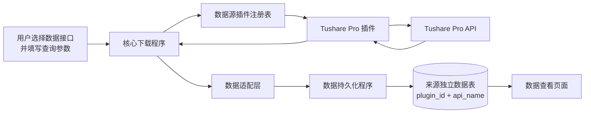

# Tensor 多数据源证券数据下载与查看 BRD

> 首期范围：下载 Tushare Pro 49 类数据、持久化到数据库、查看已入库数据

| 文档信息 | 内容 |
|---|---|
| 版本 | v1.5 |
| 状态 | 内部评审稿 |
| 日期 | 2026-08-25 |
| 首期数据源插件 | Tushare Pro |
| 数据存储模式 | 按数据源插件和来源接口分别建表，字段结构由各数据源自行定义 |
| 使用对象 | 需要下载和查看证券数据的内部用户 |

## 1. 项目目标

建设一个基于多数据源插件机制的最小可用证券数据工具，完成以下目标：

1. 建立统一的数据源插件接口；
2. 建立统一的数据适配接口，将不同数据源的数据转换为各自适用的持久化结构；
3. 将 Tushare Pro 作为首个数据源插件接入，支持下载和适配 49 类数据；
4. 不同数据源的数据经过适配后写入各自独立的数据表；
5. 支持查看已经入库的数据。

插件机制属于数据下载的基础实现方式，不扩展为插件市场或复杂的平台管理能力。除上述能力外，首期不建设其他平台化能力。

## 2. 首期范围

### 2.1 包含范围

- 配置 Tushare Pro Token；
- 提供统一的数据源插件接口和插件注册机制；
- 提供统一的数据适配接口和适配器注册机制；
- Tushare Pro 必须通过数据源插件接口接入，不得硬编码在核心下载流程中；
- Tushare Pro 的 49 类数据必须通过适配层转换后再写入数据库；
- 选择数据接口并填写该接口所需的查询参数；
- 手动触发数据下载；
- 支持 `docs/data-template/` 中的全部 49 个 Tushare Pro 接口；
- 将下载结果写入数据库；
- 在页面中选择数据集并查看已入库数据；
- 支持按证券代码、交易日期或公告日期等核心字段进行简单筛选；
- 支持分页查看数据。


## 3. 业务流程



标准操作流程：

1. 系统启动时注册可用的数据源插件，首期注册 Tushare Pro 插件；
2. 用户配置 Tushare Pro 插件所需的 Token；
3. 用户选择 Tushare Pro 插件及需要下载的数据接口；
4. 用户填写接口所需参数，例如证券代码、交易日期、公告日期或日期范围；
5. 核心下载程序通过统一插件接口调用 Tushare Pro 插件；
6. Tushare Pro 插件调用上游 API，并返回来源格式的下载结果；
7. 数据适配层根据来源插件和接口选择适配器，将来源数据转换为该数据源适用的持久化结构；
8. 核心程序按照来源插件和来源接口，将适配后的数据写入对应的来源独立表；
9. 用户进入数据查看页面，选择数据集并查看已入库记录。

## 4. 功能需求

### FR-01 多数据源插件机制

- 核心下载程序必须通过统一的数据源插件接口调用外部数据源；
- 核心下载程序不得直接调用 Tushare Pro SDK 或 API；
- 数据源插件至少提供以下信息和方法：
  - 插件标识 `plugin_id`；
  - 数据源名称 `source_name`；
  - 插件配置定义；
  - 支持的数据接口清单；
  - 每个接口的查询参数定义；
  - 数据下载方法；
  - 统一下载包络；
- 统一下载包络至少包含以下字段，其中 `fields` 和 `data` 保留来源结构：

```text
plugin_id, api_name, params, fields, row_count, data, status, error
```

- 核心程序负责插件选择、参数传递、调用适配层、提交适配结果持久化和错误展示；
- 插件负责数据源认证、请求组装、上游调用和来源结果封装；
- 新增数据源插件时，不得修改核心下载、数据库持久化和数据查看流程；
- 首期采用启动时注册插件的简单机制，不要求热加载。

### FR-02 Tushare Pro 插件

- Tushare Pro 必须实现统一数据源插件接口；
- Tushare Pro 插件必须声明并实现首期 49 个数据接口；
- 插件必须能够读取 Tushare Pro Token；
- Token 可以通过插件配置文件或环境变量提供；
- 首期不要求提供独立的凭证管理页面。

### FR-03 数据适配层

- 核心程序必须在插件下载完成后、数据库写入前调用数据适配层；
- 适配器使用 `plugin_id + api_name` 识别来源数据，并映射到该来源接口对应的持久化表；
- 每个适配器必须定义：
  - 目标表名；
  - 来源字段到表字段的映射；
  - 数据类型转换；
  - 证券代码、日期、单位和枚举值等必要转换；
  - 必填字段；
  - 业务唯一键；
- 适配结果至少包含：

```text
source_plugin, source_api, table_name, columns, rows
```

- Tushare Pro 必须为首期 49 个接口提供对应适配配置；
- 首期 Tushare Pro 表字段以 `docs/data-template/<api_name>.json` 中的 `fields` 为基线；
- 不要求不同数据源的相同逻辑数据集使用相同字段名、字段数量或数据类型；
- 后续新增数据源时，由该数据源自己的适配器和表结构承接其全部字段；
- 关键字段无法映射或数据类型转换失败时，本次下载不得写入数据库，并向用户显示错误信息。

### FR-04 数据接口选择

- 系统必须展示已注册的数据源插件；
- 选择 Tushare Pro 插件后，展示其支持的 49 个数据接口；
- 每个接口展示接口名、中文说明和需要填写的查询参数；
- 用户可以选择一个接口发起下载。

### FR-05 查询参数填写

根据接口类型支持以下查询参数：

| 查询类型 | 主要参数 | 接口数量 |
|---|---|---:|
| 交易日 | `trade_date` | 19 |
| 公告日 | `ann_date`，部分接口同时需要 `ts_code` | 15 |
| 快照 | `ts_code`、`month`、`exchange` 或无参数 | 12 |
| 日期范围 | `start_date`、`end_date` | 3 |

- 页面应根据所选接口显示对应参数；
- 用户未填写必要参数时，不允许发起下载；
- 参数格式错误时，页面显示简单错误提示。

### FR-06 数据下载

- 核心程序必须调用用户所选的数据源插件；
- Tushare Pro 插件必须调用用户所选的 Tushare Pro 接口；
- 49 个接口的返回字段以对应 JSON 文件中的 `fields` 为准；
- 下载成功后显示本次返回的记录数；
- 下载失败时显示 Tushare Pro 返回的错误信息或系统错误信息；
- 首期不要求自动重试，用户可以修正参数后重新发起下载。

### FR-07 空数据处理

当 Tushare Pro 调用成功但返回 `row_count = 0`、`data = []` 时：

- 页面显示“下载成功，0 条数据”；
- 数据库不插入占位记录；
- 该结果不视为下载失败。

鉴权失败、请求失败或解析失败不得显示为“0 条数据”。

### FR-08 数据持久化

- 不同数据源的数据必须保存到不同的数据表；
- 每个数据源按照 `plugin_id + api_name` 建立对应的数据表；
- 首期只设计并创建 Tushare Pro 的 49 张数据表；
- Tushare Pro 表字段覆盖对应 JSON 模板中的全部 `fields`；
- 写入数据时保存来源插件、来源接口名和入库时间；
- 同一来源、同一接口的数据写入同一张表；
- 不同来源的数据不得混写到同一张表；
- 再次下载同一来源、相同业务主键的数据时更新已有记录，不新增重复记录；
- 首期不要求保存完整原始响应、数据版本或数据血缘。

### FR-09 数据查看

- 用户先选择数据源插件，再选择该来源提供的数据接口；
- 页面显示该数据集已经入库的记录；
- 表格列与该数据集的字段对应；
- 支持分页查看；
- 支持按数据集中存在的核心字段筛选，包括：
  - 证券代码 `ts_code`；
  - 交易日期 `trade_date`；
  - 公告日期 `ann_date`；
  - 开始日期和结束日期；
- 不同数据集只显示其实际存在的筛选条件；
- 首期仅支持查看，不支持编辑或删除数据。

## 5. 页面范围

首期只需要两个页面。

### 5.1 数据下载页面

页面包含：

- 数据源插件选择；
- 数据接口选择；
- 接口说明；
- 查询参数输入区域；
- “开始下载”按钮；
- 下载结果提示，包括成功、0 条数据或失败信息。

### 5.2 数据查看页面

页面包含：

- 数据源插件选择；
- 数据集选择；
- 可用筛选条件；
- “查询”按钮；
- 数据表格；
- 分页控件；
- 当前查询结果的记录数。

## 6. 数据存储要求

### 6.1 来源独立数据表

- 每个数据源插件按照来源接口分别建立数据表；
- 数据表使用 `<plugin_id>__<api_name>` 命名；
- Tushare Pro 日线行情表命名为 `tushare_pro__daily`；
- 首期仅设计 `tushare_pro__*` 的 49 张表；
- 后续新增数据源时，按照该数据源的接口和字段特征单独设计表结构；
- 即使两个数据源提供相同逻辑数据，也不要求它们的表结构一致；
- 数据源插件及来源接口先通过适配器确定目标表和字段映射；
- 表字段以 `docs/data-template/<api_name>.json` 中的 `fields` 为准；
- 数据类型根据样例值和 Tushare Pro 字段定义确定；
- 每张表额外增加：
  - `source_plugin`：来源插件标识；
  - `source_api`：来源接口名；
  - `ingested_at`：入库时间。

### 6.2 重复数据

- 每张表根据业务字段定义唯一键；
- 相同唯一键的数据再次下载时执行更新；
- 不同数据源的同一业务记录分别保存在各自的数据表中；
- 不允许因重复下载产生完全相同的重复记录。

## 7. 验收标准

### 7.1 插件机制验收

- Tushare Pro 以插件形式注册并出现在可用数据源列表中；
- 核心下载程序不直接依赖或调用 Tushare Pro SDK/API；
- 核心程序通过统一接口获取 Tushare Pro 插件的接口清单、参数定义和下载结果；
- 使用测试插件完成注册和一次模拟下载时，无需修改核心下载、持久化和查看流程；
- 停用测试插件后，不影响 Tushare Pro 插件正常使用。

### 7.2 数据适配验收

- Tushare Pro 的 49 个接口均具有对应的适配配置；
- 每个接口的适配结果字段覆盖对应模板中的全部 `fields`；
- Tushare Pro 来源字段能够转换为其目标表需要的字段类型和格式；
- Tushare Pro 日线数据经过适配后写入 `tushare_pro__daily`；
- 适配失败时不写入数据库，并显示明确错误。

### 7.3 数据下载验收

- 页面可以选择 Tushare Pro 数据源插件；
- 页面可以选择全部 49 个接口；
- 每个接口可以填写所需参数并发起 Tushare Pro 请求；
- 调用成功时显示返回记录数；
- 合法空结果显示“下载成功，0 条数据”；
- 调用失败时显示错误信息。

### 7.4 数据持久化验收

- 有数据的下载结果能够写入对应数据库表；
- 数据库字段覆盖对应模板中的全部 `fields`；
- 数据表名称符合 `<plugin_id>__<api_name>` 规则；
- 首期只创建 Tushare Pro 的 49 张来源表；
- Tushare Pro 的 49 个接口各自具备对应的数据表；
- 相同数据重复下载不会产生重复记录；
- 每条记录包含来源插件、来源接口名和入库时间。

### 7.5 数据查看验收

- 用户可以先选择数据源插件，再选择该来源支持的数据集；
- 页面能够分页展示已入库数据；
- 支持使用该数据集已有的核心字段进行筛选；
- 查询结果与数据库记录一致；
- 页面不能编辑或删除数据。

## 附录 A：首期 49 类数据清单

数据清单来自 `docs/data-template/manifest.json`。这些模板作为首期 Tushare Pro 49 张数据表的结构基线，不作为其他数据源的统一字段标准。样例状态仅表示样例查询是否返回业务记录，不代表接口是否支持。

### A.1 基础与组织（11 类）

| 接口名 | 数据说明 | 查询方式 | 字段数 | 样例 |
|---|---|---|---:|---|
| `stock_basic` | 股票基础信息 | 快照 | 10 | 有数据 |
| `stock_company` | 上市公司基本信息 | 快照 | 18 | 有数据 |
| `hs_const` | 沪深港通标的范围 | 快照 | 5 | 有数据 |
| `trade_cal` | 交易日历 | 日期范围 | 4 | 有数据 |
| `new_share` | IPO 新股发行信息 | 日期范围 | 12 | 有数据 |
| `namechange` | 证券名称变更记录 | 日期范围 | 6 | 有数据 |
| `stk_managers` | 上市公司管理层信息 | 快照 | 11 | 有数据 |
| `broker_recommend` | 券商月度推荐 | 快照 | 4 | 有数据 |
| `index_classify` | 行业指数分类 | 快照 | 7 | 有数据 |
| `index_member` | 行业指数成分 | 快照 | 5 | 有数据 |
| `index_member_all` | 行业分级与完整成分 | 快照 | 11 | 有数据 |

### A.2 行情与估值（7 类）

| 接口名 | 数据说明 | 查询方式 | 字段数 | 样例 |
|---|---|---|---:|---|
| `daily` | 日线行情 | 交易日 | 11 | 有数据 |
| `weekly` | 周线行情 | 交易日 | 11 | 有数据 |
| `monthly` | 月线行情 | 交易日 | 11 | 空数据 |
| `adj_factor` | 复权因子 | 交易日 | 3 | 有数据 |
| `suspend_d` | 每日停复牌信息 | 交易日 | 4 | 有数据 |
| `daily_basic` | 每日估值与市场指标 | 交易日 | 18 | 有数据 |
| `stk_limit` | 每日涨跌停价格 | 交易日 | 4 | 有数据 |

### A.3 交易与资金（6 类）

| 接口名 | 数据说明 | 查询方式 | 字段数 | 样例 |
|---|---|---|---:|---|
| `moneyflow` | 个股资金流向 | 交易日 | 20 | 有数据 |
| `margin` | 融资融券汇总 | 交易日 | 9 | 有数据 |
| `margin_detail` | 融资融券交易明细 | 交易日 | 10 | 有数据 |
| `top_list` | 龙虎榜每日明细 | 交易日 | 15 | 有数据 |
| `top_inst` | 龙虎榜机构明细 | 交易日 | 10 | 有数据 |
| `block_trade` | 大宗交易 | 交易日 | 7 | 有数据 |

### A.4 互联互通（3 类）

| 接口名 | 数据说明 | 查询方式 | 字段数 | 样例 |
|---|---|---|---:|---|
| `moneyflow_hsgt` | 沪深港通资金流向 | 交易日 | 7 | 有数据 |
| `hsgt_top10` | 沪深港通十大成交股 | 交易日 | 11 | 有数据 |
| `hk_hold` | 沪深港股通持股明细 | 交易日 | 7 | 有数据 |

### A.5 转融通（3 类）

| 接口名 | 数据说明 | 查询方式 | 字段数 | 样例 |
|---|---|---|---:|---|
| `slb_len` | 转融通期限与规模 | 交易日 | 6 | 空数据 |
| `slb_sec` | 转融通证券汇总 | 交易日 | 7 | 空数据 |
| `slb_sec_detail` | 转融通证券明细 | 交易日 | 6 | 空数据 |

### A.6 财务与披露（9 类）

| 接口名 | 数据说明 | 查询方式 | 字段数 | 样例 |
|---|---|---|---:|---|
| `income` | 利润表 | 公告日 | 85 | 空数据 |
| `balancesheet` | 资产负债表 | 公告日 | 152 | 空数据 |
| `cashflow` | 现金流量表 | 公告日 | 97 | 空数据 |
| `fina_indicator` | 财务指标 | 公告日 | 108 | 空数据 |
| `fina_audit` | 财务审计意见 | 公告日 | 7 | 空数据 |
| `fina_mainbz` | 主营业务构成 | 公告日 | 8 | 有数据 |
| `express` | 业绩快报 | 公告日 | 15 | 有数据 |
| `forecast` | 业绩预告 | 公告日 | 13 | 有数据 |
| `disclosure_date` | 财报披露计划 | 公告日 | 5 | 有数据 |

### A.7 公司行动（3 类）

| 接口名 | 数据说明 | 查询方式 | 字段数 | 样例 |
|---|---|---|---:|---|
| `dividend` | 分红送股 | 公告日 | 14 | 空数据 |
| `repurchase` | 股票回购 | 公告日 | 9 | 有数据 |
| `share_float` | 限售股解禁 | 公告日 | 7 | 有数据 |

### A.8 股东与治理（7 类）

| 接口名 | 数据说明 | 查询方式 | 字段数 | 样例 |
|---|---|---|---:|---|
| `stk_rewards` | 管理层薪酬与持股 | 快照 | 7 | 有数据 |
| `stk_holdernumber` | 股东户数 | 快照 | 4 | 有数据 |
| `stk_holdertrade` | 股东增减持 | 公告日 | 11 | 有数据 |
| `top10_holders` | 前十大股东 | 公告日 | 9 | 空数据 |
| `top10_floatholders` | 前十大流通股东 | 公告日 | 9 | 空数据 |
| `pledge_stat` | 股权质押统计 | 快照 | 7 | 有数据 |
| `pledge_detail` | 股权质押明细 | 快照 | 14 | 有数据 |
