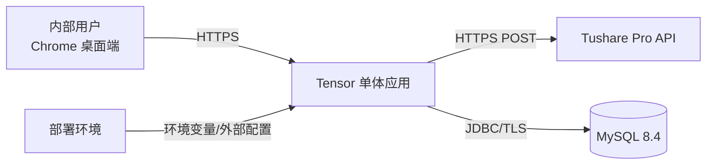
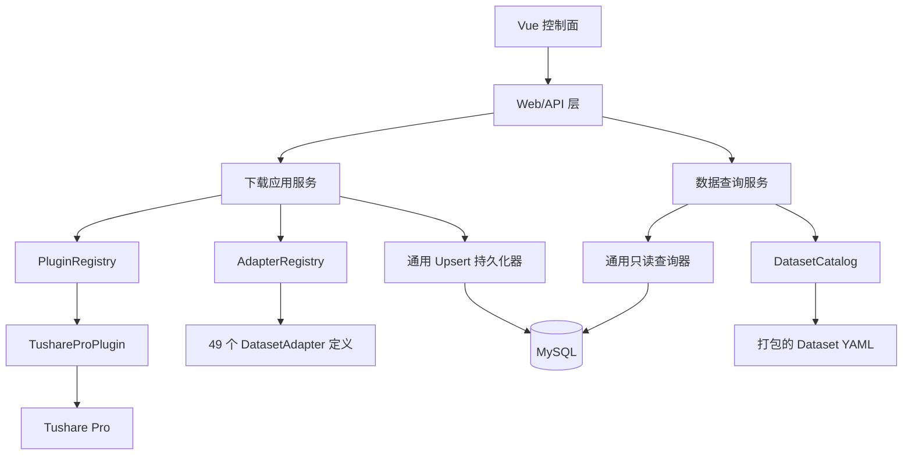
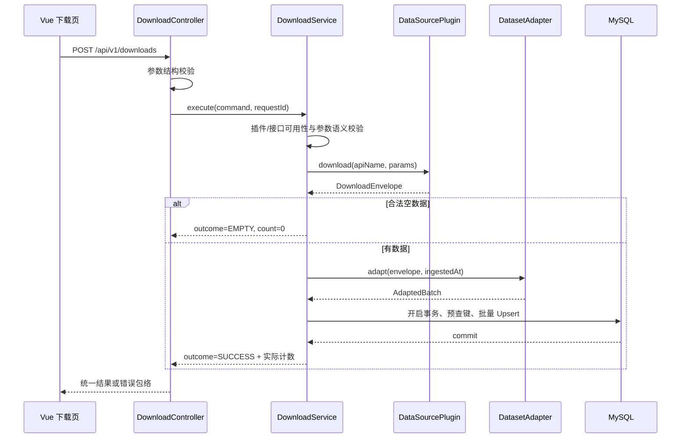
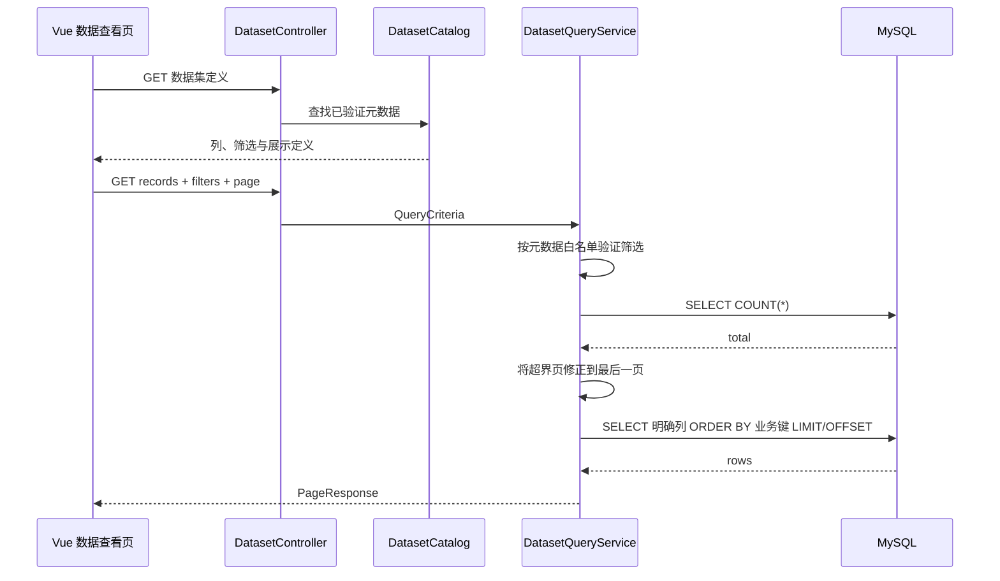
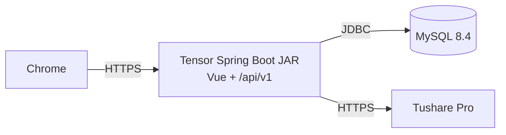

# Tensor 多源证券数据平台 TRD

> 首期技术范围：以模块化单体方式实现 Tushare Pro 49 类证券数据的插件化下载、适配、MySQL 持久化和 Vue 只读查询。

| 文档信息 | 内容 |
|---|---|
| 文档版本 | v1.0 |
| 文档状态 | 内部评审稿 |
| 编制日期 | 2026-08-25 |
| 上游需求 | `docs/design/Tensor_多源证券数据平台_PRD_v1.0.md` |
| 后端基线 | Java 21、Spring Boot 3.5.x、Maven |
| 数据库基线 | MySQL 8.4 LTS、Flyway、Spring JDBC |
| 前端基线 | Vue 3.5.x、Vite 8.x、Element Plus 2.x |
| 首期数据源 | Tushare Pro |
| 部署形态 | 前后端分离开发、单体应用交付、单实例运行 |

## 版本记录

| 版本 | 日期 | 说明 |
|---|---|---|
| v1.0 | 2026-08-25 | 基于 PRD v1.0 形成首期技术设计基线 |

## 1. 文档目的与范围

### 1.1 目的

本文档定义 Tensor 首期的系统架构、模块边界、插件协议、数据适配、数据库、接口、前端、异常、安全、可观测性、部署与测试方案，作为编码、测试、验收和发布的共同技术基线。

### 1.2 设计目标

1. 完成 Tushare Pro 49 个接口从页面请求到数据库查询的端到端闭环。
2. 核心流程仅依赖统一插件和适配器接口，不依赖 Tushare Pro 的具体实现。
3. 通过固定元数据、固定迁移脚本和数据库唯一约束保证字段完整、写入原子和重复下载幂等。
4. 以最少的运行组件满足单一受信内部用户需求，同时保留新增数据源插件的结构性扩展点。
5. 让新环境只需准备 Token 和 MySQL 连接即可按说明启动并从页面完成验收。

### 1.3 首期边界

首期采用同步请求、模块化单体和编译期插件注册，不建设微服务、消息队列、任务调度、下载历史、数据编辑、导出、登录权限、运行时建表、插件在线安装或热加载。

### 1.4 Git 能力禁用约束

业务代码、插件代码、构建辅助代码和运行配置均不得：

- 引用 JGit、GitHub API、GitLab API、Bitbucket API 或其他 Git/代码托管 API；
- 通过 `ProcessBuilder`、`Runtime.exec` 或脚本执行 `git` 命令；
- 克隆、拉取、提交、扫描或解析代码仓库；
- 使用仓库状态作为插件发现、启停、版本或配置来源。

插件只从当前应用 classpath 中的 Spring Bean 注册，元数据只从随应用发布的 classpath 资源读取。Git 不属于 Tensor 的运行时依赖、业务能力或插件机制。

## 2. 架构决策

### 2.1 决策摘要

| 编号 | 决策 | 结论 | 原因 |
|---|---|---|---|
| ADR-001 | 系统形态 | 模块化单体 | 首期单用户、流程线性，降低部署和事务复杂度 |
| ADR-002 | 前后端交付 | 分离开发、单 JAR 交付 | 保留前端开发体验，生产仅运行一个应用进程 |
| ADR-003 | 插件发现 | Spring Bean 编译期注册 | 满足核心解耦，避免热加载与供应链风险 |
| ADR-004 | 持久化 | Spring JDBC + 元数据驱动 SQL | 49 张异构宽表不适合维护等量 JPA 实体 |
| ADR-005 | 数据表 | 每个 `plugin_id + api_name` 一张表 | 满足来源隔离并避免跨来源语义混合 |
| ADR-006 | 表结构管理 | Flyway 固定迁移 | 禁止运行时猜测字段和自动改表 |
| ADR-007 | 写入方式 | 单事务批量 Upsert | 满足幂等与单次请求原子性 |
| ADR-008 | 下载执行 | 同步线性调用 | PRD 明确不建设任务队列、状态机和自动重试 |
| ADR-009 | 运行实例 | 首期单实例 | 保证本地数据集锁和准确插入/更新计数语义 |
| ADR-010 | API 风格 | `/api/v1` JSON REST API | 接口稳定、易于前端和测试调用 |

### 2.2 设计原则

- 核心依赖抽象，具体插件依赖核心定义的 SPI。
- 一个元数据定义同时驱动参数表单、上游字段、适配、查询列和筛选能力。
- SQL 标识符只允许来自启动时验证通过的不可变元数据；用户输入只作为绑定参数。
- 上游调用不持有数据库事务；只有已完成解析和适配的数据进入短事务。
- 页面成功状态只能由已提交事务的后端响应触发。
- 不因单个插件 Token 缺失或插件不可用阻断其他已注册插件。
- 首期不为尚未进入 PRD 的扩展能力提前建设基础设施。

## 3. 总体架构

### 3.1 系统上下文



部署环境负责外层访问控制。Tensor 首期不实现登录和权限管理。

### 3.2 应用内部架构



### 3.3 Maven 模块

后端仍交付一个 Spring Boot JAR，但用 Maven 模块强制依赖方向：

```text
data-plane/
├── pom.xml                       # 后端聚合模块
├── tensor-plugin-api/            # 无 Spring 业务实现的 SPI、描述符和统一包络
├── tensor-core/                  # 注册表、下载编排、适配、持久化、查询
├── tensor-plugin-tushare/        # Tushare HTTP 客户端和插件实现
├── tensor-plugin-fixture/        # 仅验收/测试配置启用的模拟插件
└── tensor-app/                   # Spring Boot 入口、Controller、配置和静态资源
```

依赖方向为：

```text
tensor-app -> tensor-core -> tensor-plugin-api
tensor-app -> tensor-plugin-tushare -> tensor-plugin-api
tensor-app -> tensor-plugin-fixture -> tensor-plugin-api（仅测试/验收配置）
```

`tensor-core` 不得依赖 `tensor-plugin-tushare`。使用 ArchUnit 验证模块依赖方向。Java 基础包名采用 `com.akkc.tensor`，保留现有项目命名空间并消除当前示例入口的裸 `com.akkc` 包。

### 3.4 前端目录

```text
control-plane/src/
├── api/                           # Axios 实例、接口和 DTO 转换
├── router/                        # /downloads 与 /datasets
├── views/                         # DownloadView、DatasetView
├── components/download/           # 数据源、接口、动态参数、结果组件
├── components/dataset/            # 动态筛选、表格、分页组件
├── composables/                    # 页面级状态和请求生命周期
├── utils/                         # 日期、空值、错误与格式化
└── styles/                        # 全局样式与主题变量
```

两个页面不共享查询或下载结果，因此首期不引入 Pinia。页面状态由各自 composable 管理。

## 4. 技术栈与版本策略

| 分类 | 技术 | 版本基线 | 用途 |
|---|---|---:|---|
| 运行时 | OpenJDK | 21 LTS | 后端运行与构建 |
| 后端 | Spring Boot | 3.5.x 最新补丁 | Web、校验、配置、JDBC、健康检查 |
| 构建 | Maven | 3.9.x | 多模块构建与依赖锁定 |
| HTTP 客户端 | Spring `RestClient` | 随 Boot BOM | Tushare Pro 同步 HTTPS 调用 |
| JSON | Jackson | 随 Boot BOM | JSON 与 `BigDecimal` 精确解析 |
| 数据访问 | Spring JDBC | 随 Boot BOM | 元数据驱动查询和批量 Upsert |
| 数据库 | MySQL | 8.4 LTS | 49 张来源表及唯一约束 |
| 数据库迁移 | Flyway | 随 Boot 兼容版本 | 版本化 DDL |
| 连接池 | HikariCP | 随 Boot BOM | JDBC 连接管理 |
| 可观测性 | Actuator + Micrometer | 随 Boot BOM | 健康检查和指标 |
| 前端 | Vue | 3.5.x | 组合式 API 与 `<script setup>` |
| 前端构建 | Vite | 8.x | 开发服务器和生产构建 |
| UI | Element Plus | 2.x | 表单、表格、分页、状态反馈 |
| 路由 | Vue Router | 4.x | 两个一级页面 |
| HTTP | Axios | 1.x | API 调用、超时和错误拦截 |
| 前端运行时 | Node.js | 24 LTS | 前端构建 |
| 后端测试 | JUnit 5、AssertJ、Testcontainers、WireMock | 由 BOM/构建锁定 | 单元、MySQL 集成和上游契约测试 |
| 前端测试 | Vitest、Vue Test Utils、Playwright | 构建锁定 | 组件与端到端测试 |

补丁版本通过构建文件和 lockfile 固定；生产升级先通过 49 接口回归，不在运行时自动升级依赖。

## 5. 核心领域模型

### 5.1 标识和值对象

| 对象 | 约束 | 示例 |
|---|---|---|
| `PluginId` | `^[a-z][a-z0-9_]{1,63}$` | `tushare_pro` |
| `ApiName` | `^[a-z][a-z0-9_]{1,63}$` | `daily` |
| `DatasetKey` | `PluginId + ApiName`，应用内唯一 | `tushare_pro/daily` |
| `TableName` | 固定为 `<plugin_id>__<api_name>` | `tushare_pro__daily` |
| `RequestId` | 服务端生成 UUID，不含用户数据 | `c52b...` |

### 5.2 插件描述符

`PluginDescriptor` 至少包含：

- `pluginId`、`displayName`、`description`；
- `enabled`、`credentialConfigured`、`downloadAvailable`、`unavailableReason`；
- `apis`：接口名、中文说明、分类、查询模式和参数定义；
- `datasets`：已完成适配与持久化配置的数据集定义。

可用性是运行态视图，不允许包含 Token 或配置路径。

### 5.3 参数描述符

`ParameterDescriptor` 包含：

- `name`、`label`、`description`；
- `type`：`DATE`、`DATE_RANGE_MEMBER`、`MONTH`、`TS_CODE`、`ENUM`、`TEXT`；
- `required`、`defaultValue`；
- `allowedValues`；
- `pattern`、`relatedParameter` 和范围顺序约束。

前端依赖此描述符渲染表单；后端使用同一定义再次校验，不信任前端校验结果。

### 5.4 下载包络

插件返回不可变 `DownloadEnvelope`：

```text
pluginId, apiName, params, fields, rowCount, data, status, error
```

约束如下：

- `status=SUCCESS` 时 `error=null`；
- `rowCount == data.size()`；
- `rowCount=0` 时 `data=[]`，属于合法成功；
- `fields` 与对应数据集定义完全一致；
- 每行元素数与 `fields` 数一致；
- 插件失败返回分类后的错误，不返回半包络。

### 5.5 适配批次

`AdaptedBatch` 包含：

```text
datasetKey, tableName, columns, rows, businessKeyDefinition, ingestedAt
```

其中 `ingestedAt` 在单次批次内使用同一个服务端时刻。适配器不得执行数据库操作。

## 6. 插件与适配器设计

### 6.1 SPI

SPI 保持最小，不暴露 Spring、数据库或前端类型：

```java
public interface DataSourcePlugin {
    PluginDescriptor descriptor();
    PluginReadiness readiness();
    DownloadEnvelope download(ApiName apiName, Map<String, Object> params);
}

public interface DatasetAdapter {
    DatasetKey datasetKey();
    DatasetDefinition definition();
    AdaptedBatch adapt(DownloadEnvelope envelope, Instant ingestedAt);
}
```

`DataSourcePlugin` 只负责认证、参数组装、上游调用和来源包络；`DatasetAdapter` 负责字段映射、类型转换和业务键生成；核心服务负责事务和持久化。

### 6.2 注册表

`PluginRegistry` 和 `AdapterRegistry` 通过构造器接收 `List<DataSourcePlugin>` 与 `List<DatasetAdapter>`，启动时构建只读映射：

- 插件标识重复：相关插件均标记为不可用并记录错误；
- `DatasetKey` 重复：相关数据集标记为不可用；
- 插件禁用：保留描述信息但禁止下载；
- Token 缺失：只禁用该插件的下载能力，已入库数据仍可查询；
- 单个插件元数据错误：隔离到该插件或数据集，不影响其他有效插件；
- 数据库整体不可用或 Flyway 失败：应用健康状态为失败，不对外提供业务接口。

插件构造阶段不得执行网络调用。可用性检查只验证本地配置；真实鉴权在用户发起下载时完成。

### 6.3 编译期扩展方式

新增数据源时新增一个实现 `DataSourcePlugin` 的 Maven 模块、相应 `DatasetAdapter` Bean、元数据和 Flyway 表迁移，然后作为依赖打入 `tensor-app`。核心下载、持久化、查询服务和 Vue 页面不修改。

启停使用 `tensor.plugins.<plugin-id>.enabled`。首期不接受外部 JAR 路径，不使用 `ServiceLoader` 扫描未知目录，不加载远程代码。

### 6.4 验收测试插件

`tensor-plugin-fixture` 默认不进入生产运行态，仅在 `tensor.plugins.fixture.enabled=true` 且启用验收配置时注册。它提供至少一个包含 `ts_code`、`trade_date`、数值和可空文本的模拟数据集，并支持：

- 成功且有数据；
- 成功但无数据；
- 上游失败；
- 类型转换失败；
- 数据库回滚测试。

测试插件与 Tushare 插件使用完全相同的注册、适配、持久化和查询流程。

## 7. Tushare Pro 插件

### 7.1 调用协议

插件使用 Spring `RestClient` 向配置的 Tushare Pro HTTPS 地址发送 POST 请求：

```json
{
  "api_name": "daily",
  "token": "<仅在出站请求内使用>",
  "params": { "trade_date": "20260807" },
  "fields": "ts_code,trade_date,open,high,low,close,pre_close,change,pct_chg,vol,amount"
}
```

插件解析 Tushare `code`、`msg`、`data.fields` 和 `data.items`，转换为统一包络。Token 不得进入通用请求对象、MDC、异常对象或响应 DTO。

### 7.2 客户端配置

| 配置 | 默认值 | 说明 |
|---|---:|---|
| 连接超时 | 5 秒 | TCP/TLS 建连上限 |
| 响应超时 | 120 秒 | 单次上游响应上限，可通过配置下调 |
| 自动重试 | 0 | 符合首期不自动重试约束 |
| 最大响应体 | 64 MiB | 超限按上游响应异常处理 |
| User-Agent | `Tensor/1.0` | 不包含环境或凭证信息 |

应用 HTTP 超时必须大于上游响应超时 10 秒；生产入口的代理超时不得小于应用 HTTP 超时。

### 7.3 返回校验

按以下顺序校验：

1. HTTP 状态与响应体可解析；
2. Tushare 业务码成功；
3. `data.fields` 和 `data.items` 存在；
4. 返回字段无重复，且与请求字段集合一致；
5. 每行列数与字段数一致；
6. `rowCount` 使用实际 `items.size()` 生成。

任一失败均不进入适配和数据库阶段。

### 7.4 错误分类

| 上游情况 | 领域错误码 | 可重试 |
|---|---|---|
| Token 无效 | `SOURCE_AUTH_FAILED` | 否 |
| 接口权限/积分不足 | `SOURCE_PERMISSION_DENIED` | 否 |
| 限流或临时服务错误 | `SOURCE_RATE_LIMITED` / `SOURCE_UNAVAILABLE` | 是，由用户手动重试 |
| 网络不可达 | `SOURCE_NETWORK_ERROR` | 是 |
| 响应超时 | `SOURCE_TIMEOUT` | 是 |
| JSON 或字段结构异常 | `SOURCE_PAYLOAD_INVALID` | 是 |

## 8. 元数据与适配设计

### 8.1 单一元数据来源

运行时元数据位于：

```text
tensor-plugin-tushare/src/main/resources/datasets/tushare_pro/<api_name>.yaml
```

每份定义包含：

- 插件、接口、分类、说明和查询模式；
- 参数类型、必填性、枚举、默认值和校验；
- 目标表名；
- 全部业务字段的顺序、数据库类型、可空性和展示信息；
- 业务唯一键或指纹键定义；
- `ts_code`、`trade_date`、`ann_date` 筛选能力；
- 表格固定列和长文本展示提示。

`docs/data-template/*.json` 是字段基线；构建测试逐一断言 YAML 字段名和顺序与 JSON 的 `fields` 完全一致。运行时不读取 `docs` 目录。

### 8.2 元数据示例

```yaml
pluginId: tushare_pro
apiName: daily
tableName: tushare_pro__daily
category: market
queryMode: trade_date
parameters:
  - name: trade_date
    type: DATE
    required: true
columns:
  - { name: ts_code, type: VARCHAR, length: 16, nullable: false }
  - { name: trade_date, type: DATE, nullable: false }
  - { name: open, type: DECIMAL, precision: 38, scale: 18, nullable: true }
  # 其余列按模板顺序完整声明
businessKey: [ts_code, trade_date]
filters: [ts_code, trade_date]
```

### 8.3 类型转换

| 逻辑类型 | Java 类型 | MySQL 类型 | 转换规则 |
|---|---|---|---|
| 证券/枚举/短文本 | `String` | `VARCHAR(n)` | 去除首尾空格；空来源值转 `NULL` |
| 长说明文本 | `String` | `TEXT` | 保留内容，不执行 HTML |
| 日期 | `LocalDate` | `DATE` | 严格解析 `yyyyMMdd`，不容错猜测 |
| 月份 | `YearMonth`/`String` | `CHAR(6)` | 严格解析 `yyyyMM` |
| 整数 | `Long` | `BIGINT` | 禁止小数和溢出 |
| 精确数值 | `BigDecimal` | `DECIMAL(p,s)` | Jackson 使用 BigDecimal；写入禁止舍入 |
| 单字符状态 | `String` | `CHAR(n)` | 必须在元数据枚举内或按开放枚举规则保存 |
| 入库时间 | `Instant` | `DATETIME(3)` | 数据库按 UTC 保存，API 按系统展示时区输出 |

数值调用 `setScale(configuredScale, RoundingMode.UNNECESSARY)`；超出精度或需要舍入时整批适配失败，避免静默精度损失。

### 8.4 适配校验顺序

1. `pluginId`、`apiName` 与目标适配器匹配；
2. `rowCount == data.size()`；
3. 来源字段集合和顺序符合定义；
4. 逐字段映射与类型转换；
5. 必填字段及业务键字段有效；
6. 目标列不得超出定义；
7. 批次内业务键不得冲突；完全相同的重复来源行只保留一条并记录警告；
8. 生成统一 `AdaptedBatch`。

出现未声明的上游字段时记录字段名和请求标识，不记录字段值，不自动扩表。

### 8.5 启动校验

每个数据集启动时必须通过：

- 表名等于 `<plugin_id>__<api_name>`；
- 字段名满足安全正则且无重复；
- 字段与业务键、筛选字段的引用均存在；
- 业务键列可建立索引且总索引长度合法；
- 参数关系合法；
- Flyway 建成的实际列、类型、可空性、主键/唯一键与元数据一致。

失败的数据集不进入可下载或可查询清单，并输出不含敏感数据的诊断日志。

## 9. 数据库设计

### 9.1 数据库级约定

- 数据库使用 MySQL 8.4、InnoDB、`utf8mb4`。
- 默认排序规则使用 `utf8mb4_0900_as_cs`，避免业务键大小写被静默折叠。
- 数据库连接会话时区固定为 UTC；应用展示时区默认 `Asia/Shanghai`，可配置。
- 表名和列名统一小写蛇形命名，不使用保留字，不对用户输入拼接标识符。
- 每张来源表包含模板全部业务字段、`source_plugin`、`source_api`、`ingested_at`。
- 仅缺少稳定非空自然键的数据集允许增加内部 `business_key` 技术列；该列不通过查询 API 返回。
- 不使用通用 JSON 大字段代替业务列，不在运行时执行 DDL。

### 9.2 来源字段

| 字段 | 类型 | 约束 | 说明 |
|---|---|---|---|
| `source_plugin` | `VARCHAR(64)` | `NOT NULL` | 固定为写入插件标识 |
| `source_api` | `VARCHAR(64)` | `NOT NULL` | 固定为接口名 |
| `ingested_at` | `DATETIME(3)` | `NOT NULL` | 本批次事务提交前生成的统一 UTC 时刻 |

查询 API 始终按业务字段定义顺序返回，再追加以上三个来源字段。

### 9.3 表结构示例

`tushare_pro__daily` 的逻辑 DDL：

```sql
CREATE TABLE tushare_pro__daily (
    ts_code       VARCHAR(16)   NOT NULL,
    trade_date    DATE          NOT NULL,
    open          DECIMAL(38,18) NULL,
    high          DECIMAL(38,18) NULL,
    low           DECIMAL(38,18) NULL,
    close         DECIMAL(38,18) NULL,
    pre_close     DECIMAL(38,18) NULL,
    `change`      DECIMAL(38,18) NULL,
    pct_chg       DECIMAL(38,18) NULL,
    vol           DECIMAL(38,18) NULL,
    amount        DECIMAL(38,18) NULL,
    source_plugin VARCHAR(64)   NOT NULL,
    source_api    VARCHAR(64)   NOT NULL,
    ingested_at   DATETIME(3)   NOT NULL,
    PRIMARY KEY (ts_code, trade_date),
    KEY idx_daily_trade_date (trade_date)
) ENGINE=InnoDB DEFAULT CHARSET=utf8mb4 COLLATE=utf8mb4_0900_as_cs;
```

真实 Flyway SQL 必须与数据集 YAML 的列类型逐列一致。SQL 中遇到 MySQL 保留字时显式使用反引号；运行时 SQL 仍只使用已校验元数据。

### 9.4 首期 49 个业务键

下表是 v1.0 固定业务键基线。`COMPOSITE` 直接建立复合主键；`FINGERPRINT` 对指定身份字段进行长度前缀化、UTF-8、固定字段顺序和显式空值标记的规范化序列化，再用 SHA-256 生成 `business_key CHAR(64)` 主键。该摘要只用于数据库幂等，不涉及 Git 或仓库能力。

| 分类 | API | 键模式 | 业务键字段/身份字段 |
|---|---|---|---|
| 基础与组织 | `stock_basic` | COMPOSITE | `ts_code` |
| 基础与组织 | `stock_company` | COMPOSITE | `ts_code` |
| 基础与组织 | `hs_const` | COMPOSITE | `hs_type, ts_code, in_date` |
| 基础与组织 | `trade_cal` | COMPOSITE | `exchange, cal_date` |
| 基础与组织 | `new_share` | COMPOSITE | `ts_code` |
| 基础与组织 | `namechange` | COMPOSITE | `ts_code, start_date, name` |
| 基础与组织 | `stk_managers` | FINGERPRINT | `ts_code, ann_date, name, gender, lev, title, birthday, begin_date` |
| 基础与组织 | `broker_recommend` | COMPOSITE | `month, broker, ts_code` |
| 基础与组织 | `index_classify` | COMPOSITE | `index_code` |
| 基础与组织 | `index_member` | COMPOSITE | `index_code, con_code, in_date` |
| 基础与组织 | `index_member_all` | COMPOSITE | `l1_code, l2_code, l3_code, ts_code, in_date` |
| 行情与估值 | `daily` | COMPOSITE | `ts_code, trade_date` |
| 行情与估值 | `weekly` | COMPOSITE | `ts_code, trade_date` |
| 行情与估值 | `monthly` | COMPOSITE | `ts_code, trade_date` |
| 行情与估值 | `adj_factor` | COMPOSITE | `ts_code, trade_date` |
| 行情与估值 | `suspend_d` | COMPOSITE | `ts_code, trade_date` |
| 行情与估值 | `daily_basic` | COMPOSITE | `ts_code, trade_date` |
| 行情与估值 | `stk_limit` | COMPOSITE | `trade_date, ts_code` |
| 交易与资金 | `moneyflow` | COMPOSITE | `ts_code, trade_date` |
| 交易与资金 | `margin` | COMPOSITE | `trade_date, exchange_id` |
| 交易与资金 | `margin_detail` | COMPOSITE | `trade_date, ts_code` |
| 交易与资金 | `top_list` | COMPOSITE | `trade_date, ts_code, reason` |
| 交易与资金 | `top_inst` | COMPOSITE | `trade_date, ts_code, exalter, side, reason, net_buy` |
| 交易与资金 | `block_trade` | COMPOSITE | `trade_date, ts_code, buyer, seller, price, vol` |
| 互联互通 | `moneyflow_hsgt` | COMPOSITE | `trade_date` |
| 互联互通 | `hsgt_top10` | COMPOSITE | `trade_date, ts_code, market_type` |
| 互联互通 | `hk_hold` | COMPOSITE | `trade_date, code, exchange` |
| 转融通 | `slb_len` | COMPOSITE | `trade_date, ob` |
| 转融通 | `slb_sec` | COMPOSITE | `trade_date, ts_code` |
| 转融通 | `slb_sec_detail` | COMPOSITE | `trade_date, ts_code, tenor, fee_rate` |
| 财务与披露 | `income` | COMPOSITE | `ts_code, end_date, report_type, ann_date` |
| 财务与披露 | `balancesheet` | COMPOSITE | `ts_code, end_date, report_type, ann_date` |
| 财务与披露 | `cashflow` | COMPOSITE | `ts_code, end_date, report_type, ann_date` |
| 财务与披露 | `fina_indicator` | COMPOSITE | `ts_code, end_date, ann_date` |
| 财务与披露 | `fina_audit` | COMPOSITE | `ts_code, end_date, ann_date` |
| 财务与披露 | `fina_mainbz` | COMPOSITE | `ts_code, end_date, bz_item, curr_type` |
| 财务与披露 | `express` | COMPOSITE | `ts_code, end_date, ann_date` |
| 财务与披露 | `forecast` | COMPOSITE | `ts_code, end_date, ann_date, type` |
| 财务与披露 | `disclosure_date` | COMPOSITE | `ts_code, end_date` |
| 公司行动 | `dividend` | COMPOSITE | `ts_code, end_date, ann_date` |
| 公司行动 | `repurchase` | COMPOSITE | `ts_code, ann_date, proc` |
| 公司行动 | `share_float` | COMPOSITE | `ts_code, float_date, holder_name, share_type` |
| 股东与治理 | `stk_rewards` | COMPOSITE | `ts_code, ann_date, end_date, name` |
| 股东与治理 | `stk_holdernumber` | COMPOSITE | `ts_code, end_date, ann_date` |
| 股东与治理 | `stk_holdertrade` | COMPOSITE | `ts_code, ann_date, holder_name, in_de, change_vol` |
| 股东与治理 | `top10_holders` | COMPOSITE | `ts_code, end_date, holder_name, ann_date` |
| 股东与治理 | `top10_floatholders` | COMPOSITE | `ts_code, end_date, holder_name, ann_date` |
| 股东与治理 | `pledge_stat` | COMPOSITE | `ts_code, end_date` |
| 股东与治理 | `pledge_detail` | FINGERPRINT | 模板中的全部 14 个业务字段，按模板顺序规范化 |

指纹模式用于上游没有稳定行标识且合法记录的区分字段允许为空的接口。必填身份字段仍按元数据校验；完全相同业务行重复下载得到相同指纹。任何业务键变更都必须通过版本化元数据、唯一约束和 Flyway 迁移同时发布。

### 9.5 二级索引

除主键外，按实际筛选能力建立：

- 存在 `ts_code`：`INDEX(ts_code)`；
- 存在 `trade_date`：`INDEX(trade_date)`，组合查询频繁时使用 `INDEX(ts_code, trade_date)`；
- 存在 `ann_date`：`INDEX(ann_date)`，组合查询频繁时使用 `INDEX(ts_code, ann_date)`；
- 主键已覆盖相同最左前缀时不重复建索引。

索引名称控制在 MySQL 限制内，格式为 `idx_<缩写>_<字段缩写>`。宽财务表不为非筛选字段建索引。

### 9.6 Flyway 迁移

建议迁移分组：

```text
V1__create_basic_and_organization_tables.sql
V2__create_market_and_trading_tables.sql
V3__create_connect_and_slb_tables.sql
V4__create_financial_tables.sql
V5__create_corporate_and_governance_tables.sql
V6__create_fixture_tables.sql（仅验收环境）
```

生产迁移只允许前向、可审阅的固定 SQL。字段新增、删除、改名或业务键变化必须提升迁移版本；应用启动时执行 `validate` 和 `migrate`，迁移失败则启动失败。

## 10. 下载、事务与幂等

### 10.1 下载时序



### 10.2 事务边界

- 参数校验、上游请求和适配均在事务外执行。
- 只有“预查现有键 + 批量 Upsert”位于同一数据库事务。
- 单次下载的所有行写入成功后统一提交；任一 SQL 失败全部回滚。
- 空结果不打开写事务，也不写占位记录。
- 事务传播使用 `REQUIRED`；事务超时默认 60 秒，可按验收规模调整。

### 10.3 批量 Upsert

`GenericUpsertRepository` 根据启动时验证通过的 `DatasetDefinition` 生成固定 SQL 模板，所有值使用 `PreparedStatement` 绑定：

```sql
INSERT INTO <validated_table> (<validated_columns>)
VALUES (?, ...)
ON DUPLICATE KEY UPDATE
  <all_non_key_business_columns> = VALUES(<column>),
  source_plugin = VALUES(source_plugin),
  source_api = VALUES(source_api),
  ingested_at = VALUES(ingested_at)
```

JDBC 批大小默认 500；超宽表可在元数据中下调，但同一请求仍处于一个事务。禁止把整批数据拼成包含用户值的 SQL 字符串。

### 10.4 插入数与更新数

MySQL 的 Upsert affected-row 语义无法直接稳定区分插入与更新，因此采用以下算法：

1. 对 `DatasetKey` 获取 JVM 内公平可重入锁；
2. 在事务内分批查询本批业务键是否存在；
3. 不存在的不同业务键计入 `insertedRows`，已存在的计入 `updatedRows`；
4. 执行批量 Upsert 并提交；
5. 提交后释放锁并返回计数。

`insertedRows + updatedRows` 等于适配后不同业务键行数。`sourceRowCount` 始终保留上游原始返回数。首期只支持单应用实例；若未来扩为多实例，必须先将数据集锁替换为数据库锁或暂存表合并方案。

### 10.5 失败语义

任一阶段失败时：

- 不进入后续阶段；
- 数据库事务已开启则回滚；
- 响应只返回错误码、可行动摘要、`requestId` 和 `retryable`；
- 详细堆栈只进入受控日志；
- 页面保留当前参数，恢复控件供用户手动重试。

## 11. 数据查询设计

### 11.1 查询时序



### 11.2 查询规则

- `ts_code` 精确匹配，入参去除首尾空格并校验 `代码.市场` 格式。
- `trade_date` 和 `ann_date` 使用闭区间范围；开始日期不得晚于结束日期。
- 多条件使用 `AND`。
- 未提供筛选条件时允许全表服务端分页。
- 页码从 1 开始；每页只允许 20、50、100，默认 50。
- 排序固定按业务键升序；指纹键数据集按首个业务字段、其余身份字段、`business_key` 升序，保证稳定分页。
- 页码超过总页数时，后端归一化为新的最后一页；总数为 0 时返回 `page=1,totalPages=0,items=[]`。
- SQL 明确列出业务字段和三个来源字段，不使用 `SELECT *`。

### 11.3 查询安全

表名、列名、排序字段全部从不可变 `DatasetDefinition` 取得，并在启动时通过正则和实际表结构校验。查询值、分页值和日期值全部使用绑定参数。客户端不能提交任意表名、列名、排序表达式或 SQL 片段。

## 12. REST API 设计

### 12.1 通用约定

- 基础路径：`/api/v1`。
- 编码：UTF-8；媒体类型：`application/json`。
- 自有 DTO 字段使用 camelCase；动态插件参数保持插件定义的 snake_case。
- 日期筛选使用 `YYYY-MM-DD`；下载动态参数使用上游要求的 `YYYYMMDD` 或 `YYYYMM`。
- 每个响应返回 `X-Request-Id`；错误响应体同时包含 `requestId`。
- Token 永远不属于请求或响应 API。

### 12.2 接口清单

| 方法 | 路径 | 用途 |
|---|---|---|
| GET | `/api/v1/data-sources` | 获取已注册数据源及可用性 |
| GET | `/api/v1/data-sources/{pluginId}/apis` | 获取下载接口、分类和参数元数据 |
| POST | `/api/v1/downloads` | 同步执行单插件单接口下载 |
| GET | `/api/v1/data-sources/{pluginId}/datasets` | 获取已持久化数据集及筛选定义 |
| GET | `/api/v1/data-sources/{pluginId}/datasets/{apiName}` | 获取完整列与展示元数据 |
| GET | `/api/v1/data-sources/{pluginId}/datasets/{apiName}/records` | 筛选并分页查询记录 |
| GET | `/actuator/health` | 部署健康检查，不返回敏感详情 |

元数据响应使用以下稳定结构：

```json
{
  "pluginId": "tushare_pro",
  "displayName": "Tushare Pro",
  "enabled": true,
  "credentialConfigured": true,
  "downloadAvailable": true,
  "unavailableReason": null,
  "apis": [
    {
      "apiName": "daily",
      "displayName": "日线行情",
      "category": "行情与估值",
      "queryMode": "trade_date",
      "parameters": [
        {
          "name": "trade_date",
          "label": "交易日期",
          "type": "DATE",
          "required": true,
          "allowedValues": []
        }
      ]
    }
  ]
}
```

数据集定义响应包含 `pluginId`、`apiName`、`displayName`、`columns`、`filters` 和默认固定列。每个 column 至少包含 `name`、`label`、`logicalType`、`nullable`、`displayOrder`；每个 filter 包含 `field`、`operator` 和控件类型。前端不得自行推断数据库类型或筛选能力。

### 12.3 下载请求

```json
{
  "pluginId": "tushare_pro",
  "apiName": "daily",
  "params": {
    "trade_date": "20260807"
  }
}
```

成功且有数据：

```json
{
  "requestId": "c52bce3d-5aa5-4c8e-ae64-e73cb76d8f33",
  "outcome": "SUCCESS",
  "pluginId": "tushare_pro",
  "apiName": "daily",
  "sourceRowCount": 5535,
  "insertedRows": 5535,
  "updatedRows": 0,
  "message": "下载成功"
}
```

合法空结果仍返回 HTTP 200：

```json
{
  "requestId": "...",
  "outcome": "EMPTY",
  "pluginId": "tushare_pro",
  "apiName": "monthly",
  "sourceRowCount": 0,
  "insertedRows": 0,
  "updatedRows": 0,
  "message": "下载成功，0 条数据"
}
```

### 12.4 分页响应

请求示例：

```text
GET /api/v1/data-sources/tushare_pro/datasets/daily/records
    ?tsCode=000001.SZ&tradeDateFrom=2026-08-01&tradeDateTo=2026-08-07&page=1&pageSize=50
```

响应：

```json
{
  "requestId": "...",
  "pluginId": "tushare_pro",
  "apiName": "daily",
  "page": 1,
  "pageSize": 50,
  "totalElements": 5,
  "totalPages": 1,
  "columns": ["ts_code", "trade_date", "open", "...", "source_plugin", "source_api", "ingested_at"],
  "items": [
    {
      "ts_code": "000001.SZ",
      "trade_date": "2026-08-07",
      "open": "11.230000000000000000",
      "source_plugin": "tushare_pro",
      "source_api": "daily",
      "ingested_at": "2026-08-25T10:30:15.123+08:00"
    }
  ]
}
```

为避免 JavaScript JSON 解析丢失精度，`DECIMAL` 和 `BIGINT` 业务字段统一序列化为十进制字符串；元数据中的 `logicalType` 仍标识其数值语义。后端全程使用 `BigDecimal`/`Long`，不得先转为 `double`。前端首期只读展示，不对这些字符串执行计算或排序。

### 12.5 错误包络

```json
{
  "requestId": "...",
  "code": "PARAM_INVALID",
  "message": "开始日期不能晚于结束日期",
  "retryable": false,
  "fieldErrors": [
    { "field": "start_date", "message": "必须早于或等于结束日期" }
  ]
}
```

### 12.6 HTTP 状态映射

| HTTP | 错误类型 |
|---:|---|
| 400 | 参数格式、必填、枚举或范围错误 |
| 404 | 插件、接口或数据集不存在 |
| 409 | 插件/数据集已注册但禁用或配置不完整 |
| 422 | 来源包络可解析但适配规则不满足 |
| 500 | 未分类内部错误或数据库错误 |
| 502 | 上游鉴权、权限、限流、服务错误或响应结构错误 |
| 503 | 数据源本地配置缺失或整体依赖不可用 |
| 504 | 上游响应超时 |

前端依据领域错误码展示文案，不显示原始 SQL、堆栈、内部路径或上游含敏感信息的原文。

## 13. 前端设计

### 13.1 路由与布局

| 路径 | 页面 | 说明 |
|---|---|---|
| `/` | 重定向 | 重定向到 `/downloads` |
| `/downloads` | 数据下载 | 单接口动态参数下载 |
| `/datasets` | 数据查看 | 动态筛选和分页表格 |
| 其他路径 | 轻量 404 | 提供返回数据下载入口 |

桌面布局使用固定一级导航，内容区最小适配宽度 1280px；小于该宽度允许页面横向滚动但不隐藏主操作。

### 13.2 数据下载页组件

| 组件 | 职责 |
|---|---|
| `DataSourceSelect` | 展示注册数据源、配置状态和不可用原因 |
| `ApiSelect` | 按八类分组并按接口名/中文说明搜索 |
| `ApiDescription` | 展示接口中文说明和查询方式 |
| `DynamicParameterForm` | 按参数元数据生成日期、月份、文本和枚举控件 |
| `DownloadAction` | 执行提交、防重复点击和控件锁定 |
| `DownloadResult` | 区分成功、空结果和失败，展示实际计数 |

切换数据源或接口时创建新的页面请求世代号并清空旧参数、错误和结果；任何较早请求的延迟响应不得覆盖新选择。

### 13.3 动态参数控件

| 元数据类型 | Element Plus 控件 | 提交值 |
|---|---|---|
| `DATE` | `el-date-picker` 单日期 | `YYYYMMDD` |
| `DATE_RANGE_MEMBER` | 两个关联日期控件 | `start_date/end_date` 各为 `YYYYMMDD` |
| `MONTH` | 月份选择器 | `YYYYMM` |
| `TS_CODE` | `el-input` | 去空格后的大写 `代码.市场` |
| `ENUM` | `el-select` | 元数据声明的值 |
| `TEXT` | `el-input` | 去除首尾空格的文本 |

不允许根据 `apiName` 在 Vue 组件内写分支。接口差异必须由元数据表达。

### 13.4 下载页状态机

页面内部可使用有限 UI 状态，但不持久化为下载任务：

```text
INITIAL -> METADATA_LOADING -> READY -> SUBMITTING
SUBMITTING -> SUCCESS | EMPTY | FAILURE
FAILURE -> SUBMITTING（用户手动重试）
```

`SUBMITTING` 期间禁用数据源、接口、参数和下载按钮。页面不展示下载/适配/入库阶段、进度条、百分比或取消按钮。

### 13.5 数据查看页组件

| 组件 | 职责 |
|---|---|
| `DatasetSelect` | 按来源选择已持久化数据集 |
| `DynamicFilterForm` | 仅渲染实际存在的核心筛选字段 |
| `DatasetTable` | 按定义顺序展示全部字段与横向滚动 |
| `DatasetPagination` | 20/50/100 分页与总数 |
| `QueryStatePanel` | 未查询、加载、空、失败状态 |

表格规则：

- 有 `ts_code` 时固定在左侧，否则固定首个业务字段；
- `null` 展示为 `--`，数值 0 和空字符串保持原义；
- 日期展示 `YYYY-MM-DD`；入库时间按配置时区显示到毫秒，界面默认显示到秒；
- 长文本省略显示并通过 tooltip 查看完整内容；
- 152 列宽表完整渲染并横向滚动，不允许静默裁列；
- 不提供排序、选中、编辑、删除、导出或列配置。

### 13.6 查询状态与竞态处理

- 选择数据集后不自动查询。
- 每次查询生成请求世代号；只接受当前世代响应。
- 新查询开始时隐藏旧表格，避免把旧数据误认为新结果。
- 修改筛选条件或每页条数后，提交时页码归 1。
- 翻页保留来源、数据集和筛选条件。
- 重置只清空筛选、结果和页码，保留当前来源与数据集。
- Axios 超时略大于后端业务超时；超时后恢复按钮并显示可重试错误。

### 13.7 可访问性

- 所有控件有可见标签，错误通过文字和 `aria-describedby` 关联；
- 加载、成功和失败状态使用 `aria-live`，不只依赖颜色；
- 键盘可以完成导航、选择、输入、提交、查询和分页；
- 焦点样式不可移除；提交校验失败后聚焦第一个错误字段。

## 14. 配置与密钥

### 14.1 配置项

```yaml
spring:
  datasource:
    url: ${TENSOR_DB_URL}
    username: ${TENSOR_DB_USERNAME}
    password: ${TENSOR_DB_PASSWORD}
  flyway:
    enabled: true

tensor:
  display-zone: ${TENSOR_DISPLAY_ZONE:Asia/Shanghai}
  plugins:
    tushare-pro:
      enabled: ${TENSOR_TUSHARE_ENABLED:true}
      base-url: ${TENSOR_TUSHARE_BASE_URL:https://api.tushare.pro}
      token: ${TENSOR_TUSHARE_TOKEN:}
      connect-timeout: 5s
      read-timeout: 120s
  persistence:
    batch-size: 500
  query:
    default-page-size: 50
    allowed-page-sizes: [20, 50, 100]
```

项目只提供变量名和示例占位符，不提交真实 Token 或数据库密码。生产环境使用环境变量或外部只读配置文件注入。

### 14.2 配置状态

后端只向前端返回 `credentialConfigured: true|false`。Token 对象不得实现可输出明文的 `toString()`，不得被 Actuator `/env`、配置属性端点、调试日志或异常消息暴露。生产仅开放必要的健康端点。

### 14.3 CORS 与静态资源

- 开发环境允许配置的本地 Vite origin 访问 `/api/v1`；
- 生产 Vue 与 API 同源，由 Spring Boot 提供 `index.html`、哈希静态资源和 SPA fallback；
- CORS 生产默认关闭；
- 静态资源使用长期缓存，`index.html` 禁止长期缓存。

## 15. 异常处理

### 15.1 领域异常

| 阶段 | 错误码示例 | 页面摘要 | 数据行为 |
|---|---|---|---|
| 参数 | `PARAM_REQUIRED`、`PARAM_INVALID` | 标注具体字段与格式 | 不调用上游 |
| 注册 | `PLUGIN_DISABLED`、`DATASET_MISCONFIGURED` | 数据源或数据集不可用 | 不调用上游/数据库 |
| 上游 | `SOURCE_AUTH_FAILED` 等 | 鉴权、权限、网络或超时提示 | 不写库 |
| 解析 | `SOURCE_PAYLOAD_INVALID` | 数据源返回格式异常 | 不写库 |
| 适配 | `ADAPTER_FIELD_MISSING`、`ADAPTER_TYPE_INVALID` | 接口和字段摘要 | 不写库 |
| 持久化 | `PERSISTENCE_FAILED` | 数据入库失败，请稍后重试 | 全部回滚 |
| 查询 | `QUERY_FAILED` | 数据查询失败，可重新查询 | 不返回旧结果 |

### 15.2 全局异常映射

`@RestControllerAdvice` 统一处理受控领域异常、Bean Validation 异常和未分类异常。未分类异常返回通用 `INTERNAL_ERROR`，日志记录堆栈但响应不包含实现细节。

### 15.3 日志脱敏

日志记录参数摘要时：

- Token 字段无条件删除；
- Authorization、Cookie 和数据库密码无条件删除；
- 证券代码按内部数据管理规则决定是否完整记录，默认记录；
- 超长文本截断并记录长度；
- 上游原始响应体默认不记录。

## 16. 安全设计

### 16.1 信任边界

用户虽为受信内部用户，浏览器输入和 Tushare 返回仍按不可信数据处理。后端执行完整参数、字段、类型和长度校验。

### 16.2 安全控制

- 应用部署在受控内网或外部身份代理之后；
- 生产入口使用 HTTPS，数据库连接优先启用 TLS；
- 数据库账号只拥有目标 schema 的 DML 和 Flyway 所需 DDL 权限，不授予全局权限；
- 查询接口只暴露 GET，不提供新增、更新或删除 Controller；
- SQL 值全参数化，标识符全白名单；
- Vue 不使用 `v-html` 渲染上游或数据库内容；
- 返回错误设置安全响应头，不回显用户提交的任意 HTML；
- 依赖扫描阻止已知高危漏洞进入发布版本；
- Maven Enforcer 禁止引入 JGit 和常见代码托管 API 依赖，代码审查禁止执行 `git` 子进程。

### 16.3 首期已接受风险

应用本身没有登录与细粒度授权。因此任何能访问部署地址的人都可触发下载和查询。该风险只在受控网络或外层访问控制已落实时可接受。

## 17. 可观测性

### 17.1 请求关联

`RequestIdFilter` 为每个请求生成 UUID，并写入 MDC 和 `X-Request-Id`。客户端传入的请求标识只有在满足长度和字符白名单时才可沿用，否则重新生成，防止日志注入。

### 17.2 结构化日志

下载完成日志包含：

```text
requestId, operation=download, pluginId, apiName, paramSummary,
sourceRowCount, insertedRows, updatedRows, durationMs,
outcome, failureStage, errorCode
```

查询完成日志包含：

```text
requestId, operation=query, pluginId, apiName, filterNames,
page, pageSize, resultCount, totalElements, durationMs, outcome, errorCode
```

只记录最终一次完成事件，避免同一请求被各层重复统计。

### 17.3 指标与健康检查

| 指标 | 标签 |
|---|---|
| `tensor_download_total` | `plugin`, `api`, `outcome` |
| `tensor_download_duration_seconds` | `plugin`, `api`, `outcome` |
| `tensor_download_rows_total` | `plugin`, `api`, `kind=source|inserted|updated` |
| `tensor_query_total` | `plugin`, `api`, `outcome` |
| `tensor_query_duration_seconds` | `plugin`, `api`, `outcome` |

健康检查覆盖应用存活和 MySQL 可用性。Tushare Token 缺失只使插件下载不可用，不使整个应用健康检查失败；真实 Tushare 网络不纳入周期健康探测，避免消耗接口或放大故障。

指标的 `api` 仅允许 49 个固定值，禁止把证券代码、请求标识或错误文本作为指标标签。

## 18. 性能与容量

### 18.1 查询目标

- 验收数据规模下 50 条查询 P95 不超过 2 秒；
- 页面收到点击后 300ms 内显示加载状态；
- `COUNT` 与分页查询均命中核心字段索引；
- 单次最多返回 100 行，禁止全表加载到前端；
- 表格只渲染当前页，宽表不在前端复制完整数据集。

### 18.2 下载容量

- 以模板样例的单接口数量和宽度为首期容量基线；
- JDBC 默认每批 500 行，宽表元数据可设 100 行；
- 单请求响应体上限 64 MiB，超过则明确失败；
- Hikari 最大连接数默认 10，下载写事务和查询共享连接池；
- 同一数据集写入串行，不同数据集可并发；
- 不设置应用层自动重试，防止重复放大上游压力。

### 18.3 性能验证

选择 `daily` 验证行数场景，选择 `balancesheet` 验证 152 列宽表场景，分别执行冷/热查询和重复 Upsert。性能报告至少记录数据量、索引、P50、P95、最大响应、数据库执行计划和应用资源占用。

## 19. 构建、部署与运行

### 19.1 构建流程

根构建按以下顺序完成：

1. 前端执行确定性依赖安装、单元测试和 `vite build`；
2. 将 `control-plane/dist` 复制到 `tensor-app` 的生成静态资源目录；
3. 后端编译、架构测试、单元测试和 MySQL 集成测试；
4. Spring Boot 打包单个可执行 JAR；
5. 验证 JAR 中包含前端入口、哈希资源、49 个数据集 YAML 和 Flyway SQL。

构建不访问 Git，不读取分支、提交号或仓库状态。版本来自 Maven 项目版本和显式构建参数。

### 19.2 运行拓扑



首期不要求 Nginx、Redis、消息队列或独立前端服务器。组织已有网关可负责 TLS 和访问控制，但不是应用功能依赖。

### 19.3 启动顺序

1. 创建 MySQL schema 和最小权限账号；
2. 注入数据库连接、Tushare Token 和显示时区；
3. 启动 JAR；
4. Flyway 验证并迁移 49 张表；
5. 注册插件和适配器并完成元数据/表结构校验；
6. `/actuator/health` 就绪后开放流量；
7. 用户打开 `/downloads` 或 `/datasets`。

### 19.4 优雅停机

启用 Spring Boot graceful shutdown。停止接收新请求后等待进行中的同步请求完成，最长等待时间应大于写事务上限；超时终止时数据库事务由连接关闭回滚。

### 19.5 备份与回退

- 发布前备份目标 schema；
- Flyway 只前向迁移，不自动执行破坏性回滚；
- 应用回退必须使用与当前 schema 兼容的上一版本；
- 涉及删除或缩窄字段的迁移采用“先兼容、后清理”的两阶段发布；
- 首期业务页面无删除能力，误写恢复依赖数据库备份。

## 20. 测试设计

### 20.1 测试分层

| 层级 | 重点 | 工具/环境 |
|---|---|---|
| 后端单元 | 参数校验、错误分类、字段转换、业务键、计数 | JUnit 5、AssertJ、Mockito |
| 元数据契约 | 49 YAML 与模板字段/顺序、表名、参数、键引用 | JUnit 5 + Jackson/YAML |
| 架构 | 模块依赖、核心不依赖具体插件、禁止 Git 相关依赖 | ArchUnit、Maven Enforcer |
| 上游契约 | Tushare 成功、空、鉴权、权限、限流、超时、畸形响应 | WireMock |
| 数据库集成 | Flyway、49 表结构、Upsert、回滚、分页、索引 | Testcontainers MySQL 8.4 |
| API 集成 | HTTP 状态、DTO、错误包络、Token 不泄露 | Spring Boot Test |
| 前端组件 | 动态控件、状态、表格格式、竞态保护 | Vitest、Vue Test Utils |
| 端到端 | 两页面用户闭环和可访问性 | Playwright + 完整服务 |
| 手工验收 | 真实 Token、真实 Tushare 权限与 49 接口 | 受控验收环境 |

禁止使用 H2 代替 MySQL 验证 Upsert、排序规则、精度或迁移。

### 20.2 必测事务用例

1. 新键全部插入，计数正确；
2. 已有键全部更新，不产生重复；
3. 新旧键混合，插入数和更新数分别准确；
4. 中间批次写入失败，前序批次全部回滚；
5. 适配中任意一行失败，数据库零写入；
6. 合法空结果不打开写事务；
7. 同数据集两个并发请求串行写入且计数一致；
8. 指纹键数据集重复相同行保持幂等；
9. `ingested_at` 在同一批次内完全一致；
10. 数值超精度或需要舍入时整批失败。

### 20.3 49 接口契约测试

每个数据集必须自动验证：

- API 名与 `manifest.json` 完全一致，数量为 49；
- YAML 字段名与对应模板 `fields` 完全一致；
- 参数集合与 PRD 附录 A 一致；
- 业务键字段存在且满足键策略；
- 表结构含全部业务字段和三个来源字段；
- 日期、数值、空值样例转换正确；
- 有数据模板可完成适配和 Upsert；
- 空数据模板通过 fixture 包络完成适配、入库和查询链路。

### 20.4 前端必测状态

- 初始、元数据加载、就绪、提交、成功、空、失败；
- 切换接口清空旧参数、错误和结果；
- 旧请求晚返回不覆盖当前选择；
- 日期、月份、证券代码、枚举和逆序日期范围校验；
- 查询前不显示误导性空表；
- 查询失败不展示旧结果；
- 20/50/100 分页与超界页归一化；
- 无核心字段的数据集不展示相应筛选；
- `balancesheet` 全列和横向滚动；
- `null`、0、空字符串和高精度数值显示不混淆；
- 键盘操作、可见标签和非颜色错误提示。

### 20.5 发布质量门槛

- 后端、前端、集成和 E2E 测试全部通过；
- PRD AC-001～AC-018 全部通过；
- 49/49 接口元数据契约通过；
- 不存在 Token 泄露、部分写入、重复业务键或字段缺失；
- 查询 P95 达标；
- 依赖漏洞扫描无未接受的高危问题；
- 可从全新环境按运行说明完成启动和页面闭环。

## 21. 需求追踪矩阵

| PRD 需求 | TRD 设计位置 | 主要验证 |
|---|---|---|
| PRD-F-001～005 | 3、5、6、8 | 注册表、fixture 插件、架构测试 |
| PRD-F-006～010 | 7、12、13 | 参数元数据、API、前端状态/E2E |
| PRD-F-011～014 | 10、12、15 | 计数、空结果、错误和重试测试 |
| PRD-F-015～018 | 5、6、8 | 适配契约、转换失败零写入 |
| PRD-F-019～023 | 9、10 | 49 表、业务键、事务和来源字段测试 |
| PRD-F-024～030 | 11～13 | 动态筛选、分页、宽表和只读 E2E |
| PRD-F-031 | 19、20 | 全新环境启动与 AC-001～AC-018 |
| 性能 10.1 | 9.5、11、18 | 索引、执行计划和 P95 测试 |
| 可靠性 10.2 | 10、19.4 | 原子事务、幂等、优雅停机 |
| 安全 10.3 | 1.4、14～16 | Token 脱敏、SQL 白名单、网络控制 |
| 扩展性 10.4 | 3、6 | 核心依赖规则与测试插件 |
| 可用性 10.5 | 13 | Chrome、宽度、键盘和标签 E2E |
| 可观测性 10.6 | 15、17 | 请求标识、结构化日志和指标测试 |

## 22. 风险与约束

| 风险 | 影响 | 缓解措施 |
|---|---|---|
| Tushare 字段或返回语义变化 | 解析/适配失败 | 严格契约、明确失败、版本化元数据与迁移 |
| Tushare 无稳定行标识 | 个别接口难以表达更新语义 | 明确指纹键、模板回归、相同响应保持幂等 |
| 152 列宽表 | SQL 包和浏览器渲染压力 | 小批写入、只查当前页、横向滚动、性能验收 |
| 同步上游耗时 | 浏览器长连接超时 | 对齐三层超时、明确失败、用户手动重试 |
| 无应用内认证 | 未受控访问可触发下载 | 强制受控内网或外层身份代理 |
| 单实例锁 | 无法直接横向扩展 | 首期明确单实例；扩展前改为数据库级协调 |
| 高精度 JSON 在浏览器中受限 | 展示精度可能丢失 | 后端 BigDecimal、不经 double；必要时提供展示字符串 |
| 数据模板为空 | 无法仅靠样例验证全部类型 | 每字段显式类型配置，fixture 非空契约补测 |

## 23. 实现与评审完成条件

实现只有同时满足以下条件才可视为符合本 TRD：

1. 生产产物为包含 Vue 静态资源的单个 Spring Boot JAR，外部只依赖 MySQL 和 Tushare Pro。
2. 核心模块不依赖具体插件，fixture 插件可在不改核心流程和页面的情况下启停。
3. 49 个数据集元数据、表、字段、键、适配和查询契约全部通过自动验证。
4. 下载执行严格遵守“下载 → 适配 → 单事务 Upsert”，失败无部分写入。
5. 页面能区分成功、合法空数据和失败，并展示本次实际返回、插入和更新数。
6. 查询仅使用服务端分页和白名单筛选，完整展示业务字段及三个来源字段。
7. Token 不出现在前端、数据库、普通日志、错误或诊断端点。
8. 代码和运行过程不使用任何 Git 相关 API、命令或仓库能力。
9. AC-001～AC-018、49 接口回归和非功能质量门槛全部通过。

## 附录 A：关键类职责

| 类/接口 | 模块 | 职责 |
|---|---|---|
| `DataSourcePlugin` | plugin-api | 数据源插件 SPI |
| `DatasetAdapter` | plugin-api | 数据集适配 SPI |
| `PluginDescriptor` | plugin-api | 数据源、接口和参数元数据 |
| `DatasetDefinition` | plugin-api | 字段、类型、键、筛选与展示定义 |
| `DownloadEnvelope` | plugin-api | 统一上游结果 |
| `PluginRegistry` | core | 插件注册、隔离和可用性 |
| `AdapterRegistry` | core | 按 DatasetKey 定位适配器 |
| `DatasetCatalog` | core | 暴露已验证数据集定义 |
| `DownloadService` | core | 同步下载编排 |
| `GenericDatasetAdapter` | core | 元数据驱动转换与校验 |
| `GenericUpsertRepository` | core | 预查键、批量 Upsert 和计数 |
| `DatasetQueryService` | core | 筛选、计数、页码归一化与读取 |
| `TushareProPlugin` | plugin-tushare | Tushare 请求和包络转换 |
| `TushareProClient` | plugin-tushare | 出站 HTTP 与上游错误分类 |
| `DownloadController` | app | 下载 REST API |
| `DataSourceController` | app | 数据源/接口元数据 REST API |
| `DatasetController` | app | 数据集元数据和只读查询 REST API |
| `GlobalExceptionHandler` | app | 统一错误包络 |
| `RequestIdFilter` | app | 请求标识与 MDC |

## 附录 B：关键配置命名

| 环境变量 | 必填 | 说明 |
|---|---|---|
| `TENSOR_DB_URL` | 是 | MySQL JDBC URL |
| `TENSOR_DB_USERNAME` | 是 | 数据库账号 |
| `TENSOR_DB_PASSWORD` | 是 | 数据库密码 |
| `TENSOR_TUSHARE_TOKEN` | 下载必填 | Tushare Pro Token；缺失时查询仍可用 |
| `TENSOR_TUSHARE_ENABLED` | 否 | 是否注册并展示 Tushare 插件，默认 true |
| `TENSOR_TUSHARE_BASE_URL` | 否 | 上游地址，默认官方 HTTPS 地址 |
| `TENSOR_DISPLAY_ZONE` | 否 | 入库时间展示时区，默认 Asia/Shanghai |

## 附录 C：术语补充

| 术语 | 技术含义 |
|---|---|
| 模块化单体 | 单进程、单产物部署，但以 Maven 和包依赖约束模块边界 |
| 编译期插件 | 插件实现随应用构建，通过 Spring Bean 注册，不在运行时加载外部代码 |
| 元数据驱动 SQL | 表、列、键和筛选来自启动时验证的固定定义，值仍使用绑定参数 |
| 指纹键 | 对明确身份字段的规范化序列计算摘要，用于无稳定非空自然键接口的幂等 |
| UI 状态 | 仅存在于当前浏览器页面生命周期，不是持久化下载任务状态机 |
