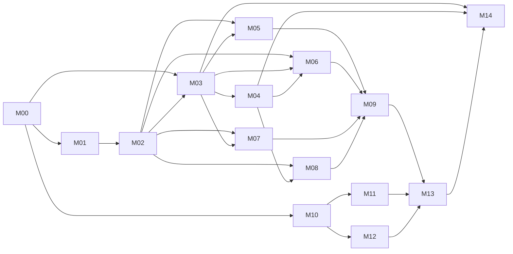

# Tensor Module Roadmap Implementation Plan

> **For agentic workers:** REQUIRED SUB-SKILL: Use superpowers:subagent-driven-development (recommended) or superpowers:executing-plans to implement this plan task-by-task. Steps use checkbox (`- [ ]`) syntax for tracking.

**Goal:** 按模块、语言和稳定契约实现 Tensor 首期，并在所有模块独立验收后完成 Tushare Pro 49 数据集的端到端集成和发布验证。

**Architecture:** 采用契约优先的模块化单体：Java 后端按 Maven 模块隔离，YAML 元数据、Flyway SQL 和 Vue 控制面分别实施。每个任务使用独立设计文档说明做什么、怎么做、如何测试、如何验证以及依赖什么信息；项目路线图不记录当前执行状态或运行时授权。

**Tech Stack:** Java 21、Spring Boot 3.5.x、Maven 3.9.x、Spring JDBC、MySQL 8.4 LTS、Flyway、Vue 3.5.x、Vite 8.x、Element Plus 2.x、Axios 1.x、JUnit 5、Testcontainers、WireMock、Vitest、Vue Test Utils、Playwright。

**Spec:** `docs/superpowers/specs/2026-08-25-tensor-module-roadmap-design.md`

## Global Constraints

- BRD 基线为 `docs/design/Tensor_多源证券数据平台_BRD_v1.0.md` 正文 v1.5；PRD 和 TRD 均为 v1.0。
- 生产运行时为 OpenJDK 21、Spring Boot 3.5.x、MySQL 8.4 LTS、Node.js 24 LTS。
- 交付形态为包含 Vue 静态资源的单个 Spring Boot JAR，外部只依赖 MySQL 和 Tushare Pro。
- 后端模块固定为 `tensor-plugin-api`、`tensor-core`、`tensor-plugin-tushare`、`tensor-plugin-fixture`、`tensor-app`。
- 核心模块不得依赖具体插件；插件通过 Spring Bean 编译期注册，不使用热加载或外部 JAR。
- 表名固定为 `<plugin_id>__<api_name>`；首期创建 49 张 `tushare_pro__*` 表。
- 数据写入严格执行“下载 → 适配 → 单事务 Upsert”；空结果不写占位记录，失败不允许部分提交。
- 查询只支持元数据白名单筛选和服务端 20/50/100 分页，不提供新增、编辑、删除或导出。
- Token 不得进入前端、业务 API、数据库、普通日志、异常正文或诊断端点。
- 生产代码、构建辅助代码和运行配置不得调用 Git API、代码托管 API 或 `git` 子进程。
- 单任务只允许一种主要语言，预计 0.5～4 AI 小时。
- 每个预定义任务使用 `docs/task-designs/<任务编号>-designs.md` 保存 Tensor 项目设计；任务卡和设计文档必须双向链接。
- 模块计划中的候选输入、文件和接口用于准备任务设计，不记录当前状态或运行时授权。
- 任务执行中的状态、权限、上下文、验证、事件、记录和恢复不写入本路线图。
- Git 可用时每个任务独立提交；Git 不可用时不得初始化新仓库，改为在任务证据中记录修改文件和校验输出。

---

## 1. 路线图使用方式

本路线图用于维护模块依赖、稳定接口、项目任务设计要求、实施顺序和验收标准。它不作为当前任务入口，也不保存当前执行状态、授权证据、事件、归档或恢复信息。

实施某个预定义任务前，先完成对应 `docs/task-designs/<任务编号>-designs.md`，明确做什么、怎么做、如何测试、如何验证和依赖什么信息。设计缺少必要结论时先修订设计；已经产生的任务进度和验证结果不回写到路线图结构中。

## 2. 文件与模块地图

| 模块 | 主要产物路径 | 责任边界 |
|---|---|---|
| M00 | `docs/contracts/`、`docs/traceability/`、`docs/superpowers/task-templates/` | 需求追踪、元数据和 REST 契约、任务设计与验收证据模板 |
| M01 | `data-plane/pom.xml`、`data-plane/tensor-*/pom.xml` | Maven 聚合、版本、依赖和架构门禁 |
| M02 | `data-plane/tensor-plugin-api/src/` | 无 Spring 业务实现的 SPI、描述符和值对象 |
| M03 | `data-plane/tensor-plugin-tushare/src/main/resources/datasets/tushare_pro/` | 49 个固定数据集 YAML |
| M04 | `data-plane/tensor-app/src/main/resources/db/migration/` | 49 表、键、索引和 fixture 迁移 |
| M05 | `data-plane/tensor-core/src/main/java/com/akkc/tensor/` | 注册表、目录、参数校验和适配 |
| M06 | `data-plane/tensor-core/src/main/java/com/akkc/tensor/persistence/`、`query/` | Upsert、事务、计数、锁和分页查询 |
| M07 | `data-plane/tensor-plugin-tushare/src/main/java/` | Tushare HTTP 协议、解析和错误分类 |
| M08 | `data-plane/tensor-plugin-fixture/src/` | 验收插件和确定性故障场景 |
| M09 | `data-plane/tensor-app/src/main/java/` | REST、配置、异常、安全、指标和静态资源 |
| M10 | `control-plane/src/api/`、`router/`、`utils/`、测试配置 | 前端工程、路由、API 契约和通用能力 |
| M11 | `control-plane/src/components/download/`、`views/DownloadView.vue` | 数据下载页面 |
| M12 | `control-plane/src/components/dataset/`、`views/DatasetView.vue` | 数据查看页面 |
| M13 | 根构建、`tensor-app` 静态资源打包、`docs/runbook/` | 单 JAR 和新环境启动说明 |
| M14 | `control-plane/e2e/`、`scripts/`、`docs/verification/` | 跨模块 E2E、49 回归、性能、安全和发布证据 |

### 2.1 跨模块稳定接口

以下签名是模块接口基线；任务设计可以补充内部细节，但不得静默改名或改变参数/返回类型：

```java
public interface DataSourcePlugin {
    PluginDescriptor descriptor();
    PluginReadiness readiness();
    DownloadEnvelope download(ApiName apiName, Map<String, Object> params);
}

public interface DatasetAdapter {
    DatasetKey datasetKey();
    DatasetDefinition definition();
    AdaptedBatch adapt(DownloadEnvelope envelope, Instant ingestedAt);
}

public final class ParameterValidator {
    ValidatedParameters validate(ApiDescriptor api, Map<String, Object> raw);
}

public final class PersistenceService {
    WriteCounts persist(AdaptedBatch batch);
}

public final class DatasetQueryService {
    DatasetPage query(DatasetKey key, QueryCriteria criteria);
}

public final class DownloadService {
    DownloadResult execute(
        PluginId pluginId,
        ApiName apiName,
        Map<String, Object> params,
        RequestId requestId
    );
}
```

稳定数据形状：

```text
DownloadEnvelope:
  pluginId, apiName, params, fields: List<String>, rowCount,
  data: List<List<Object>>, status, error

AdaptedBatch:
  datasetKey, tableName, columns: List<String>,
  rows: List<Map<String,Object>>, businessKeyDefinition, ingestedAt

WriteCounts: insertedRows, updatedRows

DatasetPage:
  columns: List<String>, items: List<Map<String,Object>>,
  page, pageSize, totalElements, totalPages

DownloadResult:
  requestId, outcome, pluginId, apiName,
  sourceRowCount, insertedRows, updatedRows, message
```

前端 API 边界：

```javascript
listDataSources()
listApis(pluginId)
downloadDataset({ pluginId, apiName, params })
listDatasets(pluginId)
getDataset(pluginId, apiName)
queryDataset(pluginId, apiName, {
  tsCode,
  tradeDateFrom,
  tradeDateTo,
  annDateFrom,
  annDateTo,
  page,
  pageSize,
})
```

## 3. 模块依赖与里程碑



| 里程碑 | 完成模块 | 交付判断 | 累计 AI 工时 |
|---|---|---|---:|
| R0 契约冻结 | M00 | REST、元数据 schema、追踪和项目任务模板可审阅 | 5 |
| R1 后端骨架 | M01～M02 | 五模块构建和 SPI 契约通过 | 20 |
| R2 数据结构冻结 | M03～M04 | 49 YAML 与 49 MySQL 表契约通过 | 63 |
| R3 后端模块完成 | M05～M09 | fixture、Tushare、核心和 REST 独立测试通过 | 133 |
| R4 前端模块完成 | M10～M12 | 两页面组件和竞态测试通过 | 167 |
| R5 可运行产物 | M13 | 单 JAR 和全新环境运行说明通过 | 176 |
| R6 首期发布门禁 | M14 | AC-001～018、49 回归和非功能门槛通过 | 206 |

## 4. AI 工时总览

| 模块 | 任务数 | AI 工时 | 计划文件 |
|---|---:|---:|---|
| M00 需求追踪与共享契约 | 4 | 5 | `tensor-modules/M00-contracts.md` |
| M01 后端工程基线 | 3 | 5 | `tensor-modules/M01-backend-foundation.md` |
| M02 Plugin API | 5 | 10 | `tensor-modules/M02-plugin-api.md` |
| M03 Tushare 数据集元数据 | 9 | 22 | `tensor-modules/M03-tushare-metadata.md` |
| M04 MySQL/Flyway | 6 | 21 | `tensor-modules/M04-flyway-schema.md` |
| M05 Core 注册与适配 | 5 | 16 | `tensor-modules/M05-core-registry-adapter.md` |
| M06 Core 持久化与查询 | 6 | 20 | `tensor-modules/M06-core-persistence-query.md` |
| M07 Tushare 插件 | 4 | 12 | `tensor-modules/M07-tushare-plugin.md` |
| M08 Fixture 插件 | 3 | 7 | `tensor-modules/M08-fixture-plugin.md` |
| M09 App/API | 6 | 15 | `tensor-modules/M09-app-api.md` |
| M10 前端工程基线 | 4 | 8 | `tensor-modules/M10-frontend-foundation.md` |
| M11 数据下载页面 | 5 | 12 | `tensor-modules/M11-download-ui.md` |
| M12 数据查看页面 | 5 | 14 | `tensor-modules/M12-dataset-ui.md` |
| M13 构建与运行 | 4 | 9 | `tensor-modules/M13-packaging-runbook.md` |
| M14 集成与发布验证 | 8 | 30 | `tensor-modules/M14-integration-release.md` |
| **总计** | **77** | **206** | 15 个模块计划 |

工时是有效 AI 执行时间，不含审批、网络故障、Tushare 不可用或 CI 排队时间。总计任务数包含 77 个预先设计的实施与验证任务；后续新增的缺陷修复任务单独估算。

## 5. 任务索引

M00–M14 的 77 个任务、AI 工时、交付物和前置依赖独立维护在 [`docs/planning/task-index.md`](../../planning/task-index.md)。该索引是 Tensor 项目计划，不记录当前执行状态或运行时授权。

## 6. 需求追踪总矩阵

| BRD | PRD | 主要 TRD | 实施模块 | 集成证据 |
|---|---|---|---|---|
| FR-01 插件机制 | F-001～005 | 3、5、6 | M02、M05、M08、M09 | M14-T01、T04 |
| FR-02 Tushare 插件 | F-004 | 7、14 | M03、M07 | M14-T04～T05 |
| FR-03 适配层 | F-015～018 | 5、6、8 | M03、M05 | M14-T02、T04 |
| FR-04 接口选择 | F-006～007 | 12、13 | M09、M11 | M14-T01、T04 |
| FR-05 参数填写 | F-007～008 | 5、8、13 | M03、M05、M11 | M14-T01、T04 |
| FR-06 下载 | F-009～014 | 7、10、12、15 | M06、M07、M09、M11 | M14-T01～T02、T05 |
| FR-07 空数据 | F-012 | 5、7、10、12 | M07、M09、M11 | M14-T02 |
| FR-08 持久化 | F-019～023 | 8～10 | M03～M06 | M14-T02、T04～T05 |
| FR-09 数据查看 | F-024～030 | 11～13 | M06、M09、M12 | M14-T03～T05 |
| 全局启动 | F-031 | 19～20 | M13 | M14-T08 |
| 性能 | PRD 10.1 | 9.5、11、18 | M04、M06、M12 | M14-T06 |
| 可靠性 | PRD 10.2 | 10、19.4 | M06、M13 | M14-T02、T08 |
| 安全 | PRD 10.3 | 1.4、14～16 | M01、M07、M09、M13 | M14-T07 |
| 扩展性 | PRD 10.4 | 3、6 | M01、M02、M05、M08 | M14-T01 |
| 可用性 | PRD 10.5 | 13 | M10～M12 | M14-T03、T08 |
| 可观测性 | PRD 10.6 | 15、17 | M09 | M14-T02、T07 |

### AC-001～AC-018 归属

| 验收用例 | 主任务 |
|---|---|
| AC-001～003 | M14-T01、M14-T04 |
| AC-004～011 | M14-T02、M14-T05 |
| AC-012～016 | M14-T03、M14-T05 |
| AC-017 | M14-T01 |
| AC-018 | M14-T08 |

### TRD 章节覆盖

| TRD 章节 | 主模块/任务 |
|---|---|
| 1–4 范围、ADR、架构、技术栈 | M00、M01、M13 |
| 5 核心领域模型 | M02 |
| 6 插件与适配器 | M02、M05、M08 |
| 7 Tushare Pro | M03、M07 |
| 8 元数据与适配 | M03、M05 |
| 9 数据库 | M03、M04、M06 |
| 10 下载、事务与幂等 | M05、M06、M09 |
| 11 查询 | M06、M09 |
| 12 REST API | M00、M09、M10 |
| 13 前端 | M10～M12 |
| 14 配置与密钥 | M07、M09、M13 |
| 15 异常 | M02、M07、M09 |
| 16 安全 | M01、M07、M09、M14-T07 |
| 17 可观测性 | M09、M14-T02、M14-T07 |
| 18 性能与容量 | M04、M06、M12、M14-T06 |
| 19 构建、部署与运行 | M13、M14-T08 |
| 20 测试设计 | M01～M14 各模块门禁、M14 |
| 21 需求追踪 | M00-T01、本路线图第 6 节 |
| 22 风险与约束 | M03、M06、M07、M12～M14 |
| 23 完成条件 | M14-T08、本路线图第 8 节 |

## 7. 集成缺陷修复原则

M14 只做黑盒验证和缺陷归属，不在一个任务中同时修改 Java、SQL/YAML 和 Vue。发现缺陷时：

1. M14 验证记录最小复现、预期、实际、请求标识和负责模块；
2. 每个缺陷建立单独规划的单语言修复任务，不把 Java、SQL/YAML 和 Vue 混入同一修复；
3. 修复任务设计明确根因、文件边界、失败测试、回归范围和验收结果；
4. 修复完成后重新运行原 M14 验证的精确失败用例和负责模块回归；
5. 所有已登记缺陷关闭后，相关 M14 验收才能完成。

## 8. 路线图完成条件

- 77 个预定义任务全部完成并通过各自验收；
- 所有已登记缺陷和设计缺口均已关闭；
- 49/49 YAML、表结构、适配、Upsert 和查询契约通过；
- PRD-F-001～031、AC-001～018 和 TRD 发布门槛均有新鲜证据；
- 生产 JAR 不含真实凭证并包含 Vue 静态资源、49 YAML 和 Flyway SQL；
- `daily` 查询 P95 不超过 2 秒，点击后 300ms 内出现加载反馈；
- 没有 Token 泄露、部分写入、重复业务键、字段缺失或跨来源混表；
- 全新环境只准备 Token 和 MySQL 连接即可按说明完成页面闭环。
