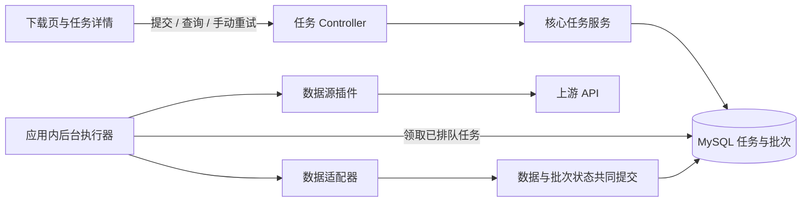

# ISSUE-018：日期区间批量下载详细设计

状态：详细设计待复核，尚未实施（2026-09-11）。依据：[已确认的方案草稿](../issues/proposals/ISSUE-018-date-range-batch-downloads.md)、[40 项官网调研](../issues/problems/ISSUE-018-date-range-batch-downloads.md)。源码基线：`452832ed17d484f4f4b4af310546242c604d5f8d`；分支：`feat/download-by-date-range`。

本文将已确认方向落实为接口和实现约束。文中新增类型、表、配置及测试均是待实施产物；官网未明确的完整性规则列为发布前待验证项，不以设计完成代替实测。

## 1. 目标

用户选择一个数据接口及日期区间，提交后取得任务 ID。后端独立执行下载，刷新或关闭页面不影响已接收的任务；用户重新打开页面可以查询任务和批次结果。

每批下载成功即独立入库，数据写入与批次成功状态使用同一事务。失败不回滚其他成功批次；手动重试只执行未成功的批次。服务重启后保留执行记录，用户手动恢复中断任务。

任务管理、事务、重试及结果查询支持多个数据源复用；上游参数、日期含义、完整性判断及认证留在插件中。

## 2. 范围

### 2.1 已确认方向与本次边界

- 31 项原生区间接口使用上游日期区间；`top_list` 遍历交易日，`dividend`、`disclosure_date` 遍历公告自然日。
- `pledge_stat`、`stk_rewards` 暂不增加区间能力；`stock_basic`、`stock_company`、`index_classify`、`index_member_all` 保留现有参数方式。
- 40 个现有接口均保留下载入口；34 项股票必填、6 项非股票输入规则继续生效。此前永久移除的 9 个接口不恢复。
- 页面下载统一通过后台任务执行。没有区间能力的接口采用单批任务，获得同样的持久化、结果查询和手动重试能力。
- 沿用现有单实例部署、MySQL 8.4、Spring JDBC、Flyway 和单个 Spring Boot JAR；依据现有 TRD 的 ADR-009，不增加多实例协调能力。
- 本次不增加多股票、多接口合并任务、取消、定时下载、自动失败重试、重启后自动续跑、任务删除或历史数据回滚。

### 2.2 兼容方式

新增 `/api/v1/download-tasks` 系列接口供页面使用；现有 `POST /api/v1/downloads` 保留同步合同，兼容已有脚本与单次调用。两者复用插件、适配器及入库实现，但后台 worker 不调用旧 HTTP 接口。

保留原有 YAML 参数作为 `SINGLE` 模式合同；新增独立的区间能力描述作为 `RANGE` 模式合同，避免把同一表单变成“单日与区间同时必填”。原生区间能力不通过修改全部旧单次合同实现。唯一已知无官方依据的 `fina_mainbz.ann_date` 同步纠正为原有股票单值入口（`ts_code`、`queryMode: snapshot`），区间入口另按报告期提供；其旧非法参数请求返回 400，不默默忽略。

`SINGLE` 成功表示一次请求及入库完成，不承诺完整历史；`RANGE` 成功必须通过本设计的覆盖和完整性检查。页面对两种含义分别说明。

## 3. 方案

### 3.1 模块与执行流



| 层 | 职责 |
| --- | --- |
| `tensor-plugin-api` | 定义可选批量能力、规范化区间、完整性判断和调用上下文；不依赖 Spring Web、数据库或具体插件 |
| `tensor-core.download.task` | 接收任务、持久化、批次规划与拆分、后台调度、状态流转、重试恢复、查询和统计 |
| `tensor-core.persistence` | 沿用数据集锁和 Upsert；在同一事务中协调证券数据与批次状态 |
| 数据源插件 | 认证、请求参数映射、交易日规划、范围校验、限量与完整性判断、上游错误分类 |
| `tensor-app` | HTTP 绑定、后台生命周期与配置装配、错误映射、日志、Flyway |
| 前端 | 提交表单、任务列表与详情、轮询、失败批次展示及手动操作；不在浏览器遍历日期 |

后台默认仅有一个 worker，全局同时执行一个任务，任务内部串行处理批次；其他任务持久化排队。worker 不持有跨 HTTP 请求的数据库事务，也不依赖浏览器连接。首版用应用内执行器和数据库队列，不引入消息中间件。

### 3.2 可选插件合同

保留 `DataSourcePlugin.download(ApiName, Map<String,Object>)`。支持区间的插件额外实现以下接口，普通插件仍可通过 `SINGLE` 单批任务执行：

```java
public interface BatchDownloadSupport extends DataSourcePlugin {
    Optional<BatchDownloadDescriptor> batchDescriptor(ApiName apiName);
    List<DateRange> plan(ApiName apiName, Map<String, Object> params,
                         BatchCallContext context);
    Map<String, Object> sourceParameters(ApiName apiName,
                         Map<String, Object> params, DateRange range);
    DownloadEnvelope downloadBatch(ApiName apiName,
                         Map<String, Object> sourceParams, BatchCallContext context);
    BatchAssessment assess(ApiName apiName, DateRange range,
                         DownloadEnvelope envelope);
}
```

合同中的值对象：

| 类型 | 字段 / 约束 |
| --- | --- |
| `DateRange` | `LocalDate start, end`；闭区间，`start <= end`；核心层不推断其为公告日还是报告期 |
| `BatchDownloadDescriptor` | `parameters`、起止参数名、`dateAxis`、`planningMode`、`splittable`、`availability`、`unavailableReason`、`policyVersion`、`completenessRule` |
| `dateAxis` | `TRADE_DATE / ANNOUNCEMENT_DATE / REPORT_PERIOD / CALENDAR_DATE / ISSUE_DATE`；展示标签由描述提供 |
| `planningMode` | `NATIVE_RANGE / CALENDAR_DAYS / TRADING_DAYS`；只表示本次实现的三种规划方式 |
| `availability` | `AVAILABLE / NEEDS_VERIFICATION / UNSUPPORTED`；AVAILABLE 还须结合插件凭证与启用状态 |
| `completenessRule` | 已确认的行数上限及依据，或插件提供的已验证完整性规则；未知不得写成无限制 |
| `BatchAssessment` | `COMPLETE / SPLIT_REQUIRED / UNKNOWN`；范围不符、非法字段等通过已分类异常返回 |
| `BatchCallContext` | 本轮截止时间、停止信号、`beforeRequest()`；每个真实上游请求先预约请求预算，调用超时不得超过剩余时间 |

`plan` 只在 worker 中执行，可访问上游，例如取得交易日历。原生区间返回一个根区间，自然日模式返回逐日区间，交易日模式返回经验证的交易日列表；结果按日期排序、无重复、均位于用户范围内。规划与子批次插入一次事务提交，并设置 `plan_ready=true`；规划结果提交前失败，不留下半份计划。

核心额外核对：NATIVE_RANGE 计划必须恰好等于用户整个闭区间；CALENDAR_DAYS 必须覆盖每个自然日；TRADING_DAYS 的完整日历证据由插件负责，核心验证返回日期合法、唯一且不越界。SINGLE 不调用区间 plan，核心直接创建一条 source_params 等于规范化请求参数、range_start/end 均为空的根批次。

`sourceParameters` 是纯函数，将用户参数与某一片段转换为上游参数；输出必须是可持久化的非敏感业务参数。每个批次保存实际请求参数，重试读取该快照。调用凭证仍来自插件运行配置，不进入任务、批次或参数 JSON。

`downloadBatch` 复用该插件已有客户端和错误处理；返回 envelope 的数据源、接口和参数必须与批次快照一致。核心不拿旧单次元数据重新校验区间上游参数。Tushare 的股票归属校验继续在客户端执行。

`assess` 在完整响应收到后、适配和入库前运行，先验证每行属于请求股票与正确日期轴，再判断完整性。核心只处理判断结果，不直接比较 Tushare 的 `ann_date` 或 `end_date`。

公共日期二分和自然日枚举放在 core；插件不引用 core，可自行生成合法规划结果。首版不实现游标 / offset 的通用状态机，也不假设所有来源使用行数阈值。未来游标来源仍可复用任务、状态、事务与重试，但需要扩展批次载荷及能力合同；不得用 `UNKNOWN` 冒充 `COMPLETE`。

### 3.3 能力发现与参数绑定

新增 `GET /api/v1/data-sources/{pluginId}/apis/{apiName}/download-capabilities`，由核心任务服务组合现有单次描述与可选区间描述，不改变旧 `/apis` 响应格式。

```json
{
  "single": {
    "available": true,
    "parameters": [
      {"name":"ts_code","label":"股票代码","type":"TS_CODE","required":true},
      {"name":"trade_date","label":"交易日期","type":"DATE","required":true}
    ]
  },
  "range": {
    "availability": "AVAILABLE",
    "unavailableReason": null,
    "dateAxis": "TRADE_DATE",
    "dateLabel": "交易日期",
    "parameters": [
      {"name":"ts_code","label":"股票代码","type":"TS_CODE","required":true},
      {"name":"start_date","label":"交易开始日期","type":"DATE_RANGE_MEMBER","required":true,"relatedParameter":"end_date"},
      {"name":"end_date","label":"交易结束日期","type":"DATE_RANGE_MEMBER","required":true,"relatedParameter":"start_date"}
    ]
  }
}
```

上例是 daily 的完整两种参数形状。完全不支持区间时 `range.availability=UNSUPPORTED`、`parameters=[]`，给出可理解的原因。区间 AVAILABLE 时还要对具体参数组合执行条件检查，例如未验证的 BSE 日历请求在任务提交前拒绝。

任务请求仍采用强类型参数绑定：新增任务请求反序列化器，先读 `mode`，再选择单次或区间描述，复用 `ParameterJsonReader`、`ParameterValidator` 和参数形状匹配。为 `DownloadParameterResolver` 增加显式描述的解析入口，避免 RANGE 错取 SINGLE 描述。

| RANGE 参数组合 | 类型处理 |
| --- | --- |
| `start_date, end_date` | 复用 `DateRangeParameters`：`new_share, repurchase, slb_len` |
| `exchange, start_date, end_date` | 复用 `ExchangeDateRangeParameters`：`trade_cal` |
| `exchange_id, start_date, end_date` | 新增 `ExchangeIdDateRangeParameters`：`margin` |
| `ts_code, start_date, end_date` | 新增 `TsCodeDateRangeParameters`：其余 29 项区间 / 逐日接口 |

新类型各有唯一 Codec，不重复注册同一个 Java 类型。JSON 重复字段、未知字段、非字符串参数、非法日期、缺少端点、起始晚于结束及额外股票条件继续严格拒绝，提交失败时零任务、零上游调用。输入日期沿用 `YYYYMMDD`，数据库区间使用 DATE，时间戳使用 UTC。

现有 YAML Loader 和 schema 是 Tushare 专用实现，不强行推广为所有来源通用加载器。其他插件可以自行构造描述、注册适配器；新参数组合仍须扩展现有 Codec。本次不改写全项目参数系统。

### 3.4 Tushare 策略清单

下表为 RANGE 策略目标清单，官网链接和原始参数依据见母 issue。数值是官网声明的单次行数，不是当前 `DatasetDefinition.batchSize`；后者是数据库写入批量大小。

| 接口 | 规划 | 范围校验输出列 | 单次上限 / 完整性依据 |
| --- | --- | --- | --- |
| `daily` | 原生区间 | `trade_date` | 6000 |
| `weekly` | 原生区间 | `trade_date` | 6000；日期为每周最后交易日 |
| `monthly` | 原生区间 | `trade_date` | 4500；日期为每月最后交易日 |
| `adj_factor` | 原生区间 | `trade_date` | 未注明，待验证 |
| `daily_basic` | 原生区间 | `trade_date` | 6000 |
| `stk_limit` | 原生区间 | `trade_date` | 5800 |
| `suspend_d` | 原生区间 | `trade_date` | 未注明，待验证 |
| `moneyflow` | 原生区间 | `trade_date` | 6000 |
| `margin` | 原生区间 | `trade_date` | 4000；保留 `exchange_id` |
| `margin_detail` | 原生区间 | `trade_date` | 6000 |
| `block_trade` | 原生区间 | `trade_date` | 1000 |
| `slb_len` | 原生区间 | `trade_date` | 5000 |
| `slb_sec` | 原生区间 | `trade_date` | 5000；官网标停，历史可用性待验证 |
| `slb_sec_detail` | 原生区间 | `trade_date` | 5000；官网标停，历史可用性待验证 |
| `trade_cal` | 原生区间 | `cal_date` | 不猜行数上限；核对所请求交易所的每个自然日恰好一条 |
| `new_share` | 原生区间 | `ipo_date` | 2000；不是上市日期 `issue_date` |
| `income` | 原生区间 | `ann_date` | 未注明，待验证 |
| `balancesheet` | 原生区间 | `ann_date` | 未注明，待验证 |
| `cashflow` | 原生区间 | `ann_date` | 未注明，待验证；不是 `f_ann_date` |
| `fina_audit` | 原生区间 | `ann_date` | 未注明，待验证 |
| `forecast` | 原生区间 | `ann_date` | 3500 |
| `express` | 原生区间 | `ann_date` | 未注明，待验证 |
| `repurchase` | 原生区间 | `ann_date` | 仅写无参数默认 2000，不可当区间硬上限 |
| `stk_managers` | 原生区间 | `ann_date` | 未注明，待验证 |
| `stk_holdernumber` | 原生区间 | `ann_date` | 3000；输入 `enddate` 和输出 `end_date` 不是公告范围 |
| `stk_holdertrade` | 原生区间 | `ann_date` | 3000；不是实际增减持开始 / 结束日 |
| `pledge_detail` | 原生区间 | `ann_date` | 1000；输出 `start_date/end_date` 是质押业务日期 |
| `fina_indicator` | 原生区间 | `end_date` | 100；报告期 |
| `fina_mainbz` | 原生区间 | `end_date` | 100；报告期，无 `ann_date` 输入 |
| `top10_holders` | 原生区间 | `end_date` | 未注明，待验证；报告期 |
| `top10_floatholders` | 原生区间 | `end_date` | 未注明，待验证；报告期 |
| `top_list` | 交易日逐日 | `trade_date` | 10000；每个子请求传必填 `trade_date` |
| `dividend` | 自然日逐日 | `ann_date` | 2000；每个子请求传 `ann_date` |
| `disclosure_date` | 自然日逐日 | `ann_date` | 6000；最新披露公告日，不承诺所有历史修改版本 |

其余 6 项只有 SINGLE 能力：`pledge_stat, stk_rewards, stock_basic, stock_company, index_classify, index_member_all`。原有 34 项股票约束作用于两种模式；RANGE 清单中有 29 项必填股票，5 项不传股票。

策略存于插件内一个显式注册表 `TushareBatchPolicies`，避免将下载策略混入 40 份来源表字段定义。区间参数描述按上述四类组合生成，日期标签按策略填写。注册表应包含官网 URL、核验日期、策略版本及上线验证标记，并在测试中断言无重复、无遗漏、未恢复被移除接口。

31 项原生区间里，19 项有数值上限、`trade_cal` 可设计按日历覆盖校验、11 项的完整提取依据未确认。所有策略通过相应验证后才能设为 AVAILABLE；11 项不能仅凭一次宽区间与窄区间结果相同就认定无限量。待验证期间保留 SINGLE，不宣称 34 项 RANGE 全部验收完成。

交易日规划由 Tushare 插件获取日历：SH 使用 SSE，SZ 使用 SZSE；BJ 的日历参照沪深须先核验官方说明和实际返回。使用日历时要求整段自然日无缺失、无重复，再取 `is_open=1`；失败则整个规划失败，不用“周一至周五”替代。规划结果入库后重试使用保存的日期，不重新改变覆盖范围。`trade_cal(exchange=BSE)` 的区间入口在直接输入支持性未验证前拒绝，不默默替换用户请求的交易所；SINGLE 保持原行为。

`fina_mainbz` 不按 P/D/I 自动扩展请求：现有业务键不含类型，混合类型可能冲突。保留未传 `type` 的范围，验证其默认返回含义；要开放类型选择须另行处理业务键兼容。报告期接口采用报告期列校验，公告日在区间外不构成越界。

### 3.5 区间拆分与完整性

1. 收到响应后验证来源、接口、参数、字段结构、股票和日期范围。越界或日期不可解析使该批失败，不通过本地过滤掩盖上游条件无效。
2. 对已验证的固定上限 L，原始返回数 `>= L` 判为 `SPLIT_REQUIRED`，不适配或保存父批数据；`< L` 仅在该接口已确认以 L 截断的合同下可判 COMPLETE。
3. 可拆分闭区间 `[a,b]` 按自然日中点 m 拆为 `[a,m]`、`[m+1,b]`，并重新生成各子请求参数。拆分必须覆盖原区间且不重叠；报告期也按日期边界拆，不能漏掉非标准报告期。
4. 父批从 RUNNING 改为 SPLIT、两条子批 PENDING 的插入在同一事务完成；父批保留调用次数但不贡献成功 / 失败叶子数或入库数。
5. `a=b` 仍需拆分、策略不可拆分或判断 UNKNOWN，记 `BATCH_COMPLETENESS_UNCONFIRMED` 失败。本轮不发同一个请求自动重试。逐日接口达到上限同样失败。
6. 空批次在完整性规则允许时记 SUCCEEDED、计数 0，继续后续片段；交易日列表为空是合法空任务，但必须先通过完整日历校验。
7. 下载、适配、入库逐批执行，不累计整段原始数据；失败父批、用于规划的日历响应不计入最终证券数据获取数。

### 3.6 持久化模型

新增生产迁移 `V8__create_download_task_tables.sql`，创建 `tensor_download_task` 和 `tensor_download_batch`。均为 InnoDB、`utf8mb4_0900_as_cs`，时间为 UTC `DATETIME(3)`，ID 为 UUID `CHAR(36)`，状态使用 VARCHAR + CHECK，不使用 MySQL ENUM。不修改 V1～V7；两张任务表不注册为可查询证券数据集。

任务表：

| 字段 | 类型与约束 | 含义 |
| --- | --- | --- |
| `task_id` | CHAR(36) PK | 服务端任务 ID |
| `submission_id` | CHAR(36) NOT NULL UNIQUE | 客户端提交幂等键 |
| `request_hash` | CHAR(64) NOT NULL | 规范化数据源、接口、模式和参数的 SHA-256 |
| `plugin_id, api_name` | 各 VARCHAR(64) NOT NULL | 来源身份 |
| `mode` | VARCHAR(8) NOT NULL | SINGLE / RANGE |
| `params` | JSON NOT NULL | 规范化用户业务参数，无凭证 |
| `definition_hash` | CHAR(64) NOT NULL | 参数合同、策略版本、完整性规则、字段及业务键的摘要 |
| `policy_snapshot` | JSON NOT NULL | 本次使用的日期轴、规划方式、完整性规则与版本；SINGLE 为单批规则 |
| `status` | VARCHAR(24) NOT NULL | 任务状态，见下一节 |
| `plan_ready` | BOOLEAN NOT NULL DEFAULT FALSE | 是否已原子保存完整初始计划 |
| `active_run_id` | CHAR(36) NOT NULL | 当前执行许可所属应用启动 ID |
| `run_generation` | INT NOT NULL DEFAULT 0 | 每次领取任务递增，隔离旧 worker 的晚到结果 |
| `version` | BIGINT NOT NULL DEFAULT 1 | 提交、领取、终态与重试 / 恢复等控制转换版本 |
| `request_count, run_request_count` | BIGINT NOT NULL DEFAULT 0 | 全任务 / 本轮已预约的上游请求次数，含规划和已拆父批 |
| `last_error_code, last_error_message` | VARCHAR(64) / VARCHAR(512)，可空 | 最近任务级失败 / 中断原因；仅保存已脱敏分类文案 |
| `created_at, updated_at, queued_at` | DATETIME(3) NOT NULL | 创建、变更、最近排队时间 |
| `started_at, finished_at, deadline_at` | DATETIME(3)，可空 | 本轮开始、停止与截止时间 |

批次表：

| 字段 | 类型与约束 | 含义 |
| --- | --- | --- |
| `batch_id` | CHAR(36) PK | 批次 ID |
| `task_id` | CHAR(36) NOT NULL，FK task | 所属任务 |
| `parent_batch_id` | CHAR(36)，可空 | 拆分父批；应用验证同任务，外键引用 batch |
| `batch_key` | VARCHAR(128) NOT NULL | 稳定树路径，如 `000001/0/1`；UNIQUE(task_id,batch_key) |
| `range_start, range_end` | DATE，可空 | RANGE 必填；SINGLE 均为空 |
| `source_params` | JSON NOT NULL | 实际上游业务参数快照 |
| `status` | VARCHAR(16) NOT NULL | PENDING / RUNNING / SUCCEEDED / FAILED / SPLIT |
| `attempt_count` | INT NOT NULL DEFAULT 0 | 每次领取该批递增；展示重试次数为 max(attempt_count-1,0) |
| `run_generation` | INT，可空 | 最近执行该批的任务轮次 |
| `source_rows, inserted_rows, updated_rows` | BIGINT NOT NULL DEFAULT 0 | 仅成功提交批次的计数 |
| `error_code, error_message` | VARCHAR(64) / VARCHAR(512)，可空 | 最近失败原因 |
| `created_at, updated_at` | DATETIME(3) NOT NULL | 批次创建 / 变更时间 |
| `started_at, finished_at` | DATETIME(3)，可空 | 最近一次执行开始 / 结束 |

索引：task `(status,active_run_id,queued_at,task_id)` 用于领取，`(created_at,task_id)` 用于列表，`(plugin_id,api_name,created_at,task_id)` 用于筛选；batch `(task_id,status,batch_key)` 用于执行与统计，另为 `parent_batch_id` 建索引。FK 禁止级联删除；首版不提供删除入口。

任务提交业务参数序列化后上限 8 KiB，批次参数上限 16 KiB，策略快照上限 16 KiB；值按参数类型规范化，JSON 键排序后计算摘要。core 增加 Jackson databind 依赖处理受限 JSON，不持久化任意 Java 类名或序列化对象。完整响应数据只进入证券来源表，不放入任务 JSON。

计数采用批次查询聚合，避免任务表另维护一套易漂移计数。成功批次重试不清零、不再次累计；SPLIT 父批不进入叶子计数。跨片段相同业务键可能形成新增后更新，任务 `insertedRows/updatedRows` 是已提交写入操作的合计，不是跨整段去重后的证券总数；页面使用“新增 / 更新记录次数”，不承诺不同记录总量。

### 3.7 状态机与判定

任务状态：

| 状态 | 含义 | 允许操作 |
| --- | --- | --- |
| QUEUED | 已持久化，等待当前启动实例领取 | 查询 |
| RUNNING | 正在规划或执行批次 | 查询 |
| SUCCEEDED | 已规划且全部叶子成功，或已确认无须执行任何交易日 | 查询；需要重新下载时新建任务 |
| PARTIAL_FAILED | 本轮已停止，部分叶子成功，其余失败或因中止未执行 | 手动 retry |
| FAILED | 本轮已停止且没有成功叶子，或规划失败 | 手动 retry |
| INTERRUPTED | 执行许可已失效，存在未完成工作 | 手动 resume |

批次状态：`PENDING -> RUNNING -> SUCCEEDED / FAILED / SPLIT`。仅 FAILED 可由 retry 重新变为 PENDING；resume 可重新排队被中断的执行批次。SUCCEEDED 与 SPLIT 不反向转换。

只要 worker 仍被允许继续执行任务，即使已经有失败批次，任务仍显示 RUNNING。全部可执行批次处理完再按叶子结果汇总终态；全部空批次也是 SUCCEEDED，显示 0 条。`plan_ready=false` 时绝不因叶子数为 0 判成功。

预算耗尽、鉴权失败、插件停用等导致提前停止时，当前批次记录失败，未开始批次保持 PENDING；任务根据已有成功叶子进入 PARTIAL_FAILED / FAILED，并显示未执行数量与停止原因。重试时除重新排队 FAILED 外，也继续这些 PENDING 批次。

### 3.8 提交、领取与后台生命周期

1. 提交路径只做本地参数、能力、注册状态和队列容量检查，不调用 Tushare。创建任务并提交事务后返回 202，再通知后台检查队列；数据库 QUEUED 是事实来源，内存通知丢失时轮询仍可领取。
2. 单个后台协调器每秒检查当前启动 ID 的 QUEUED，按 `queued_at,task_id` 领取一项；条件更新 QUEUED→RUNNING，递增轮次和版本，写开始与截止时间后提交事务。一次仅启动一个实际 worker，禁止 CallerRunsPolicy 把下载挪回 HTTP 线程。
3. 规划、HTTP 下载和适配在事务外执行；每次上游调用前检查剩余预算与停止信号。领取批次时在短事务中将 PENDING→RUNNING、增加 attempt_count。
4. worker 完成 / 失败后显式保存结果并释放活动登记。数据库暂时不可用、无法保存失败状态时，停止该任务，不继续调用上游；连接恢复后协调器只能将确认已无活动 worker 的遗留任务标为 INTERRUPTED，不自动重发该批请求。
5. 应用启动在 Flyway 和数据集校验后产生新的随机启动 ID。扫描旧启动 ID 的 QUEUED / RUNNING：若计划及全部叶子已成功则重算终态；否则置 INTERRUPTED，旧 RUNNING 批次记为 FAILED / EXECUTION_INTERRUPTED，PENDING 和成功批次保留。启动完成前不接收任务提交或领取。
6. 正常关闭时停止接收与领取，通知当前 worker 在边界停止；允许正在提交的数据库事务完成。未完成任务记录 INTERRUPTED。强制退出时由下次启动恢复标记；不以线程 Future.cancel 成功作为“上游已停止”的证据。

每次批次写库、拆分或失败状态更新必须检查 `active_run_id + run_generation + RUNNING`。手动恢复使旧执行许可失效，迟到的旧 worker 不能更新状态或提交数据。沿用单实例运行要求，新实例启动前应停止旧实例；执行许可校验不等于多实例生产支持。

### 3.9 数据和状态的共同事务

现有 `PersistenceService.persist` 在数据集锁内开启事务，但任务状态不在其中；当前空数据还会直接返回。新增通用事务参与接口 `PersistenceParticipant`，提供 `beforeWrite()` 和 `afterWrite(WriteCounts)`：

```text
下载、范围 / 完整性检查、适配（事务外）
  -> 取得现有 DatasetLockManager 数据集锁
  -> 开启单批事务（现有 60 秒上限）
     -> beforeWrite：锁任务行、再锁批次行，验证启动 ID / 轮次 / RUNNING
     -> 按业务键查询已有记录、计算计数、Upsert
     -> afterWrite：批次 SUCCEEDED + 三项计数 + finished_at
  -> 提交事务，再释放数据集锁
```

旧 `persist(batch)` 委托无参与逻辑的重载，保留原单次行为。后台由 `BatchCommitService` 提供参与实现，persistence 包不依赖 task 包。调用方不得先开启外层事务再等数据集锁；锁顺序固定为数据集锁→任务行→批次行，插件及网络代码不进入事务。

空批次也要执行同样的状态事务，不能沿用现有提前返回而漏记 SUCCEEDED。数据写入、计数或状态更新任一失败，整批回滚；随后另开短事务保存 FAILED。数据和成功状态已共同提交后，如果仅任务终态汇总失败，恢复通过叶子状态重算，不重新下载成功批次。

拆分事务只锁任务行→父批行，原子保存父状态与子批；任何失败都不留下缺子节点的 SPLIT。重试控制事务按任务行→批次行排序，不在持有这些行锁时获取数据集锁。

### 3.10 重试、恢复与定义变化

- `retry` 只允许 FAILED / PARTIAL_FAILED；锁任务行并校验客户端 expectedVersion，将 FAILED 重排为 PENDING，保留已有 PENDING / SUCCEEDED / SPLIT，任务改为当前启动 ID 的 QUEUED。规划未完成的任务重新规划。
- `resume` 只允许 INTERRUPTED，且确认没有仍在执行的本地 worker；重新排队 PENDING 及 EXECUTION_INTERRUPTED 失败批次。中断前已发生的普通 FAILED 保留，恢复结束后可再手动 retry。
- 两个操作均增加 version，清理本轮时间 / 停止原因，保留历史 attempt_count 和成功计数。领取时才增加执行轮次和批次尝试次数，避免“点重试但还未请求”也记为已执行。
- 同时点击、多个页面重复点击或旧请求重放，只能有一次条件转换成功，其他返回 409 并重新查询。失败响应丢失后重新查询状态即可，不重复创建任务。
- retry / resume 与首次提交共用队列容量和启用检查，锁顺序为接收锁→任务行→批次行；排队满时不改变原任务状态。
- 执行前比较当前定义摘要与任务快照；参数语义、日期轴、业务键、字段或策略版本变化时，不按新含义重放旧批次，返回 / 记录 TASK_DEFINITION_CHANGED，要求新建任务。凭证更新和资源预算配置不属于定义摘要，可在修正配置后手动重试。
- 确定性错误也允许在条件修正后手动尝试，但能力仍不可用或定义已变化时拒绝。不会为消除报错而自动省略股票、改日期轴、切换 VIP 或跳过失败区间。

### 3.11 HTTP 合同

所有路径前缀为 `/api/v1`。新 Controller 只依赖任务应用服务、参数绑定和日志组件；任务查询不依赖插件仍可下载，因此停用插件后仍能查看历史结果。

| 方法与路径 | 成功响应 | 规则 |
| --- | --- | --- |
| POST `/download-tasks` | 202 + Location + 接收结果 | 持久化后返回，不等待上游 |
| GET `/download-tasks` | 200 分页任务列表 | `page=1,pageSize=20`，pageSize 仅 20/50/100；可选 pluginId/apiName/status/submissionId，其他参数拒绝 |
| GET `/download-tasks/{taskId}` | 200 任务详情 | 返回计划状态、计数、版本、操作能力、时间与停止原因 |
| GET `/download-tasks/{taskId}/batches` | 200 分页批次 | 默认叶子批次；pageSize 同上，可选 status、includeSplit=false |
| POST `/download-tasks/{taskId}/retry` | 202 + 当前任务 ID / 状态 / 版本 | body 仅 `expectedVersion`，只重排未成功工作 |
| POST `/download-tasks/{taskId}/resume` | 202 + 当前任务 ID / 状态 / 版本 | 同上，仅中断任务 |
| GET `/data-sources/{pluginId}/apis/{apiName}/download-capabilities` | 200 能力描述 | 数据源 / 接口必须存在，不发上游请求 |

提交示例：

```json
{
  "submissionId": "e831ec45-ddfd-4342-92e2-21ddaa3a64c0",
  "pluginId": "tushare_pro",
  "apiName": "daily",
  "mode": "RANGE",
  "params": {"ts_code":"000001.SZ","start_date":"20250101","end_date":"20251231"}
}
```

接收响应形状：`{requestId, taskId, status, version, createdAt}`，Location 指向任务详情；status 为持久化时的状态，返回到浏览器前 worker 可能已经开始，页面以 GET 结果为准。`requestId` 是本次 HTTP 跟踪标识，不能替代持久化 taskId。

相同 submissionId + 相同规范化 request_hash 返回既有任务（200，不再次入队）；相同键不同请求返回 409 SUBMISSION_CONFLICT。表的唯一索引处理并发提交，不能只用内存去重。重复提交查询已有任务优先于当前插件可用性检查，保证停用插件后也能找回已接收任务。

详情形状：

```json
{
  "taskId":"59e8b5f4-ef0d-4a48-80bf-48da597d4a0b", "pluginId":"tushare_pro", "apiName":"daily",
  "mode":"RANGE", "params":{"ts_code":"000001.SZ","start_date":"20250101","end_date":"20251231"},
  "status":"PARTIAL_FAILED", "version":4, "planReady":true,
  "counts":{"totalBatches":3,"pendingBatches":0,"runningBatches":0,"succeededBatches":2,"failedBatches":1,"splitBatches":2,"sourceRows":400,"insertedRows":390,"updatedRows":10},
  "lastError":null, "canRetry":true, "canResume":false,
  "createdAt":"2026-09-11T02:00:00Z", "startedAt":"2026-09-11T02:00:01Z", "finishedAt":"2026-09-11T02:01:00Z"
}
```

`totalBatches` 只含叶子，等于 pending+running+succeeded+failed；splitBatches 单列。批次查询返回 `{batchId,parentBatchId,batchKey,rangeStart,rangeEnd,sourceParams,status,attemptCount,sourceRows,insertedRows,updatedRows,error,startedAt,finishedAt}`，rangeStart/end 为 `YYYY-MM-DD`，时间戳为 UTC ISO-8601，params 保留原规范化字符串；列表统一 `{page,pageSize,total,items}`。范围拆分会改变总批数，UI 不将初始批数视为固定分母。

任务列表按 `created_at DESC,task_id DESC` 稳定排序，批次按 batch_key 排序。任务详情的状态与批次聚合在同一个只读一致性快照中读取，避免拆分过程中出现总数和分项不一致。规划失败可以有 lastError 且无任何批次；普通单批错误由批次表展示，lastError 不替代所有失败明细。

已有 ApiErrorResponse 形状继续复用。新增错误码及 HTTP 映射：

| 错误码 | HTTP / 存储用途 |
| --- | --- |
| TASK_NOT_FOUND | 404；未知任务 |
| SUBMISSION_CONFLICT | 409；幂等键不同请求 |
| TASK_STATE_CONFLICT | 409；旧版本、状态不允许或仍有活动 worker |
| TASK_DEFINITION_CHANGED | 409；重试前拒绝；worker 检出时存为任务错误 |
| BATCH_DOWNLOAD_UNAVAILABLE | 409；区间能力未验证 / 不支持 |
| TASK_QUEUE_FULL | 429；队列容量不足，未创建任务 |
| BATCH_COMPLETENESS_UNCONFIRMED | 批次失败；不是 HTTP 查询失败 |
| SOURCE_RANGE_MISMATCH | 批次失败；实际返回不属于股票 / 日期范围 |
| TASK_LIMIT_EXCEEDED | 任务停止 / 批次失败；保留已入库数据 |
| EXECUTION_INTERRUPTED | 持久化中断原因 |

后台失败通过任务查询返回 200 + 状态和错误；不将某批 SOURCE_TIMEOUT 映射成任务 GET 的 504。提交 / 查询数据库失败仍使用已分类 5xx。同步兼容入口、HTTP 错误枚举及前端映射须一同回归，禁止新增枚举后遗漏 switch 分支。

若批次专用错误意外到达统一 HTTP 异常边界，兜底映射固定为：BATCH_COMPLETENESS_UNCONFIRMED、TASK_LIMIT_EXCEEDED、EXECUTION_INTERRUPTED 为 409，SOURCE_RANGE_MISMATCH 为 502；正常 worker 路径捕获并持久化，不让异常逃逸到查询接口。重试是否可操作由任务状态、能力和定义共同决定，不单凭原有 `ErrorCode.retryable`。

### 3.12 前端交互

下载页保留现有布局与数据源 / 接口选择，新增模式选择和近期任务列表，不在本次重做视觉系统。

- 选择接口后请求其能力描述：区间 AVAILABLE 时默认 RANGE；NEEDS_VERIFICATION / UNSUPPORTED 时默认 SINGLE，并显示区间不可用原因。切换模式重建表单参数，不将旧 `trade_date/ann_date` 带入 RANGE 请求。
- 动态表单继续使用 ParameterDescriptor，按日期轴显示标签、说明和端点错误。报告期范围不写成公告时间；SINGLE 显示“单次请求，结果不代表完整历史”。
- 提交按钮只在参数提交阶段禁用，收到任务 ID 后允许用户继续选择别的接口。提交成功意味着“任务已接收”，不能沿用原来的“下载成功”提示。
- 近期任务表包含接口、股票 / 交易所、模式与范围、状态、已完成 / 当前计划批数、已写入计数、提交时间和查看入口；新任务加入服务端列表，列表分页以数据库为准。
- 新增路由 `/downloads/tasks/:taskId` 展示任务详情与批次表；页面导航包含返回下载页。刷新该 URL 直接 GET 任务，返回下载页从近期列表重新发现任务，不依赖内存保存 taskId。
- 任务运行时每 2 秒轮询详情，列表在下载页可见时每 5 秒刷新；终态停止轮询。窗口隐藏可暂停轮询、恢复可见立即查询，但不能取消后台任务。
- 请求轮询不重叠；组件卸载或 taskId 切换时丢弃旧响应，保留既有 generation 防串结果做法。临时查询失败显示“状态暂时无法更新”，按 5/10/30 秒退避查询，不把任务改为 FAILED。
- 展示批次计数、当前区间及更新时间；自适应拆分会增加总批数，首版不展示可能倒退的固定百分比。部分失败突出失败与未执行区间、原因、尝试次数及手动操作。
- retry / resume 按 `canRetry/canResume` 提供独立按钮，附带详情中的 version；提交期间禁用重复操作，202 后恢复轮询，409 后刷新并提示任务状态已变化。
- 首次提交生成 submissionId，在 sessionStorage 保存尚未确认的提交标识与非敏感请求快照。网络响应不明时用同一键重放或按 submissionId 查询，不自动生成新任务。刷新后先找回该提交；关闭标签页后仍可通过服务端近期任务列表找到已接收任务。
- 详情、查询参数和新 202 响应使用独立 DTO 校验，不能复用只接受 SUCCESS / EMPTY 的旧 DownloadResponse。现有单次前端 API 方法保留给兼容测试，页面 submit 改调 task API。

### 3.13 资源、失败与日志

以下是本设计选定的首版技术默认值，可通过配置调整，不代表上游能力或用户承诺的最大历史范围；提交检查和执行检查同时生效。

| 配置 | 默认值 / 规则 |
| --- | --- |
| `tensor.download-tasks.enabled` | true；关闭时停止接收 / 领取新任务，历史仍可查询 |
| 后台并行度 | 固定 1；本次不暴露多 worker 配置 |
| `max-queued-tasks` | 100；排队满时 429，无新任务；单实例用同一接收锁保护容量检查和插入 |
| `max-range-days` | 36600；按包含两端的自然日数校验，不限制到过去日期以免阻止日历和披露计划 |
| `max-batch-nodes` | 10000；包含 SPLIT 父批，规划 / 拆分插入前检查，超限原子失败 |
| `max-requests-per-run` | 5000；含规划与拆分父批的请求预约，本轮 retry / resume 后重新计数 |
| `max-run-duration` | 30 分钟，从领取开始；排队时间不计入执行预算 |
| `max-source-rows-per-task` | 1000000；按已成功批次的 source_rows 累加；重试保留该累计值 |
| 上游响应大小 | 沿用各插件单响应限制；Tushare 默认 64 MiB，不因批量任务扩大 |
| 数据库事务超时 | 沿用单批 60 秒；超过则回滚该批 |
| `tensor.plugins.tushare-pro.min-request-interval` | 1500 毫秒，作用于同一客户端实例的全部请求路径；账户 / 接口要求更慢时取更慢值 |

固定行数上限属于有版本的接口策略，不能当资源配置随意调大。无权限或其他进程使用同一账户仍可能触发上游限流，客户端按实际错误处理，不承诺节流间隔能替代账户权限。

Tushare 客户端增加带调用上下文的执行入口，每次实际请求先预约预算，再由共享 `TushareRequestGate` 节流，等待过程也检查截止时间；单次读超时取现有配置与剩余预算的较小值。SINGLE 后台任务对实现 BatchDownloadSupport 的插件同样调用 `downloadBatch`，但不套 RANGE 完整性承诺；同步兼容接口复用同一客户端节流器。

普通插件 SINGLE 可复用原 download 入口，核心将一次插件调用记作一个预算单位，不声称获知其内部 HTTP 次数。插件必须保证有限调用超时；无法遵守截止时间的第三方插件须先补适配才能承诺完整后台时限。超过任务截止时间的结果不得入库；若旧调用尚未实际退出，保持活动登记、禁止 resume 或并发启动替代 worker。fixture 的内存响应可用于此兼容路径验证。

错误处理范围：

| 情形 | 本轮行为 |
| --- | --- |
| 单批网络 / 超时 / 响应或适配错误 | 记 FAILED，继续其他批次；没有自动重发 |
| 完整性无法确认 / 最小片段满额 | 该批 FAILED，继续其他独立片段，最终不为全部成功 |
| 鉴权、权限、插件停用、定义变化、上游限流 | 当前批失败并停止本任务，剩余 PENDING 保留，等待用户处理后手动操作 |
| 批次数、累计行数、请求数或时间预算超限 | 停止本任务；超限片段不入库，保留之前成功数据，记录 TASK_LIMIT_EXCEEDED |
| 单批可定位的数据库写入失败，失败状态可保存 | 回滚并记 FAILED，继续其他可执行批次 |
| 数据库不可用，失败状态也无法保存 | 停止 worker，恢复连接后标为中断；不盲目继续上游请求 |
| 页面刷新 / 浏览器断开 | 不改变任务与批次状态，worker 继续执行 |
| 进程停止 / 重启 | 失效执行许可，未完成任务转中断，等待手动恢复 |

任务截止时间在发请求、收到响应、拆分和入库前检查。已开始的单批数据库事务可在自身 60 秒事务期限内结束；停止信号不在事务提交中途另开状态事务。不能仅调大前端 HTTP 超时来实现后台下载。

日志区分 HTTP 接收、后台执行与任务完成：记录 taskId、batchId、来源、接口、轮次、耗时、错误码与计数。每个成功批次在提交之后输出成功事件，失败事件在失败状态确认之后输出；HTTP 202 不记录为“下载成功”。后台 MDC 单独建立并在 finally 清理，不继承 servlet 线程状态。日志与持久化错误信息不包含 token、认证头、完整响应、数据库连接或原始异常消息。任务详情展示已声明的股票 / 日期业务参数。

### 3.14 关键故障窗口

| 故障位置 | 恢复结果 |
| --- | --- |
| 任务已提交，内存唤醒通知丢失 | 当前进程轮询领取 QUEUED；若进程重启则标中断后手动恢复 |
| 202 响应未到浏览器 | 同 submissionId 找回原任务，不新增第二个 |
| 规划取数完成、计划事务提交前退出 | plan_ready=false，手动恢复后重新规划，无半份计划 |
| 上游响应收到、证券数据事务开始前退出 | 原批标中断失败，手动恢复重新请求，已有成功批次不动 |
| 数据写入完成、批次成功标记失败 | 同事务回滚，不留下“有数据无成功状态” |
| 批次成功提交、任务终态更新前退出 | 从成功叶子重算终态，不重复下载 / 累计计数 |
| 父批拆分时退出 | 父状态与两子批要么一起提交，要么一起回滚 |
| 手动重试与旧 worker 迟到结果交错 | 执行许可 / 轮次不匹配使旧提交回滚，不能改写新状态 |
| 两个页面同时 retry / resume | 任务行锁 + version 只接受一次转换，另一次 409 |

## 4. 文件与改动落点

下表的新文件为实施路径，不表示本次已创建代码。辅助 record 可按职责放在同文件或子类型中，避免为每个字段单独建文件。

| 路径 | 动作与职责 |
| --- | --- |
| `data-plane/tensor-plugin-api/src/main/java/com/akkc/tensor/plugin/api/BatchDownloadSupport.java` | 新增可选批量能力接口 |
| `data-plane/tensor-plugin-api/src/main/java/com/akkc/tensor/plugin/api/download/batch/` | 新增 DateRange、BatchDownloadDescriptor、BatchAssessment、BatchCallContext 等合同 |
| `data-plane/tensor-core/src/main/java/com/akkc/tensor/core/download/task/DownloadTaskService.java` | 新增提交、retry、resume、能力解析和前置校验用例 |
| `data-plane/tensor-core/src/main/java/com/akkc/tensor/core/download/task/DownloadTaskQueryService.java` | 新增任务、批次只读查询及聚合 |
| `data-plane/tensor-core/src/main/java/com/akkc/tensor/core/download/task/DownloadTaskRepository.java` | 新增任务与批次 JDBC 访问；固定表名、参数化 SQL、状态条件更新 |
| `data-plane/tensor-core/src/main/java/com/akkc/tensor/core/download/task/DownloadTaskRunner.java` | 新增领取、规划、执行、拆分、预算和终态处理；不依赖 HTTP |
| `data-plane/tensor-core/src/main/java/com/akkc/tensor/core/download/task/BatchCommitService.java` | 新增数据与批次状态共同事务参与逻辑 |
| `data-plane/tensor-core/src/main/java/com/akkc/tensor/core/download/task/DateRangePlanner.java` | 新增纯日期枚举与二分，不含具体数据源字段 |
| `data-plane/tensor-core/src/main/java/com/akkc/tensor/core/download/task/` | 同包补领域状态 / 记录和 JSON 摘要编解码；不另加业务框架 |
| `data-plane/tensor-core/src/main/java/com/akkc/tensor/core/persistence/PersistenceService.java` | 增加事务参与重载，处理空批次，保持锁顺序 |
| `data-plane/tensor-core/src/main/java/com/akkc/tensor/core/persistence/PersistenceParticipant.java` | 新增 beforeWrite / afterWrite 合同，旧入口使用空实现 |
| `data-plane/tensor-core/pom.xml` | 增加 BOM 管理的 Jackson databind 依赖用于受限任务 JSON |
| `data-plane/tensor-plugin-tushare/src/main/java/com/akkc/tensor/plugin/tushare/TushareProPlugin.java` | 实现可选批量能力并复用既有客户端 |
| `data-plane/tensor-plugin-tushare/src/main/java/com/akkc/tensor/plugin/tushare/batch/` | 新增 TushareBatchPolicies、交易日规划、上游参数转换和范围 / 完整性判断 |
| `data-plane/tensor-plugin-tushare/src/main/java/com/akkc/tensor/plugin/tushare/client/TushareProClient.java` | 带上下文的请求入口、预约预算、共享节流与剩余超时 |
| `data-plane/tensor-plugin-tushare/src/main/java/com/akkc/tensor/plugin/tushare/client/TushareRequestGate.java` | 新增该来源客户端共享的请求间隔控制 |
| `data-plane/tensor-plugin-tushare/src/main/java/com/akkc/tensor/plugin/tushare/config/TushareProperties.java` | 新增来源节流配置；凭证继续仅后端持有 |
| `data-plane/tensor-plugin-tushare/src/main/resources/datasets/tushare_pro/fina_mainbz.yaml` | 移除无依据 ann_date，旧模式改股票单值；其他 YAML 保留原合同 |
| `data-plane/tensor-app/src/main/java/com/akkc/tensor/web/DownloadTaskController.java` | 新增任务 HTTP 入口，调用核心用例 |
| `data-plane/tensor-app/src/main/java/com/akkc/tensor/web/DataSourceController.java` | 增加能力查询路由，仍不调用具体插件或 Repository |
| `data-plane/tensor-app/src/main/java/com/akkc/tensor/web/download/` | 新增任务请求反序列化；扩展 DownloadParameters、ParameterCodec、DownloadParameterResolver 的两类区间绑定 |
| `data-plane/tensor-app/src/main/java/com/akkc/tensor/web/dto/` | 新增任务接收 / 查询 / 批次 / 能力 DTO，保留旧 DownloadResponse |
| `data-plane/tensor-app/src/main/java/com/akkc/tensor/config/DownloadTaskConfiguration.java` | 新增启动恢复、后台执行器装配和关闭边界；依赖数据库初始化完成 |
| `data-plane/tensor-app/src/main/java/com/akkc/tensor/config/ApplicationConfiguration.java` | 装配公共服务、任务仓储及事务参与者 |
| `data-plane/tensor-app/src/main/resources/application.yml` | 增加任务预算配置；沿用原数据源和数据库配置 |
| `data-plane/tensor-app/src/main/resources/db/migration/V8__create_download_task_tables.sql` | 新建两张任务表，保留所有来源表和旧迁移 |
| `data-plane/tensor-plugin-api/src/main/java/com/akkc/tensor/plugin/api/error/ErrorCode.java`、`data-plane/tensor-app/src/main/java/com/akkc/tensor/web/GlobalExceptionHandler.java` | 新错误码和完整 HTTP 映射 |
| `data-plane/tensor-app/src/main/java/com/akkc/tensor/observability/` | 新任务 / 批次事件；旧同步成功日志不混同 202 |
| `control-plane/src/api/downloadTasks.js` | 新任务 API、能力查询和 DTO 校验 |
| `control-plane/src/composables/useDownloadFlow.js` | 页面提交改为创建后台任务，保留元数据 / 单次参数逻辑 |
| `control-plane/src/composables/useDownloadTask.js` | 新任务查询、轮询、retry / resume 与旧响应隔离 |
| `control-plane/src/views/DownloadView.vue` | 增加模式和近期任务列表，复用动态表单 |
| `control-plane/src/views/DownloadTaskView.vue`、`control-plane/src/components/download/DownloadTaskList.vue` | 新任务详情与列表；可分出批次表组件，复用现有 UI 样式 |
| `control-plane/src/router/index.js`、`control-plane/src/api/errors.js` | 新详情路由与错误显示 |
| `control-plane/playwright.config.js` | 将需受控后端的生命周期 spec 与常规浏览器套件区分，由专用 IT 启动执行 |
| `docs/contracts/download-task.schema.json`、`docs/contracts/download-task-examples.json`、`docs/contracts/error-codes.md` | 实施时落地新外部合同及错误语义；同步修正旧 fina_mainbz 请求示例 |
| `docs/runbook/configuration.md`、`docs/runbook/first-run.md` | 实施后补配置、单实例约束、重启恢复与新任务入口说明 |

现有 `DatasetDefinition`、40 项来源表和通用查询无需为任务状态扩列。`ApplicationConfiguration` 目前直接装配 Tushare 通用适配器，其他插件仍通过现有 DatasetAdapter 扩展 bean 注册；本次验证该通道，不顺带重写全局适配器发现。

新任务表会影响“所有表”数量、迁移列表和打包断言。`FlywaySchemaContractIT` 当前测试 schema 有 50 张业务表（49 张历史来源表 + fixture），新增后为 52；生产不含 fixture，为 51。生产迁移当前 6 个，新增 V8 后 7 个，带测试 V6 的测试迁移从 7 变 8；40 个已注册证券数据集不变。更新精确列数 / 索引数时分别核对两张任务表，不将它们当成证券表放宽旧验证。

## 5. 测试

本节是实施后的验证合同；本次详细设计写作不运行不存在的测试，也不把已有单次测试通过视为批量功能已验收。

### 5.1 自动化场景与落点

| 测试 | 文件 / 位置 | 必须观察的结果 |
| --- | --- | --- |
| 插件合同与日期算法 | plugin-api 新 BatchDownloadDescriptorTest；core 新 DateRangePlannerTest | 四参数组合、非法能力、闭区间二分、闰年 / 跨年、不重叠不漏边界 |
| Tushare 34 项策略 | plugin-tushare 新 TushareBatchPoliciesTest、TushareBatchDownloadTest | 31+3 清单准确、6 项不支持区间、股票与日期轴准确、未知上限不能 AVAILABLE |
| 上限处理 | WireMock + core runner 测试 | `<L / =L / >L`、空响应、父响应不写、最小片段仍满额失败，完整性 UNKNOWN 不当成功 |
| 交易日规划 | 插件测试 | 非交易日不请求 top_list；周五休市不硬编码；缺日 / 重复日历拒绝；全休市范围合法空成功 |
| 持久化状态机 | core 新 DownloadTaskRepositoryIT、DownloadTaskRunnerTest | 所有合法 / 非法转换、计划失败不误成功、SPLIT 不进叶子计数、定义变化拒绝重放 |
| 分批事务 | core 新 BatchCommitServiceIT，并扩展 PersistenceServiceIT | 证券写入失败 / 成功标记失败均回滚；空批也记成功；旧 persist 回归；无跨 HTTP 长事务 |
| 部分成功与重试 | core 新 DownloadTaskRecoveryIT | 三批中第二批失败，第一和第三批已提交；retry 仅再次执行第二批，计数不重复 |
| 故障恢复 | app 新 DownloadTaskLifecycleIT | 旧启动 ID 队列和运行任务转中断、全部成功的任务只重算终态、不自动上游调用、手动恢复正确 |
| 并发与迟到结果 | core RecoveryIT / CommitServiceIT | 双 retry 仅一成功；旧轮次写入回滚；无法保存失败状态时不继续请求上游 |
| HTTP 合同 | app 新 DownloadTaskControllerIT、DownloadTaskRequestBindingTest | 202 无上游等待、幂等键冲突、分页与未知参数拒绝、版本冲突 409、查询失败批次仍 HTTP 200 |
| 元数据与旧接口 | 扩展 DownloadParameterResolverTest、StockScopedDownloadTest、DownloadControllerIT | 新旧形状唯一、34 项股票约束、6 项非股票合同、fina_mainbz 旧非法参数拒绝 |
| 多来源复用 | core runner 测试 + app IT 中的独立测试插件 | core 用 `symbol/from/to` 验证不同参数与字段；HTTP 测试插件复用已支持形状，并验证未知形状仍拒绝；不修改生产 40 项注册 |
| 迁移与打包 | 扩展 FlywaySchemaContractIT、PackagedJarContractTest、AcceptancePackagedJarContractTest | V8 新建 / 升级 / 再次迁移幂等，旧迁移校验不变，生产不混 fixture，任务表不进入数据集查询 |
| 前端单测 | useDownloadFlow.spec.js、新 useDownloadTask.spec.js / DownloadTaskView.spec.js | 接收不显示下载成功、轮询互斥、终态停止、切换丢弃旧响应、失败查询不改任务状态、重试版本传递 |
| 浏览器 | 新 `control-plane/e2e/download-tasks.spec.js` | 提交→任务详情→刷新后继续、关闭重开可查、部分失败→手动重试→成功，表单日期轴与失败提示可见 |
| 真实后台闭环 | 新 `control-plane/e2e/download-task-lifecycle.spec.js` 与 app 生命周期 IT | 使用真实测试后端和受控上游，浏览器断开后后端计数继续增长；不能仅靠路由 mock 证明后台持续执行 |

后端集成测试使用 Testcontainers MySQL 8.4.6，不能用 H2 替代事务 / Upsert / 迁移验证。并发和故障场景用 latch、可控时钟及可注入执行器，不通过长时间 sleep 猜测结果。

### 5.2 执行命令

前置：Java 21、Maven、Docker、Node / npm 使用 package.json 指定版本，依赖和浏览器已安装。以下均在仓库根执行。

```sh
# 当前源码后端单元与 MySQL 集成（Surefire 默认不包含 *IT，须明确选择）
mvn -f data-plane/pom.xml -Dtest='*Test,*IT,!PackagedJarContractTest,!AcceptancePackagedJarContractTest' -Dsurefire.failIfNoSpecifiedTests=false test

# 前端组件和状态管理
npm --prefix control-plane test

# 生产构建及生产包合同
mvn -f data-plane/pom.xml clean verify

# 包含 fixture 的验收包及对应包合同
mvn -f data-plane/pom.xml -Pacceptance clean verify

# 页面任务交互；真实后台生命周期 spec 由第一条中的 DownloadTaskLifecycleIT 启动
npm --prefix control-plane run test:e2e -- e2e/download-tasks.spec.js

# 现有页面 / 下载结果 / 股票参数浏览器回归
npm --prefix control-plane run test:e2e
```

预期：所有命令退出 0、无失败或未解释跳过；三批场景数据库最终仅包含成功批数据，恢复 / 重试后的业务键和计数符合合同。`clean verify` 当前并不自动覆盖所有 `*IT`，不能替代第一条；包合同测试也不替代真实下载验收。

浏览器 API mock 测试需同步扩展 `ui-redesign.fixtures.js` 与旧 download-outcomes / stock-download-parameters 请求断言，使页面验证 task API，同时保留旧 `/downloads` 后端兼容测试。真实生命周期用 app IT 控制受控上游和进程重建，浏览器 spec 验证同一任务的刷新体验；二者合起来覆盖后台不依赖浏览器连接。

`DownloadTaskLifecycleIT` 负责启动 MySQL 容器、受控上游及随机端口测试应用，使用同一数据库创建新应用上下文验证新启动 ID 的恢复；并通过 ProcessBuilder 执行 `npm --prefix control-plane run test:e2e -- e2e/download-task-lifecycle.spec.js`，显式传入 `PLAYWRIGHT_BASE_URL` 和 `TENSOR_TASK_LIVE_E2E=1`。工作目录固定为仓库根。测试插件的批次释放 / 调用计数控制入口仅在测试配置中注册，不进入生产包。

Playwright 默认套件忽略这个受控生命周期 spec，仅在 `TENSOR_TASK_LIVE_E2E=1` 时纳入；专用 IT 必须检查浏览器进程退出 0 且该 spec 实际执行，不允许因缺少环境静默跳过。Maven 第一条命令包含此 IT，因此需要已安装 npm 依赖与 Chromium。常规 e2e 命令依旧要求按项目既有方式启动页面服务，`PLAYWRIGHT_BASE_URL` 默认 `http://127.0.0.1:8080`。

`scripts/verify-contracts.sh` 当前硬性要求 main、源码输入干净并从 HEAD 建快照。本设计不绕过该条件：分支开发阶段执行上述当前源码命令；后续按既有发布流程满足条件后运行 `sh scripts/verify-contracts.sh`。实施时更新该脚本中与 V8、任务表和新合同相关的精确断言，不为了在分支运行而删除原发布前置检查。

### 5.3 真实数据验收

每个拟设为 AVAILABLE 的接口记录：请求股票 / 交易所、日期轴、起止日期、预期覆盖、官方完整性依据、实际批次数、成功 / 失败 / 空批数、source / insert / update 计数及复查结果。取数只用已授权账户配置，不把凭证写入验收文档。

至少覆盖：daily 多日与重叠重下、income 公告区间、fina_indicator 报告期及满额拆分、repurchase 非股票区间、top_list 交易日、dividend 非交易日公告、disclosure_date 最新公告语义、trade_cal 完整日历和全休市范围。受控上游负责稳定触发行数上限与故障；真实 API 负责确认真实参数语义和可用性，两类证据不能互相替代。

未知上限的接口需取得明确的官方完整提取规则或其他可核验的完整性依据，再设计对应规则。只取少量样例没有达到上限、与宽区间结果暂时一致，均不足以将其标为完整支持。官网标停接口须记录可取得的历史范围，不能把当前日期空结果当作持续更新的证明。

## 6. 验收条件

1. 新任务事务提交后返回 ID，页面无需等待下载；刷新或关闭后任务继续，重新打开可从数据库查回同一任务。
2. 请求模式、日期轴、参数名称和股票约束从描述到上游一致；34 项 RANGE 目标清单和 6 项 SINGLE 清单有逐项处理状态。
3. 数据入库与批次成功状态原子提交；任一批失败不撤销其他成功批，失败区间和未执行范围可见。
4. retry 不重跑成功批次，resume 不自动发生；服务中断、提交响应丢失、重复点击、迟到结果均按明确规则处理。
5. 拆分计划持久化且覆盖完整，父批不计入成功行数；未知完整性、最小片段满额、未完成批次均不能显示全部成功。
6. 任务预算、来源节流和单批事务限制可验证，任务执行不绑定 servlet 生命周期，不以调大浏览器超时替代后台执行。
7. 一个非 Tushare 测试插件通过通用批次、事务和重试闭环；核心代码无 Tushare 参数名 / 接口名分支，现有单次插件与来源查询继续可用。
8. 当前源码测试、迁移、生产包及浏览器回归通过；每个开放的 RANGE 接口有真实语义与完整性依据。基础设施完成和所有接口验收完成分别记录；仍有待验证项时不能将母 issue 宣称全部完成。

## 7. 风险与未解决事项

| 项目 | 已知事实与处理边界 |
| --- | --- |
| 11 项原生区间完整性依据缺失 | `adj_factor, suspend_d, income, balancesheet, cashflow, fina_audit, express, repurchase, stk_managers, top10_holders, top10_floatholders` 保持 NEEDS_VERIFICATION；需要补官方规则或可靠完整性依据，不能以设计假设补齐 |
| trade_cal 与北交所日历 | 完整自然日覆盖校验及 SSE/SZSE/BJ 映射须实测；BSE 直接请求支持性未确认，不默默改交易所 |
| slb_sec / slb_sec_detail 标停 | 历史可用范围与账户权限待验；设计有数值上限不代表数据可用 |
| fina_mainbz 默认类型 | 未传 type 的实际范围与现有业务键适配需确认；本次不混合 P/D/I 或扩大到 VIP |
| 数据并非静态快照 | 批次执行期间上游可能补数 / 修订；“完整区间”指各批按已确认规则取完，不承诺跨批全市场同一时刻快照；重复下载可更新 |
| 服务运行边界 | 单实例来自既有技术约束。支持多个应用实例前必须重设任务协调、数据集锁和计数方案，本设计不提供该保证 |
| 参数与策略演进 | 不同来源新参数组合、游标分页等仍可能需要扩展合同；保存摘要防止旧任务被新语义误重放 |

核心状态机、事务、API 和 UI 的实施路径已具体化；上述外部数据能力仍是逐接口开放的前置条件。详细设计评审应检查这些条件是否落实，不能用“全部参数已经加上”作为完成标准。
